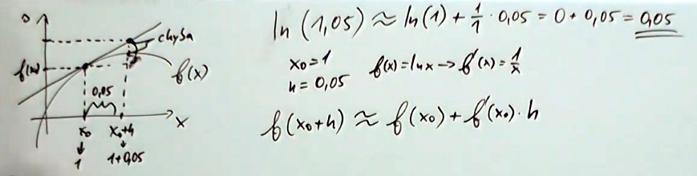

# 01

> Derivace, diferenciál a integrál (definice, výpočty, praktický význam).

## Derivace

* Derivace funkce představuje změnu (míru růstu či poklesu) hodnoty dané funkce v poměru ke změně jejího argumentu, pro velmi malé změny argumentu
* Někdy bývá nazývána jako _okamžitá míra změny_, což je paradox (změna nemůže být okamžitá, potřebuje dva body), jedná se ale o&nbsp;zjednodušení a pojem lze chápat jako _nejlepší aproximaci změny v okolí bodu_
* Derivace funkce v konkrétním bodě představuje směrnici tečny v tomto bodě (číslo)
  * Směrnice přímky je tangens úhlu, který přímka svírá s kladnou poloosou _x_
  * Směrnice přímky udává změnu _y_ na jednotku změny _x_
  * Tangens je pro (0; π/2) kladný a pro (π/2; π) záporný ⇒ podle směrnice tečny lze zjistit, zdali funkce stoupá/klesá

### Základní vlastnosti derivace

* Každá funkce má ve všech svých bodech buď jednu, nebo žádnou derivaci
* Aby měla funkce v konkrétním bodě derivaci, musí být definována i v epsilon okolí tohoto bodu
* Pokud má funkce v bodě derivaci, je zde spojitá; neplatí to ale naopak (např. u _f_(_x_) = |_x_|)

### Aplikace derivace

* Popisuje-li funkce _f_ proměnné _t_ celkovou ujetou vzdálenost v čase _t_, pak derivace _f'_ popisuje okamžitou rychlost v čase _t_ a druhá derivace _f''_ popisuje zrychlení v čase _t_
* Analýza průběhu funkce:
  * První derivace určuje, zdali je funkce (ne)stoupající / (ne)klesající / konstantní
  * Druhá derivace určuje, zdali je funkce konvexní "∪" / konkávní "∩"
* Nalezení lokálních extrémů – lokální extrém může být pouze v bodě, kde _f'_(_x_) = 0, nebo kde _f'_(_x_) neexistuje
* Aproximace funkcí (Taylor)
* Diferenciální rovnice

### Parciální derivace

* Funkce více proměnných, derivuje se podle jedné proměnné a ostatní se berou jako konstanty
* Použití pro zjištění extrémů funkcí více proměnných
* Gradient funkce je vektor všech jejích parciálních derivací, bod s nulovým gradientem je adeptem na extrém

### Odvození vzorců derivace

<!-- $$
\begin{align*}
&f'(x)=\lim_{h\to0}\frac{f(x+h)-f(x)}{h}\\
\mathrm{pro}\ f(x)=x^2:\\
&\frac{(x+h)^2-x^2}{h}=\frac{x^2+2xh+h^2-x^2}{h}=\frac{2xh+h^2}{h}=\frac{h(2x+h)}{h}=2x+h\stackrel{\lim_{h\to0}}{=}2x
\end{align*}
$$ -->

### Vzorce derivace

<!-- $$
\begin{align*}
(c)'&=0\\
(x^n)&=n\cdot n^{n-1}\\
(e^x)'&=e^x\\
(a^x)'&=a^x\cdot\ln{(a)}\\
(\ln{(x)})'&=\frac{1}{x}\\
(\log_a{(x)})'&=\frac{1}{x\cdot\ln{(a)}}\\
\\
(\sin{(x)})'&=\cos{(x)}\\
(\cos{(x)})'&=-\sin{(x)}\\
(\mathrm{tg}\,{(x)})'&=\frac{1}{\cos^2{(x)}}\\
(\mathrm{cotg}\,{(x)})'&=-\frac{1}{\sin^2{(x)}}\\
\\
(\arcsin{(x)})'&=\frac{1}{\sqrt{1-x^2}}\\
(\arccos{(x)})'&=-\frac{1}{\sqrt{1-x^2}}\\
(\mathrm{arctg}\,{(x)})'&=\frac{1}{1+x^2}\\
(\mathrm{arccotg}\,{(x)})'&=-\frac{1}{1+x^2}\\
\\
(f(x)+g(x))'&=f'(x)+g'(x)\\ \\
(c\cdot f(x))'&=c\cdot f'(x)\\ \\
(f(x)\cdot g(x))'&=f'(x)\cdot g(x)+f(x)\cdot g'(x)\\ \\
\left(\frac{f(x)}{g(x)}\right)'&=\frac{f'(x)\cdot g(x)-f(x)\cdot g'(x)}{g^2(x)}\\ \\
(f(g(x)))'&=f'(g(x))\cdot g'(x)
\end{align*}
$$ -->

## Diferenciál

Říkáme, že funkce _f_(_x_) má v bodě _c_ diferenciál, je-li možno její přírůstek vyjádřit ve tvaru

<!-- $$
f(c+h)-f(c)=f'(c)h+r(h)h
$$ -->

kde _r_ je (~chybová) funkce splňující podmínku

<!-- $$
\lim_{h\to0}r(h)=0
$$ -->

* Funkce má v bodě diferenciál jen tehdy, pokud v něm má i vlastní derivaci
* V takovém případě lze přírůstek k funkci aproximovat přírůstkem k tečně _f'_(_c_)_h_
* Výrazu _f'_(_c_)_h_ pak říkáme diferenciál funkce _f_ v bodě _c_ a značíme ho d<i>f</i>(_c_)
* V obecném případě se píše d<i>f</i>(_x_) nebo také d<i>y</i>

### Aplikace diferenciálu

#### Aproximace hodnoty funkce

#### Aproximace distribuce chyby

Naměříme-li, že poloměr koule je _x_ = 4 cm, a víme-li, že chyba měření je maximálně _h_ = 0,01 cm, pak maximální chyba při výpočtu objemu

<!-- $$
\begin{align*}V(x)&=\frac{4\pi}{3}r^3\\ V(4)&=\frac{4\pi}{3}4^3\approx268\ \mathrm{cm^3}\end{align*}
$$ -->

je přibližně dána diferenciálem

<!-- $$
\begin{align*}V'(x)\cdot h&=4\pi x^2\cdot h\\ V'(4)\cdot0{,}01&=4\pi4^2\cdot0{,}01\approx2\ \mathrm{cm^3}\end{align*}
$$ -->

## Diference

* ~Derivace u diskrétních signálů
* Δ<i>f</i>(_n_) = _f_[_n_] - _f_[_n_ - 1]
  * Vzorek minus následující vzorek; rozdíl sousedních hodnot
* Opět popisuje, zdali signál stoupá / klesá / je konstantní

## Integrál

* Integrace je inverzní funkcí derivace
* _F'(x)_ = _f(x)_
  * Funkce _F_ je primitivní k funkci _f_
  * Dvě různé primitivní funkce k funkci _f_ se liší (maximálně) o konstantu
  * Pokud je funkce _f(x)_ spojitá v (_a_; _b_), pak existuje funkce _F(x)_, která je k ní primitivní v (_a_; _b_)

### Neurčitý integrál

<!-- $$
\int\!f(x)\,\mathrm{d}x\stackrel{c}{=}F(x)
$$ -->

* Neurčitý integrál funkce je množina jejích primitivních funkcí, které se liší o konstantu
* Využívá se k výpočtu určitého integrálu nebo při řešení diferenciálních rovnic

### Určitý integrál

<!-- $$
\int_a^b\!f(x)\,\mathrm{d}x=F(b)-F(a)
$$ -->

* Výsledkem určitého integrálu je jedno číslo, konkrétně obsah plochy pod křivkou (resp. plochy mezi křivkou a osou _x_) vstupní funkce v intervalu <_a_; _b_>
  * Výsledná velikost plochy bere ohled na znaménko – pokud se křivka nachází pod osou _x_, plocha nad křivkou se odečítá
* Použití pro výpočet plochy, v kinematice, pravděpodobnosti, termodynamice ...

### Vzorce integrace

<!-- $$
\begin{align*}
\int\!x^n\,\mathrm{d}x&\stackrel{c}{=}\frac{x^{n+1}}{n+1}\\
\int\!x^{-1}\,\mathrm{d}x&=\int\!\frac{1}{x}\,\mathrm{d}x\stackrel{c}{=}\ln{(|x|)}\\
\int\!e^x\,\mathrm{d}x&\stackrel{c}{=}e^x\\
\int\!a^x\,\mathrm{d}x&\stackrel{c}{=}\frac{a^x}{\ln{(x)}}\\
\int\!\ln{(x)}\,\mathrm{d}x&\stackrel{c}{=}x\ln{(x)}-x\\
\\
\int\!1\,\mathrm{d}x&=\int\!x^0\,\mathrm{d}x\stackrel{c}{=}x\\
\int\!c\,\mathrm{d}x&=c\cdot\int\!1\,\mathrm{d}\stackrel{c}{=}cx\\
\\
\int\!\sin{(x)}\,\mathrm{d}x&\stackrel{c}{=}-\cos{(x)}\\
\int\!\cos{(x)}\,\mathrm{d}x&\stackrel{c}{=}\sin{(x)}\\
\int\!\mathrm{tg}\,{(x)}\,\mathrm{d}x&\stackrel{c}{=}-\ln{|\cos{(x)}|}\\
\int\!\mathrm{cotg}\,{(x)}\,\mathrm{d}x&\stackrel{c}{=}\ln{|\sin{(x)}|}\\
\int\!\frac{1}{\cos^2{x}}\,\mathrm{d}x&\stackrel{c}{=}\mathrm{tg}\,{(x)}\\
\int\!\frac{1}{\sin^2{x}}\,\mathrm{d}x&\stackrel{c}{=}-\mathrm{cotg}\,{(x)}\\
\int\!\frac{1}{\sqrt{1-x^2}}\,\mathrm{d}x&\stackrel{c}{=}\arcsin{(x)}\stackrel{c}{=}-\arccos{(x)}\\
\int\!\frac{1}{1+x^2}\,\mathrm{d}x&\stackrel{c}{=}\mathrm{arctg}\,{(x)}\stackrel{c}{=}-\mathrm{arccotg}\,{(x)}\\
\end{align*}
$$ -->

### Per partes

<!-- $$
\int\!uv'\,\mathrm{d}x\stackrel{c}{=}uv-\int\!u'v\,\mathrm{d}x
$$ -->

### Rozklad na parciální zlomky

<!-- $$
\begin{align*}\frac{1}{n(n+3)}&=\frac{A}{n}+\frac{B}{n+3}\\ \\ 1&=An+3A+Bn\\ 1&=(A+B)n+3A\\ A+B&=0\\ 3A&=1\implies A=\frac{1}{3}\implies B=-\frac{1}{3}\\ \\ \frac{1}{n(n+3)}&=\frac{\frac{1}{3}}{n}+\frac{-\frac{1}{3}}{n+3}=\frac{1}{3n}-\frac{1}{3n+9}\end{align*}
$$ -->

---
[>>>](./02.MD)
