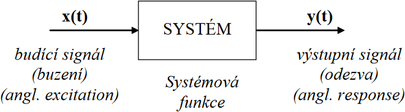
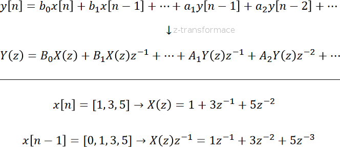
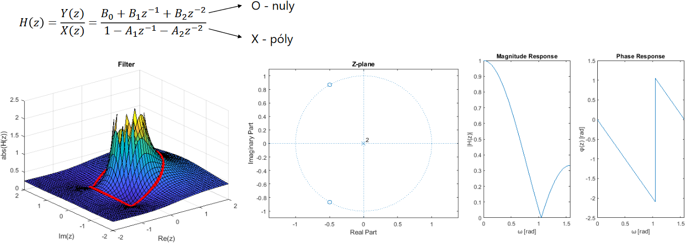

# 06

> Signály a systémy. LTI systémy. Přenosová funkce, impulsní odezva. Konvoluce u číslicových signálů.

## Signál

* Nositel informace o vývoji v čase nebo prostoru
* Např. tón, hudba, řeč, údaje získané měřením, ekonomické ukazatele, obraz, video, ...

### Spojitý/analogový signál

* Spojitý v čase i hodnotách, v libovolném okamžiku může nabývat libovolné hodnoty

<!-- $$
\begin{align*}
x(t)&=A\cdot\cos{(2\pi\cdot f\cdot t+φ)+M}\\
&=\Re(Ae^{i\cdot2\pi\cdot f\cdot t+φ})+M
\end{align*}
$$ -->

* _A_ – amplituda
* _f_ – frekvence
* _φ_ – fáze (__minus posouvá doprava__)
* _M_ – stejnosměrná složka

### Číslicový/diskrétní signál

* Nespojitý – nabývá jen určitých hodnot v určitém čase a prostoru
* Reprezentován číselnou řadou / maticí / diskrétní funkcí

### Energie signálu

* Suma čtverců všech hodnot u konečného signálu
* Jedno číslo toho o signálu moc neřekne, proto se používá krátkodobá energie
  * Energie se měří po krátkých úsecích (okénko / window)
  * Podle průběhu krátkodobé energie lze např. u nahrávky řeči odhadovat, o jaká slova se jedná

## Systém

* Systém dokáže generovat, zpracovávat, modifikovat a přijímat signály
* Signál je projevem činnosti systému

### Klasifikace systémů

* Podle charakteru signálu
  * Spojité
  * Číslicové
  * Hybridní – fungují jako převodníky A↔D
* Podle kauzality
  * Kauzální – odezva závisí pouze na současných a minulých hodnotách
  * Nekauzální – odezva závisí i na budoucích hodnotách (realizovatelné pouze offline)
* Podle linearity (zdali je aditivní a homogenní)
* Podle stacionarity (časové nezávislosti)

### Časově nezávislý systém

* Je-li vstup zpožděn o _Δt_, musí být i výstup zpožděn o _Δt_ (hodnoty jsou kromě zpoždění stejné)
* Chování takového systému se nemění v čase
* Příklad časově nezávislého systému: _y_(_t_)=_kx_(_t_)
* Příklad časově závislého systému: _y_(_t_)=_<b>t</b>x_(_t_)

## LTI systémy

* Linear Time Invariant – lineární a časově nezávislé
* U spojitých signálů jejich chování popisují diferenciální rovnice s konstatntními koeficienty, u číslicových systémů jsou jejich ekvivalentem diferenční rovnice
* Chování libovolného LTI systému lze jednoznačně popsat tím, jak reaguje na jednotkový impulz
  * ⇒ Odezva na jednotkový impulz jednoznačně identifikuje libovolný LTI systém
  * Tato odezva se označuje _h_[_n_] a nazývá se __impulzní odezva__
  * Známe-li _h_[_n_], můžeme pomocí konvoluce určit odezvu na libovolný vstupní signál
    * ![_y_\[_n_\] = _x_\[_n_\] * _h_\[_n_\]](./MG/LX/06_s03.svg)<!-- $y[n]=x[n]*h[n]$ -->
    * len(_y_) = len(_x_) + len(_h_) - 1
* FIR – Finite Impulse Response – Nerekurzivní systém
  * Reaguje konečnou odezvou na jakýkoliv konečný signál
* IIR – Infinite Impulse Response – Rekurzivní systém
  * Reaguje nekonečnou odezvou na jakýkoliv konečný signál
  * Stabilní / nestabilní (pro omezený vstupní signál generuje signál s neustále rostoucími amplitudami)

<!-- $$
\begin{align*}
&\mathrm{FIR{:}}&&y[n]=b_0x[n]+b_1x[n-1]+\cdots+b_Mx[n-M]\\
&\mathrm{\ IIR{:}}&&y[n]=b_0x[n]+b_1x[n-1]+\cdots+b_Mx[n-M]-a_1y[n-1]-\cdots-a_Ny[n-N]\\
\end{align*}
$$ -->

* Činnost LTI systému lze popsat pomocí:
  * diferenciální nebo diferenční rovnice
  * impulzní odezvy
  * přenosové funkce

## Konvoluce

* Matematická funkce popisující interakci signálu a systému popsaného impulzní odezvou
* Základ zpracování zvuku, obrazu, videa; má dedikované instrukce z MMX; časté použití ve 2D grafice

* ⇒ Součet posunutých odezev na jednotlivé vzorky signálu
* Komutativní, asociativní, distributivní, asociativní při násobení skalárem, existence jednotky
* Výsledkem konvoluce periodického signálu je opět periodický signál se stejnou periodou

## Z-transformace

* Převádí číslicové signály a popisy číslicových systémů do prostoru komplexních čísel, kde se s nimi snadněji pracuje
* Převádí konvoluci na (levnější) součin
* Výsledkem je polynom s mocninami komplexní proměnné _z_-1, která má význam jednotkového zpoždění
* Umožňuje lépe vyjádřit odezvu IIR systémů
* Usnadňuje počítačový návrh systémů i výpočet frekvenčních charakteristik
* ~Zobecnění Fourierovy transformace (ze z-transformace lze odvodit frekvenční charakteristiku systému)

<!--
### Terminologie z-transformace

* Signál popsaný v čase se nazývá _originál_
  * Jeho transformovaná verze se nazývá _obraz_
* Prostor, v němž jsou popsány originální vzorky signálu, se nazývá _časový prostor_
  * Transformací je převeden na komplexní _obrazový prostor_ (z-rovina)
-->
## Přenosová funkce

* Dostaneme po aplikování z-transformace na diferenční rovnici, vydělení, substituci...:

<!-- $$
\begin{align*}
y[n]&=x[n]*h[n]\\
Y(z)&=X(z)\cdot H(z)\\
H(z)&=\frac{Y(z)}{X(z)}=\frac{B_0+B_1z^{-1}+\cdots}{1-A_1z^{-1}-A_2z^{-2}-\cdots}
\end{align*}
$$ -->

* Popisuje chování systému v komplexní rovině
* Je transformovanou verzí impulzní odezvy
* Lze z ní získat frekvenční charakteristiku

---
[>>>](./07.MD)
