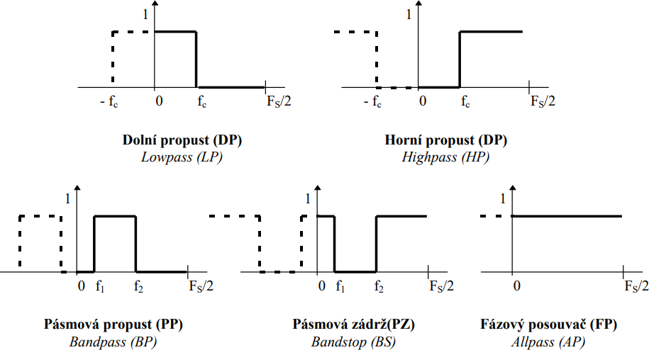
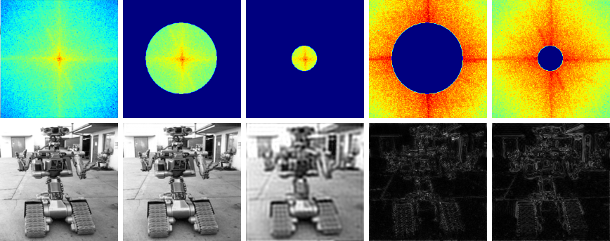
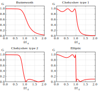

# 07

[<<<](./06.MD)
> Fourierovy řady. Diskrétní Fourierova transformace, její použití a interpretace. Spektrum signálu, FFT. Číslicové filtry FIR a IIR. Filtrace v čase nebo prostoru.

* Harmonická složka – signál sinus nebo kosinus
* Harmonicky vázané signály – součet (ko)sinusovek s frekvencemi, které jsou násobky základní frekvence

## Fourierův teorém

* Jakýkoliv __periodický spojitý__ signál lze rozložit na součet harmonických složek
* Součtem složek se stejnou frekvencí je signál o této frekvenci
* U rozdílných frekvencí říkáme nejnižší frekvenci nosná, na ní „kmitají“ signály s vyššími frekvencemi

## Gibbsův jev

* Problém u ostrých hran signálu (např. u square wave), kde při aproximaci harmonickými složkami vznikají překmity

## Fourierovy řady

* Umožňují rozložit a složit jakýkoliv __periodický spojitý__ signál na jednotlivé harmonické složky
* Polární tvar vede na jednostranné spektrum
* Exponenciální tvar (níže používaný) vede na oboustranné spektrum a je snazší s ním počítat (pro PC)
* Harmonická syntéza – vytvoření signálu součtem harmonických složek

## Fourierova transformace

* Lze použít i na neperiodické signály

### FT – Spojitá Fourierova transformace


* Spojitý signál → spojité spektrum

<!--
### DTFT – Fourierova transformace v diskrétním čase


* Diskrétní signál → spojité spektrum
* Navzorkováno – frekvence se předělají na úhel – opakování spektra s periodou vzorkovací frekvence
-->

### DFT – Diskrétní Fourierova Transformace


* Diskrétní signál → diskrétní spektrum
* Vhodné pro zpracování v PC
* Navzorkováno – frekvence se předělají na úhel – opakování spektra s periodou vzorkovací frekvence
* Zkouší jen určité frekvenční kroky, frekvence v signálu ale mohou být jakékoliv
  * Frekvence, která nebyla přesně trefena, nezmizí, ale rozprostře se do okolních kroků
  * ⇒ Rozmazání spektra (dojde k němu prakticky vždy)

### IDFT – Inverzní Diskrétní Fourierova Transformace

* Převádí signál popsaný spektrem zpět do časové oblasti
* Vstupem je vždy oboustranné spektrum
* `Signál = IDFT(DFT(Signál))`

### FFT – Fast Fourier Transform

* Rychlý DFT algoritmus, poskytuje stejné hodnoty mnohem rychleji (až 200krát)
* Optimalizace (využívá symetričnosti exponenciálních členů, podobnosti sudých a lichých koeficientů)
* IFFT – Inverzní FFT

## Frekvenční spektrum

* Závislost amplitud a fází harmonických složek na frekvenci
* Vrací (pro kosiny):
  * Magnitudové spektrum
    * Absolutní hodnota amplitudy pro každou frekvenci
    * Symetrické
  * Fázové spektrum
    * Hodnota _φ_ pro každou frekvenci
    * Antisymetrické
* Záporná frekvence u kosinu je rovna kosinu s kladnou frekvencí a obrácenou fází
* Důvod oboustranného spektra – FT nepozná, zdali se jedná o signál s _f_ a -_φ_ nebo s -_f_ a _φ_
* Spektrum používané v praxi je jednostranné, většina výpočetních postupů však vrací oboustranné spektrum, z něhož lze ale to jednostranné snadno odvodit

## Spektrogram

* Frekvenční spektrum neřeší čas
* Spektrogram zobrazuje i změnu v čase
  * Udělá FT pro určitý malý úsek (frame), spočtená spektra vykreslí jako jeden sloupec grafu
  * _x_=čas, _y_=frekvence, _z(barva)_=amplituda

### Zero-crossing rate

* Počet průchodů nulou
* Lze z něj zjistit nosnou (nejnižší) frekvenci
* Méně náročné pro výpočet než spektrogram
* Neřeší amplitudu (energii)

## Frekvenční charakteristika systému

* Závislost přenosových vlastností systému (magnitudy a fáze) na frekvenci
* Zajímá nás u zesilovačů, snímačů (mikrofon, kamera) a výstupních členů (reproduktory)
* Zajímá nás, když navrhujeme filtry pro posílení/zeslabení určité části spektra
* Získáme ji buď pomocí postupného měření amplitud výstupu systému pro různé harmonické signály (odkrokované frekvence), nebo pomocí vyslání speciálního impulzu a provedení FT
* Její výpočet spočívá v dosazení konkrétních hodnot do vztahu odvozeného z přenosové funkce
* __Chování systémů tedy lze popsat třemi způsoby:__
  * V časové oblasti pomocí konvoluce
  * V z-rovině pomocí z-transformace
  * Ve frekvenční oblasti pomocí frekvenční charakteristiky

## Číslicové systémy/filtry

* Filtry jsou systémy upravující signál požadovaným způsobem

### Základní typy (ideálních) filtrů podle frekvenční charakteristiky



### Vlastnosti FIR filtru

* Výstupní signál filtru je lineární kombinací vzorků z určitého okolí vstupního signálu
* Nerekurzivní systém – reaguje konečnou odezvou na jakýkoliv konečný signál
* __+__ Jednodušší návrh, intuitivní
* __+__ Nerekurzivní ⇒ stabilní
* __-__ Hůře se dosahuje velká strmost přechodů mezi pass/stop; k tomu by bylo nutné mnoho koeficientů ⇒ dlouhé zpoždění

### 2D FIR pro zpracování obrazu

* Ve statickém obraze nehraje roli čas, ale prostor
* Opět princip konvoluce – nová hodnota v daném bodě je lineární kombinací hodnot okolních bodů
* Např.: potlačení šumu / rozmazání (Lowpass), detekce hran (Highpass)

### Příklady FIR filtrů

#### Zesilovač

<!-- $$
\begin{align*}
&\mathrm{System{:}}             &&y[n]=k\cdot x[n] \\
&\mathrm{Vektor\ koeficientů{:}}&&B=[k] \\
\end{align*}
$$ -->


#### Zpožďovač

<!-- $$
\begin{align*}
&\mathrm{System{:}}             &&y[n]=x[n-k] \\
&\mathrm{Vektor\ koeficientů{:}}&&B=[0,0,\dots,1] \\
\end{align*}
$$ -->


#### Derivátor (diferenciátor)

<!-- $$
\begin{align*}
&\mathrm{System{:}}             &&y[n]=x[n]-x[n-1] \\
&\mathrm{Vektor\ koeficientů{:}}&&B=[1,-1] \\
\end{align*}
$$ -->


#### Průměrovací filtr (třetího řádu) (klouzavý průměr – moving average)

<!-- $$
\begin{align*}
&\mathrm{System{:}}             &&y[n]=\frac{x[n]+x[n-1]+x[n-2]}{3} \\
&\mathrm{Vektor\ koeficientů{:}}&&B=\left[\frac{1}{3},\frac{1}{3},\frac{1}{3}\right] \\
\end{align*}
$$ -->


#### 2D



```text
          ⎡1/9  1/9  1/9⎤               ⎡-1  -1  -1⎤
          ⎢             ⎥               ⎢          ⎥
Lowpass = ⎢1/9  1/9  1/9⎥    Highpass = ⎢-1   9  -1⎥
          ⎢             ⎥               ⎢          ⎥
          ⎣1/9  1/9  1/9⎦               ⎣-1  -1  -1⎦
```

### Vlastnosti IIR filtru

* __+__ Lze s ním dosáhnout velmi strmých přechodů mezi pass/stop i při malém počtu koeficientů
* __-__ Oproti FIR složitý a méně intuitivní návrh
* __-__ Rekurzivní ⇒ může být nestabilní
  * Pokud všechny jeho póly leží uvnitř jednotkové kružnice, pak je stabilní

### Příklady IIR filtrů



### Další druhy filtrů

>FIR and IIR filters are discrete-time linear time-invariant (LTI) filters. There are also (linear) time-varying systems, which could be implemented just like FIR or IIR filters, but with time-varying coefficients. Audio effects like chorus, flanger, or phaser are time-varying filters.<br><br>Of course there are also non-linear filters, the most well-known of which is probably the median filter, which is very useful for removing impulsive noise. Many different types of non-linear filters are used in image processing.<br><br>Note that none of the above mentioned filters can be characterized by their impulse response or, equivalently, by their frequency response. This is only possible for LTI systems.<br><br>[dsp.stackexchange.com](https://dsp.stackexchange.com/a/28457)

---
[>>>](./08.MD)
