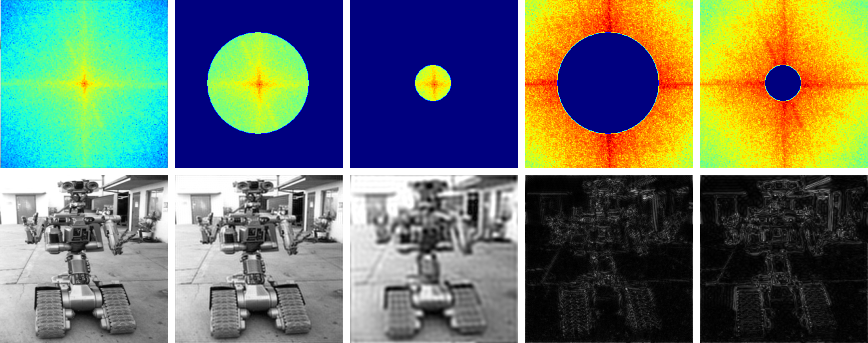

# 07

> Fourierovy řady. Diskrétní Fourierova transformace, její použití a interpretace. Spektrum signálu, FFT. Číslicové filtry FIR a IIR. Filtrace v čase nebo prostoru.

* Harmonická složka – signál sinus nebo kosinus
* Harmonicky vázané signály – součet (ko)sinusovek s frekvencemi, které jsou násobky základní frekvence

## Fourierův teorém

* Jakýkoliv __periodický spojitý__ signál lze rozložit na součet harmonických složek
* Součtem složek se stejnou frekvencí je signál o této frekvenci
* U rozdílných frekvencí říkáme nejnižší frekvenci nosná, na ní „kmitají“ signály s vyššími frekvencemi

## Gibbsův jev

* Problém u ostrých hran signálu (např. u square wave), kde při aproximaci harmonickými složkami vznikají překmity

## Fourierovy řady

* Metoda rozkladu signálu na jednotlivé harmonické složky
* Polární tvar vede na jednostranné spektrum
* Exponenciální tvar (níže používaný) vede na oboustranné spektrum a je snazší s ním počítat (pro PC)
* Syntéza – vytvoření signálu součtem harmonicky vázaných kosinusovek

## Fourierova transformace

### FT – Spojitá Fourierova transformace

$$
x(t)\to X(f)=\int_{-\infty}^{\infty}\!x(t)\cdot e^{-ift}\,\mathrm{d}t
$$

* Spojitý signál → spojité spektrum

### DTFT – Fourierova transformace v diskrétním čase

$$
x[n]\to X(\omega)=\sum_{n=-\infty}^\infty x[n]\cdot e^{-i\omega n}
$$

* Diskrétní signál → spojité spektrum
* Navzorkováno – frekvence se předělají na úhel – opakování spektra s periodou vzorkovačky

### DFT – Diskrétní Fourierova Transformace

$$
x[n]\to X[k]=\frac{1}{N}\sum_{n=0}^{N-1}x[n]\cdot e^{\frac{-i2\pi kn}{N}}
$$

* Diskrétní signál → diskrétní spektrum
* Vhodné pro zpracování v PC
* Zkouší jen určité frekvenční kroky, frekvence ale v signálu mohou být jakékoliv
  * Frekvence, která nebyla přesně trefena, nezmizí, ale rozprostře se do okolních kroků
  * = Rozmazání spektra (dojde k němu prakticky vždy)

### IDFT – Inverzní Diskrétní Fourierova Transformace

* Převádí signál popsaný spektrem zpět do časové oblasti
* Vstupem vždy oboustranné spektrum
* `Signál = IDFT(DFT(Signál))`

### FFT – Fast Fourier Transform

* Rychlý DFT algoritmus, poskytuje stejné hodnoty mnohem rychleji (třeba 200x)
* Optimalizace (symetričnost exponenciálních členů, podobnost sudých a lichých koeficientů)
* Inverzní IFFT

## Frekvenční spektrum

* Závislost amplitud a fází harmonických složek na frekvenci
* Vrací (pro kosiny):
  * Magnitudové spektrum
    * Absolutní hodnota amplitudy pro každou frekvenci
    * Symetrické
  * Fázové spektrum
    * Hodnota _φ_ pro každou frekvenci
    * Antisymetrické (záporná frekvence u kosinu v podstatě otáčí fázi)
* Důvod oboustranného spektra – Fourierovka nepozná, zdali se jedná o signál s _f_ a -_φ_ nebo s -_f_ a _φ_
* Spektrum používané v praxi je jednostranné, většina výpočetních postupů však počítá oboustranné spektrum, z něhož ale lze snadno odvodit to jednostranné

## Spektrogram

* Frekvenční spektrum neřeší čas
* Spektrogram zobrazuje i změnu v čase
  * Udělá FT pro určitý malý úsek (frame), spočtená spektra vykreslí jako jeden sloupec grafu
  * _x_=čas, _y_=frekvence, _z(barva)_=amplituda

### Zero-crossing rate

* Počet průchodů nulou
* Lze z něj zjistit nosnou (nejnižší) frekvenci
* Méně náročné pro výpočet než spektrogram
* Neřeší amplitudu (energii)

## Z-transformace

$$
X(z)=\sum_{n=-\infty}^\infty x[n]z^{-n}\\ z\in\Complex
$$

* Převádí číslicové signály a popisy číslicových systémů do prostoru komplexních čísel, kde se s nimi snadněji pracuje (převádí konvoluci na (levnější) součin)
* Umožňuje lépe vyjádřit odezvu IIR systémů
* ~Zobecnění Fourierovy transformace (ze z-transformace lze odvodit frekvenční charakteristiku systému)

## Frekvenční charakteristika systémů

* Frekvenční charakteristika systému je závislost přenosových vlastností systému (magnitudy a fáze) na frekvenci
* Frekvenční analýzu systémů potřebujeme, když zjišťujeme frekvenční charakteristiku zesilovačů, snímačů (mikrofon, kamera) a výstupních členů, a když navrhujeme filtry pro posílení/zeslabení určité části spektra.
* Frekvenční charakteristiku měříme buď pomocí postupného měření amplitud výstupu systému pro různé harmonické signály (odkrokované frekvence), nebo pomocí vyslání speciálního impulsu a provedení FT
* __Chování systémů tedy lze popsat třemi způsoby:__
  * V časové oblasti pomocí konvoluce
  * V z-rovině pomocí z-transformace
  * Ve frekvenční oblasti pomocí frekvenční charakteristiky

## Číslicové systémy/filtry

* Filtry jsou systémy upravující signál požadovaným způsobem

### Základní typy (ideálních) filtrů podle frekvenční charakteristiky


### Vlastnosti FIR filtru

* Výstupní signál filtru je lineární kombinací vzorků z určitého okolí vstupního signálu
* Nerekurzivní systém – reaguje konečnou odezvou na jakýkoliv konečný signál
* __+__ Jednodušší návrh, intuitivní
* __+__ Nerekurzivní ⇒ stabilní
* __-__ Hůře se dosahuje velká strmost přechhody mezi pass/stop, k tomu by bylo nutné mnoha koeficientů ⇒ dlouhé zpoždění

### 2D FIR pro zpracování obrazu

* Ve statickém obraze nehraje roli čas ale prostor
* Opět princip konvoluce – nová hodnota v daném bodě je lineární kombinací hodnot okolních bodů
* Např.: potlačení šumu / rozmazání (Lowpass), detekce hran (Highpass)

### Příklady FIR filtrů

#### 1D Zesilovač

$$
\begin{align*}
&\mathrm{Systém{:}}             &&y[n]=k\cdot x[n] \\
&\mathrm{Vektor\ koeficientů{:}}&&B=[k] \\
\end{align*}
$$

#### 1D Zpožďovač

$$
\begin{align*}
&\mathrm{Systém{:}}             &&y[n]=x[n-k] \\
&\mathrm{Vektor\ koeficientů{:}}&&B=[0,0,\dots,1] \\
\end{align*}
$$

#### 1D Derivátor (diferenciátor)

$$
\begin{align*}
&\mathrm{Systém{:}}             &&y[n]=x[n]-x[n-1] \\
&\mathrm{Vektor\ koeficientů{:}}&&B=[1,-1] \\
\end{align*}
$$

#### 1D Průměrovací filtr (třetího řádu) (klouzavý průměr – moving average)

$$
\begin{align*}
&\mathrm{Systém{:}}             &&y[n]=\frac{x[n]+x[n-1]+x[n-2]}{3} \\
&\mathrm{Vektor\ koeficientů{:}}&&B=\left[\frac{1}{3},\frac{1}{3},\frac{1}{3}\right] \\
\end{align*}
$$

#### 2D



```txt
          ⎡1/9  1/9  1/9⎤               ⎡-1  -1  -1⎤
          ⎢             ⎥               ⎢          ⎥
Lowpass = ⎢1/9  1/9  1/9⎥    Highpass = ⎢-1   9  -1⎥
          ⎢             ⎥               ⎢          ⎥
          ⎣1/9  1/9  1/9⎦               ⎣-1  -1  -1⎦
```

---
[>>>](./08.MD)
