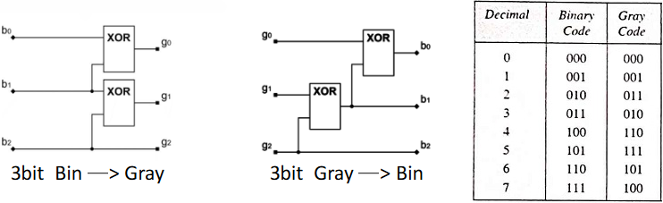

# 08

[<<<](./07.MD)
> Vzorkování, kvantování. Vzorkovací teorém. Aliasing. Práce se zvukem na počítači.

## AD převod

1. Lowpass filter (antialiasingový filtr)
2. Vzorkování
3. Kvantování
4. Kódování (ke každé úrovni je přiřazena hodnota z určitého kódu (např. 4 úrovně – 00, 01, 10, 11))

## Vzorkování

* Převod analogového signálu na diskrétní
* Čtení hodnoty v konkrétních časech
* Vzorkovací frekvence _Fs_ – kolikrát za sekundu udělám vzorek [Hz]
* Vzorkovací perioda  _Ts_ – kolik sekund mezi jednotlivými vzorky [s]

## Kvantování

* Převod na konečný počet úrovní
* Lineární (úrovně 0 až 2_n_ se stejnými rozestupy) / nelineární (např. pro zvuk)
* Vzniká kvantizační šum kvůli zaokrouhlování (toleranční pásy)
  * _SNR_ – signal to noise ratio – odstup signálu od šumu – čím vyšší tím lepší

## Vzorkovací teorém

* Vzorkovací frekvence musí být __alespoň dvakrát vyšší__ než nejvyšší frekvence obsažená ve vzorkovaném signálu
  * f_{\max}$" src=".\MG\LX\08_s01.svg">
  * 2f_{\max}$" src=".\MG\LX\08_s02.svg">
  * Je-li toto dodrženo, signál není vzorkováním zkreslen

## Aliasing

* Zkreslení při nedodržení vzorkovacího teorému
* Frekvence se překládají a navíc sčítají s dalšími, které zde jsou kvůli symetrii
* Důsledkem je ztráta či zkreslení informace
<!--
* Druhy – příklad na hodinách:
  * F_s>f$" src=".\MG\LX\08_s03.svg"> – jeví se spíše jako záporná frekvence
  *  – jeví se jako stejnosměrná složka
  *  – nestihneme zaznamenat jednu nebo více celých period – jeví se jako nižší frekvence
  *  – nelze poznat směr frekvence
-->

## Záznam zvuku

* Mikrofon
  * Kvalitu zvuku určuje mj. kvalita konektorů a kabelů
  * Také nás zajímá frekvenční a směrová charakteristika mikrofonu
* Zvuková karta
  * Provádí AD převod (při záznamu)
  * Zajímá nás vzorkovací frekvence a počet kvantizačních úrovní (44.1 KHz / 16 bit)
* Uchování v souboru s určitým formátem a kontejnerem, např.:
  * Bez komprese – wav
  * Lossless – flac
  * Lossy – mp3

## AD převodníky

### Flash ADC

* Také paralelní / _direct-conversion ADC_

* _n_-bitový převodník potřebuje 2_n_-1 komparátorů
  * Komparátor – pokud je napětí na `+` větší než na `-`, pak „vrací“ 1, jinak 0
* Nejrychlejší, nejdražší
* Využití pro rychlé měřící přístroje a oscilátory

### Digital ramp

* Princip:
  * Spustí čítač a začne generovat stoupající signál (saw wave) pomocí DAC
  * Jakmile je signál roven vstupu, hodnota čítače je rovna hodnotě výstupu
  * Poté se resetuje čítač a může se měřit další vzorek

### Integrační ADC

* Také _single/dual/multi-slope ADC_
* Princip:
  * Podobný jako digital ramp (generace saw wave a porovnání), ale místo DAC používá tzv. integrátor
  * Integrátor – ze vstupu _n_ generuje _nx_ (integrace konstanty), realizován pomocí komparátoru
  * V pevném časovém úseku necháme generovat signál _nx_ (čím vyšší _n_, tím rychleji funkce roste)
  * Poté necháme signál klesat konstatní rychlostí a měříme, za jak dlouho klesne na nulu
* Využívá se pro digitální měřící přístroje, kde je vyžadován nízký šum (způsobený průměrováním) a vysoké rozlišení

### ADC s postupnou integrací

* Také _Successive Approximation Register_
* Princip:
  * Porovnává vygenerovaný signál se vstupem pomocí DAC
  * Nejdříve porovná MSB – signál=`01111111`, výsledkem komparace je `X`
  * Další krok porovnává `X0111111`, pak `XY011111`, ...
  * Počet bitů udává počet kroků pro jeden vzorek
* Využití pro rychlý sběr dat, audio

### Delta-sigma ADC

* Velmi zjednodušeně až špatně:
  * Využívá delta sigma modulátor (integrátor + komparátor se zpětnou vazbou pro vynulování)
  
  
  
  * Modulovaný signál rozkouskujeme a máme _n_ bitové hodnoty

## Kódování / komprese

* RLE
* LZW
* Huffman
* Aritmetické kódování
* MTF
* BWT

### Grayův kód

### Lineární kód

* Kód pro opravu chyb
* Lineární kombinace kódových slov je opět kódové slovo

---
[>>>](./09.MD)
