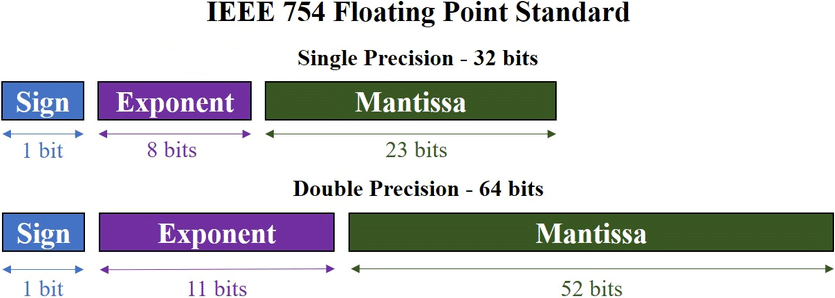
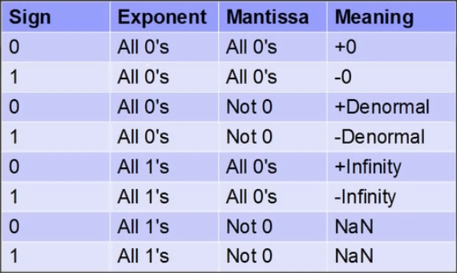
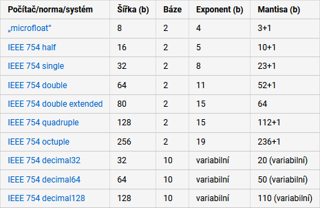

# 09

[<<<](./08.MD)
> Číselné soustavy a převody mezi nimi. Způsoby kódování čísel s pevnou a s pohyblivou řádovou tečkou. Kódování záporných čísel.

## Číselné soustavy

* _F_(_Z_) je číslo vyjádřené v číselné soustavě o základu _Z_
* _ai_ jsou číselné koeficienty – to, co běžně zapisujeme – nejvyšší řád obvykle vlevo
* _m_ je počet řádových míst
* Nejčastějšími základy soustavy jsou 2, 8, 10 a 16
  * „Paradox“ – pro označení základu používáme desítkovou soustavu

### Převody mezi soustavami

* `dec → bin`
  * Celá čísla
    * Postupně číslo dělíme dvěma a zapisujeme si zbytky
    * Vždy dělíme celou část předchozího dělení
    * Zbytek je vždy 0 nebo 1
    * Jakmile je výsledek 0, máme hotovo
    * Zbytky tvoří naše číslo v binární soustavě
    * Zapíšeme zdola nahoru
  * Desetinná čísla
    * Celou část převedeme klasicky
    * Desetinnou část postupně násobíme dvěma
    * Pokud je výsledek větší než 1, odečteme 1 (a dál násobíme dvěma)
    * Pokud je výsledek roven 1, máme hotovo
    * Celé části výsledků tvoří desetinnou část našeho čísla v binární soustavě
    * Zapíšeme shora dolu
  * V převodu celé i desetinné části je to, co spočítáme jako první, nejblíže řádové čárce
* `dec → hex`
  * Šlo by podobným způsobem dělit 16
  * Lepší převést na binární a pak jednotlivé čtveřice převést na hexadecimální číslice
  * 16 je mocninou 2, proto je převod `bin ↔ hex` jednoduchý
* `hex → dec`
  * Lze opět přes binární soustavu
  * Nebo násobit jednotlivé číslice mocninami 16

## Záporná čísla

* V psané formě lze vyjádřit záporné binární číslo stejně jako dekadické – znaménkem minus
* Pro reprezentaci záporného (binárního) čísla v paměti PC ale existuje více metod, např.:
  * Vyhrazení znaménkového bitu – obvykle `1` znamená záporné číslo, existence kladné a záporné nuly
  * Přičtení konstanty – kód s posunutou nulou
  * Jednotkový doplněk – existence kladné a záporné nuly
  * Dvojkový doplněk

### Dvojkový doplněk

Bits|Unsigned|2's complement
:-:|:-:|:-:
000|0|0
001|1|1
010|2|2
011|3|3
100|4|-4
101|5|-3
110|6|-2
111|7|-1

* Podle MSB lze zjistit znaménko (`1`⇒záporné), záporná čísla jsou ale „namapována obráceně“
* Existuje jen jedna nula, proto lze třemi bity vyjádřit rozsah -4 až 3
* Pro vyjádření záporného čísla ve dvojkovém doplňku znegujeme kladné číslo a přičteme jedna
  * Nejprve je nutné doplnit kladné číslo zleva správným počtem nul (`1`→`001`)
* Pro zjištění absolutní hodnoty záporného čísla ve dvojkovém doplňku opět znegujeme a přičteme jedna
* Ve dvojkovém doplňku můžeme běžně sčítat jakákoliv dvě čísla a pokud je výsledek v rozsahu, pak je správný
* To, že výsledek není v rozsahu, lze poznat tak, že carry-in a carry-out u MSB si nejsou rovny

## Nepřesnost čísel s řádovou čárkou

* Prvním problémem jsou reálná a periodická čísla
  * Příkladem v dekadické soustavě je jedna třetina, pro její vyjádření potřebujeme nekonečno desetinných míst
  * V binární soustavě tento problém nastává, pokud desetinné číslo nelze vyjádřit sumou čísel 2-_n_
* Druhým problémem je velikost datového typu (obvykle 32/64 bitů)
  * U celých čísel omezuje jejich rozsah, u desetinných omezuje i jejich přesnost
* <https://0.30000000000000004.com/>

## Čísla s pevnou řádovou čárkou

* V pevné řádové čárce je číslo _A_ rovno polynomu:

* _ai_ je binární číslice (0/1)
* Pro záporná čísla lze opět využít znaménkový bit / posunutí nuly / doplněk
* Některé bity tedy reprezentují koeficienty s kladným a některé se záporným exponentem, záleží na umístění pomyslné řádové čárky
  * Umístění čárky určuje rozsah a přesnost
  * Nabízí se myšlenka zdali by umístění nemohlo být variabilní ⇒ plovoucí řádová čárka
* Výhody pevné řádové čárky:
  * Předem známá pozice čárky:
    * Prostor pro optimalizaci
    * Není třeba ji ukládat
    * Je možné ji měnit a tedy měnit rozsah a přenost ⇒ předem známá přesnost
  * Snadná implementace základních matematických operací
* Nevýhody pevné řádové čárky:
  * Relativně nestandardní formát – horší podpora ze strany HW i SW
  * Nevhodné zpracování hodnot s vysokou dynamikou (poměr mezi nejvyšší a nejnižší absolutní hodnotou)

## Čísla s plovoucí řádovou čárkou

* Vychází z vědeckého zápisu čísel (scientific notation):

* Mantisa je ve formátu _jedna\_číslice_ + _řádová\_čárka_ + _1\_až\_n\_číslic_
* Hodnota exponentu pak posouvá řádovou čárku
* Přesnost závisí na počtu bitů definujících mantisu, rozsah závisí na počtu bitů definujících exponent
* Výpočty:
  * U sčítání/odečítání se srovnají exponenty a sečtou/odečtou mantisy
  * U násobení se sečtou exponenty a vynásobí mantisy
  * U dělení se odečtou exponenty a vydělí mantisy
* Výhodou je maximální podpora ze strany HW i SW (`float`, `double`, ...)

## IEEE 754

* Standard z roku 1985 pro kódování/kompresi čísel s plovoucí řádovou čárkou

* Číslo je uloženo jako:

* V tomto standardu 23/52 bitů mantisy reprezentuje až čísla __za její řádovou čárkou__
  * V běžném případě je číslice před čárkou implicitně `1`
* Záporné hodnoty exponentu lze docílit díky _bias_
  * 32 bit → _bias_ = 127
  * 64 bit → _bias_ = 1023
  * Pro záporný exponent je tedy využit kód s posunutou nulou
* Pro kódování záporných (výsledných) čísel slouží znaménkový bit _S_
* Standard kromě významu jednotlivých bitů definuje také operace (aritmentika, konverze) a speciální hodnoty:

* Pokud je číslo denormal, platí pro něj speciální pravidla
  * Slouží pro reprezentaci velmi malých čísel
  * Funguje na principu pevné řádové čárky
  * Běžně se nepoužívá
* Přesnost/rozsah:
  * Single má přesnost 6–7 číslic v rozsahu `±1.18×10⁻³⁸ až ±3.4×10³⁸`
  * Double má přesnost 15–16 číslic v rozsahu `±2.23×10⁻³⁰⁸ až ±1.80×10³⁰⁸`
* 32/64bitové floaty jsou nejběžnější, standard a jeho rozšíření ale definují i jiné velikosti a existují i jiné standardy

---
[>>>](./10.MD)
