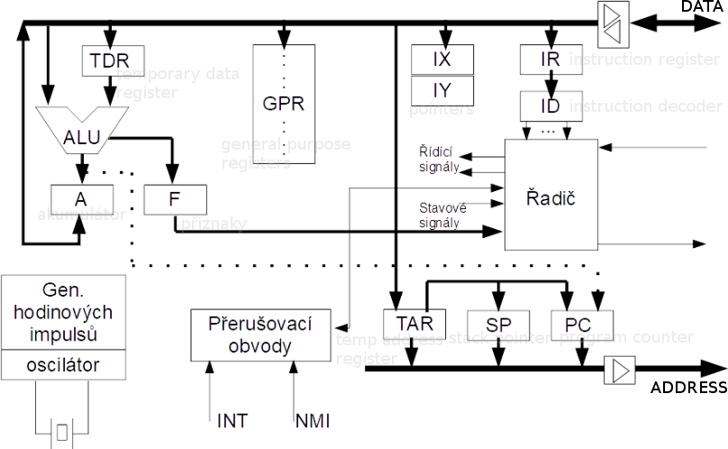

# 10

[<<<](./09.MD)
> Programátorský model procesoru, instrukce, instrukční soubor, symbolická adresa, operace v registrech, s pamětí, I/O operace. Sekvence instrukcí, algoritmizace základních úloh v jazyku symbolických adres. Časování programu, podprogramy, přerušení.

## Vnitřní schéma CPU

1. Program counter má v sobě uloženou adresu toho, co se má vykonat; to jde na adresní sběrnici
2. Po datové sběrnici přijde daná instrukce a uloží se do IR, kde zůstane po celou dobu jejího vykonávání
3. ID instrukci dál rozdělí na mikroinstrukce
4. Řadič instrukcí je jednoduchý automat, který na základě požadovaných mikroinstrukcí vygeneruje sekvenci jedniček a nul v čase tak, aby se operace vykonaly ve správném pořadí (pro každou mikroinstrukci má přiřazenou sekvenci jedniček a nul)

### ALU – Aritmeticko Logická Jednotka

* Kombinační obvod
* Provádí najednou všechno, co umí; podle instrukce je vybrán žádaný výsledek (pomocí multiplexoru)
* Obvykle: Jedno číslo je v akumulátoru, druhé se přesune do TDR

## Instrukce

* Elementární část programu, určuje co a s čím má procesor udělat a kam má uložit výsledek
* Jsou uložené za sebou v programové paměti
* Skládají se z operačního kódu a operandů
* Průběh vykonání instrukce:
  * Přečtení a dekódování instrukce
  * Načtení operandů
  * Vykonání operace
  * Uložení výsledků

### Rozdělení instrukcí

* Prázdná (`NOP`)
* Přesun dat
* Práce se zásobníkem
* Aritmetické (+ - * /)
* Logické (NOT AND OR XOR)
* Posun a rotace
* Bitové operace (nastavení konkrétního bitu, kopírování bitu, logické operace s bitem)
* Skoky (ne/podmíněný, sdružené instrukce – podmíněný skok + akce)

### Mikroinstrukce

* Pro programátora „neviditelné“
* Hodně instrukcí může mít podobné kroky, proto si je CPU rozdělí na mikroinstrukce, které pak vykoná

## Instrukční soubor

### CISC – Complex Instruction Set Computer

* __Sada komplexních instrukcí__
* Typicky velký počet instrukcí a malý počet vnitřních registrů
* Instrukce jsou různě dlouhé – různý počet operandů, různá velikost v programové paměti, různá doba vykonání
* Instrukční sada obsahuje i složité instrukce (násobení, dělení, ...), většina operací se provádí s&nbsp;akumulátorem
* Složitý řadič instrukcí, pomalejší zpracování instrukcí
* Instrukce jsou více „lidské“/čitelné, přirozenější pro člověka programujícího v assembly kódu

### RISC – Reduced Instruction Set Computer

* __Optimalizovaná sada instrukcí__ (v 1970s většina programů používala pouze 30 % instrukcí)
* Jednoduché a stejně dlouhé instrukce, lze je provádět mnohem efektivněji
* Jednodušší řadič instrukcí, délka provádění všech instrukcí je vždy jeden cyklus
* Většina instrukcí pracuje s vnitřními registry – rychlejší, žádné specializované registry
* Typické jsou tříoperandové instrukce (např. reg1 + reg2 = reg3) – Odpadají přesuny z/do akumulátoru
* Uplatnění zřetězení (problém když nastane např. skok – nutno zahodit to, co už se začalo zpracovávat)
* Instrukce jsou optimalizované pro překladač (nikoliv pro člověka)
* Kompilátory vyšších jazyků musí být složitější, pro optimalizaci mění pořadí instrukcí

## Assembly Language – Jazyk Symbolických Adres

* Psaní programu ve strojovém kódu by bylo nepraktické
* Assembly má pro každý operační kód instrukce přiřazenou několikapísmennou zkratku
  * Zároveň jsou zavedena jednoduchá jména pro registry
  * Také je možné používat symbolická návěstí – pojmenované skoky
* Program assembler pak přeloží assembly kód do strojového kódu
* Příklad assembly instrukce: `MOV X, Y` – překopíruj data z Y do X
* Operace s jedním registrem – rotace, posun, increment, decrement
* Operace s dvěma reigstry – sečti, odečti, logické operace – jeden z registrů je přepsán výsledkem
* Skoky – mohou být podmíněné, např. `CJNE` – compare and jump if not equal
* Práce s pamětí – zásobník – push a pop
* IO operace – `IN A, adresaVstupníhoPortu`, `OUT adresaVýstupníhoPortu, A`
* Podprogram – skok, kde se očekává návrat – `CALL adresa` → `RET`

## Časování

* CPU je sekvenční a synchronní obvod; potřebuje frekvenci → oscilátor
* CISC – Jeden instrukční cyklus se skládá z více taktů oscilátoru, každá instrukce může trvat různý počet instrukčních cyklů
* RISC – Vykonání instrukce trvá jeden instrukční cyklus, který je jedním taktem oscilátoru
  * Instrukce se ale skládá z několika částí, které nelze provést jedním taktem
  * Proto se frekvence musí pro účely řadiče instrukcí interně vynásobit pomocí PLL (Phase Lock Loop, fázový závěs)
* CPU používá hodinové pulzy nejen pro řadič instrukcí, ale i pro časování sběrnic/periferií, které mohou vyžadovat různé frekvence; nastavení časování u moderních CPU proto může být komplikované

## Přerušení

* Přerušení je mechanismus umožňující okamžitě reagovat na asynchronní/neočekávanou událost
* Řadič přerušení registruje aktivní požadavky (pamatuje si je) a řadí je podle priorit; identifikuje požadavky a informuje o jejich existenci procesor
* __Postup obsluhy__:
  1. Dokončí se právě vykonávaná instrukce
  2. Uloží se návratová adresa, případně i některé důležité registry
  3. CPU si z řadiče přečte typ přerušení a přiřadí mu příslušnou adresu obslužné rutiny
* Adresa je definována buď pevně (obvykle Harvard; na adrese bývá jen skok na „reálnou obsluhu“), nebo tabulkou v paměti (obvykle Von Neumann)
* U řady CPU lze přerušení vyvolat i softwarově (např. pro ladění)
* Někdy lze přímo přistupovat k Interrupt Request Register a tím požadavek nulovat nebo na něj reagovat i bez přerušení
* U některých CPU existují dlouhé instrukce, u kterých je možné přerušit jejich vykonávání např. uprostřed
* V některých případech může být obsluha přerušení také přerušena (_nested interrupt_)
  * (např. obsluha přerušení s nižší prioritou přerušena obsluhou přerušení s vyšší prioritou)
  * Riziko přetečení zásobníku
* Obsluha přerušení může (ale nemusí) být samostatné vlákno (nese s sebou všechna úskalí vícevláknového programování)

### Zdroje přerušení

1. Vnější – Změna stavu na vnějším pinu nebo požadavek od nějaké vnější periferie
2. č/č – Přetečení čítače/časovače, CAPCOM
3. Komunikační kanály – Příjem nebo odesílání informace po UART, SPI, I2C, USB, CAN, ...
4. AD převodník – Dokončení převodu

### Způsoby vyhodnocení priorit

1. Pevné
2. Libovolná priorita – Každý zdroj má svou prioritu, žádné dva nemají stejnou, lze měnit za běhu
3. Registr úrovní – Několik úrovní, ve stejné úrovni je priorita pevná, přiřazení úrovní lze měnit za běhu pomocí registru úrovní

---
[>>>](./11.MD)
