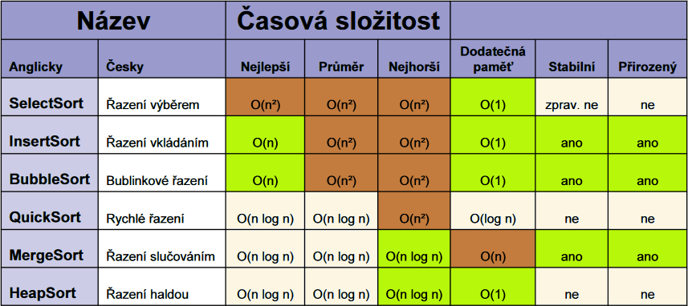

# 12

> Algoritmy pro vyhledávání a řazení, složitost algoritmů.

## Sorting (řazení)

* Sorting je řazení – seřazujeme data; třídění by znamenalo spíše jejich zařazení do skupin
* Tři „typy“ algoritmů:
  * Školní
    * Jednoduché algoritmy, obvykle kvadratická složitost
    * Vhodné pro malé množiny dat a pro pochopení principu řazení dat
  * Praktické
    * Používáno v praxi, složitost lepší než kvadratická
    * Často podporované ve standardních knihovnách jazyka
  * Teoretické, které zatím do praxe nepronikly
* Podle typu dat dělíme algoritmy na:
  * Vnitřní – použito pro data, která lze najednou uchovat v operační paměti
  * Vnější – rozsáhlá data jsou průběžně načítána z disku
* V řadě případů neřadíme jednoduché datové typy ale nějaké struktury
  * U stabilních algoritmů zůstane zachováno pořadí údajů se stejným klíčem
  * Nestabilní algoritmy toto nemohou zaručit; z většiny lze využitím pomocné datové struktury učinit stabilní
* V řadě případů jsou data částečně uspořádaná předem
  * Přirozený algoritmus je na takových datech rychlejší
  * Nepřirozený algoritmus je na nich stejně rychlý jako na datech náhodných

### BogoSort

* (nebo RandomSort, MonkeySort, StupidSort)
* Teoretický algoritmus demostrující nejhorší možné řešení
* Složitost O(_N_ ⋅ _N_!)
* Náhodně zamíchat a zkontrolovat, zdali je kolekce seřazena

### SelectSort

* Velmi jednoduchý, snadno implemetovatelný, složitost vždy kvadratická – O(_N_2)
* Vnitřní, nestabilní, nepřirozený
* __Princip:__
  * Kolekce je rozdělena na seřazenou a neseřazenou část
  * V každém kroku je v neseřazené části nalezen nejnižší prvek, který je zařazen na konec seřazené části
  * Na začátku má seřazená část 0 prvků a seřazená _N_ prvků
* __Krok:__
  * V neseřazené části najdeme nejmenší prvek
  * Vyměníme ho s prvním prvkem v neseřazené části
  * Prvek nyní považujeme za součást seřazené části (neseřazená část se zmenší o jeden)
  * Pokud `len(neseřazená) == 1`, pak máme seřazeno; jinak opakujeme krok

### InsertSort

* Jednoduchá implementace, složitost lineární až kvadratická
* Dokáže řešit data tak, jak přícházejí na vstupu – online algoritmus
* Vnitřní i vnější, stabilní, přirozený
* __Princip:__
  * Na začátku je první prvek jediným prvkem seřazené části, zbytek patří do neseřazené části
  * V každém kroku je první neseřazený prvek vložen na správné místo v seřazené části
* __Krok__:
  * První prvek neseřazené části zařadíme na správné místo v seřazené části
  * (Nejedná se o výměnu, ale zařazení, některé prvky v seřazené části se tedy mohou posunout o pozici)
  * Krok opakujeme, dokud není kolekce seřazená
* __Krok podrobněji:__
  * Aktuálně zkoumaný prvek uložíme do pomocné proměnné (může být přepsán kvůli „posunům“)
  * _podkrok:_ Podíváme se na předchozí prvek
    * Je-li větší než zkoumaný, posuneme ho doprava a opakujeme tento podkrok
      * Posunutím doprava je zde myšleno `p[x] = p[x-1]`
    * Je-li menší než zkoumaný, vložíme za něj zkoumaný prvek (máme ho v pomocné proměnné)
* Místo „posunutí“ by zařazení šlo řešit i postupnými záměnami se zkoumaným prvkem (probubláním), pak by nebyla potřeba pomocná proměnná, kód by ale obsahoval více operací přiřazení

### BubbleSort

* __Princip:__
  * Na začátku je celá kolekce neseřazená (seřazená část je prázdná)
  * V každé iteraci se postupně porovnávají všechny sousední dvojice prvků v neseřazené části
  * Pokud menší prvek následuje po větším, proběhne výměna
  * S každou iterací na konec kolekce probublá největší prvek neseřazené části
  * Seřazená část se tak zvětší o jedna
  * Pokud v iteraci neproběhne žádná výměna, můžeme ukončit předčasně
* Složitost lineární až kvadratická, je ale pomalejší než InsertSort (více elementárních operací s daty)
* Vnitřní, stabilní, přirozený

### ShakerSort

* ShakerSort narozdíl od BubbleSortu neřadí pole pouze jedním směrem, ale oběma
* Každá iterace algoritmu se tedy skládá ze dvou fází – při dopředné se dostane největší prvek na konec a při zpětné se dostane nejmenší prvek na začátek
* Tímto postupem se předejde nedostatku BubbleSortu – tzv. problému zajíců a želv – který spočívá v tom, že vysoké hodnoty probublají na konec pole rychle, ale ty nízké postupují na začátek velmi pomalu
* Kvadratická složitost

### CombSort

* Vylepšení BubbleSortu, opět řeší problém zajíců a želv, ale jinak než ShakerSort
* Závádí postupně snižující se přírůstek (skok) – neprovnávají se sousedi, ale prvky vzdálené o tento skok
* Díky skoku jsou želvy přesouvány rychleji na svou stranu
* Při každé iteraci se skok dekrementuje, až je degradován na prostý BubbleSort
* Délka skoku začíná na ¾ délky kolekce, s každou iterací se násobí ¾
* Principu zmenšujícího se přírůstku využívá i varianta InsertSortu zvaná ShellSort

### QuickSort

* Rozděl a panuj – vhodné pro paralelizaci
* Klíčovým problémem je volba pivota – první/poslední/náhodný prvek, medián pole, ...
* Výběr pivota určuje složitost algoritmu
* Nejhorší složitost je kvadratická (např. sortování seřazeného pole), očekávaná a nejlepší složitost je O(_N_ log _N_)
* Logaritmická složitost sice nelze zaručit, podle testů se ale jedná o nejrychlejší z obecných řadících algoritmů
* Vnitřní, nestabilní, nepřirozený
* Kroky:
  1. Zvolit pivota
  2. Vše menší nebo rovno jak pivot jde do levého chlívku, vše větší do chlívku pravého
  3. Na každém neatomickém chlívku začneme krokem 1, dokud nemáme jen chlívky o velikosti 1
  * Chlívky nakonec poskládáme: levý chlívek jde před pivota, pravý za pivota (začneme od nejhlubšího chlívku)

### MergeSort

* Rozděl a panuj – paralizovatelný
* Složitost vždy O(_N_ log _N_)
* Větší paměťové nároky – obvykle potřebuje odkládací ADT o velikosti _N_
* Implicitní řazení v řadě jazyků
* Stabilní, přirozený
* Základní myšlenka:
  * Seřadit kratší posloupnost zabere méně kroků
  * Spojit dohromady dvě seřazené posloupnosti tak, aby výsledek byl seřazený, je snadnější, než když jsou posloupnosti neseřazené
* Oproti QuickSortu, který řadí při rozdělování, MergeSort rozděluje vždy na poloviny a řadí až při slučování
* Potřebujeme tedy nějakou podpůrnou funkci merge

### Heap (halda)

* Speciální případ stromu, který splňuje vlastnosti haldy:
* Pokud B je potomek A a funkce h(X) udává hodnotu uzlu X, pak platí, že:
  * `h(A) >= h(B)` pro max-heap, nebo
  * `h(A) <= h(B)` pro min-heap
* Chová se jako prioritní fronta, kořenem je prvek s nejvyšší prioritou (nejvyšší hodnota u max-haldy, nejnižší u min-haldy)
* Binární halda je binární strom splňující vlastnosti haldy, zároveň by měl být vyvážený
* Konstrukce:
  * První vytvoříme kořen
  * Následující přidávané potomky vkládáme na spodní úroveň haldy
  * Přidaného potomka porovnáme s rodičem; pokud je splněna vlastnost haldy, končíme; jinak prvky prohodíme a tento krok opakujeme
    * Maximální počet kroků je tedy roven výšce stromu; logaritmická složitost
    * Reálně je vkládání rychlejší – přesuny se odehrávají většinou dole, kde je strom košatý, a někdy nemusí být vůbec potřeba

### HeapSort

* Řazení pomocí binární haldy
* Nestabilní, nepřirozený
* Složitost vždy O(_N_ log _N_)
* Pokud využijeme vstupní pole, nemá žádné další paměťové nároky
* Horší možnosti paralelizace
* V průměru pomalejší než QuickSort, ale vhodnější pro rozsáhlé kolekce neznámých dat
* __Princip__:
  * Prvky vstupní posloupnosti jsou uspořádány do haldy
  * Kořen haldy je odebrán a vložen do výstupní posloupnosti, halda se rekonstruuje, kořen se znovu odebere atd.

## Vyhledávání

* Hledání klíče _k_ (může být i rozsah klíčů) v množině klíčů _S_ (search space, typ množiny určuje zvolený algoritmus a jeho implementaci)
* Prohledávaný prostor dělíme na statický (za běhu se nemění hodnota ani pořadí, změna vytváří novou verzi prostoru) / dynamický (změna v čase)
* __Lineární vyhledávání__
  * Jednoduchý a často používaný způsob (pokud neprohledáváme obří data)
  * Postupně procházíme všechny prvky _S_, dokud nenajdeme _k_
  * Lineární složitost O(_N_), pracuje na obecné (neseřazené) množině
  * Prohledávaná data mohou být dynamická v tom smyslu, když budou přicházet nová (do neprohledané části)
  * Co můžeme chtít: bool našel/nenašel, index nálezu, vrátit nalezený objekt, kolikrát nalezeno, na kterých indexech nalezeno
* __Binární vyhledávání__
  * Prohledávaný prostor musí být seřazený
  * Metoda půlení intervalu
    1. Zvolit dělící prvek (prostřední)
    2. Je zvolený prvek shoda?
    3. Je hledaný klíč větší nebo menší než zvolený prvek?
    4. Zahodit nepotřebnou část search space a opakovat
  * Logaritmická složitost, je nutno přičíst režii sortovacího algoritmu
  * Vyplatí se, pokud v seřazené množině budeme hledat opakovaně
    * Pokud počet hledaných hodnot je větší než log2(_n_)
  * Není vhodné u dynamických množin (operace s daty může porušit seřazení, odebírání prvků ok)
* __Interpolační vyhledávání__
  * Varianta binárního, snaha simulovat lidské chování (vyhledávání ve slovníku)
  * Narozdíl od binárního se dělící prvek nevolí uprostřed, ale existuje vzorec pro určení pivota, který bere v úvahu velikost prostoru a jeho minimální a maximální hodnotu

### Strom

* Strom je souvislý graf bez kružnic, hierarchická struktura s jedním kořenem
* V binárním stromu má každý uzel 0 (list) až 2 potomky a jednoho rodiče (kořen rodiče nemá)
* Realizace pomocí pole nebo ukazatelů/referencí; snadná definice pomocí rekurze
* Každý potomek je podstromem
* Vlastnosti:
  * N-arita – maximální počet potomků, u binárního = 2
  * Hloubka – počet "pater", samotný kořen má hloubku 0
  * Pravidelnost – strom je pravidelný, pokud každý uzel je buď list, nebo má maximální počet potomků
  * Vyváženost
    * Několik druhů měření vyváženosti (např. poměry počtu levých a pravých potomků)
    * Vyvážený strom má vyhledávání s logaritmickou složitostí
    * Vyvážený strom může být použit pro konstrukci asociativního pole
* Binární strom pomocí pole – vztah rodiče s jeho potomky definují funkce 2i+1 a 2i+2
* Operace: search, add, delete, prořezávání (vyjmutí části), roubování (přidání části), depth, numel; je třeba umět stromem procházet
* Procházení:
  * Do hloubky – Začínáme v kořeni a procházíme jednotlivé podstromy (rekurzivně), jsou tři metody pořadí zpracování uzlů:
    1. Preorder – nejprve uzel, pak podstromy
    2. Inorder – levý podstrom, uzel, pravý podstrom
    3. Postorder – nejprve oba podstromy, pak uzel
  * Do šířky – procházení po jednotlivých patrech
* __Binární vyhledávací strom__
  * Všechny uzly levého podstromu mají menší a všechny uzly pravého podstromu mají větší hodnotu, než je hodnota jejich předchůdce
  * Projetím metodou inorder dostaneme seřazenou množinu prvků
  * Využití – hledání určitého klíče, hledání minima a maxima, řazení (konstrukce a inorder; pomalejší než heapsort)
  * Implementace – stejné jako klasický binární strom, rozdíl v pravidlech pro metody přidání/odebrání prvku

## Hašování

* Hašovací funkce je zobrazení z množiny klíčů do množiny adres
* Kolize nastane, pokud hašovací funkce vrátí stejný výstup pro více vstupů (hodnota již obsazena)
* Zřetězené hašování
  * Pod hashem se neskrývá jedna adresa, ale kolekce adres
  * V případě kolize přidáme adresu do kolekce
  * Při hledání sekvenčně procházíme konkrétní kolekci
* Otevřené hašování – Open address hashing
  * Při kolizi hledáme nějakou metodou nejbližší možnou pozici, která je zatím volná
  * Metodou může být lineární prohledávání (linear probing) nebo dvojí hašování (double hashing)
* Linear probing – posouváme se v paměti a hledáme nejbližší volnou pozici
  * Vyhledávání funguje analogicky, posouvám se až narazím na hledanou hodnotu
* Double hashing – první funkce určí původní pozici a druhá (odlišná) hašovací funkce určí offset

## Prohledávání řetězců

* __Přirozené prohledávání__ (bruteforce)
  * Postupně procházíme všechny znaky stringu a pro každý testujeme, zda jím nezačíná hledaný vzor
    * Pokud ano, tak zkoušíme ostatní znaky vzoru, pokud se shodují všechny, našli jsme substring
  * Vzor se posouvá vždy o jednu pozici
  * Složitost v nejhorším případě O(_MN_), v praxi obvykle O(_M_+_N_)
  * Algoritmus je rychlejší pro velké abecedy (protože dochází k méně shodám)
* Jak zrychlit?
  * U přirozeného hledání opakovaně procházíme již prohledané části stringu
  * Klíčem je chytré řízení procesu, toho dosáhneme heuristickou analýzou textu a hlavně vzoru, která je prováděna předem (preprocessing)
  * Jde o to, jestli si občas můžu dovolit se vzorem poskočit o více jak jednu pozici
* __KMP – Knuth-Morris-Pratt__
  * Stejný princip jako bruteforce
  * Řízení procesu:
    * Nastupuje, pokud se vyskytne neshoda na pozici vzor\[_j_\] (_j_ = index neshody)
    * Vzor posuneme tak, aby se pod indexem neshody nacházel takový index vzoru, který je roven délce největšího možného prefixu ve vzor\[0:_j_-1\], který je roven suffixu ve vzor\[1:_j_-1\]
  * KMP preprocessing – chybová funkce
    * Vzor známe předem, uděláme i analýzu pre/suffixů předem
    * Chybová funkce (failure function) _F(k)_ je definována jako délka nejdelšího prefixu vzor\[0:_k_\], který je také suffixem vzor\[1:_k_\]
    * Pro každý index neshody si vypočítáme _F(k)_ a uložíme do tabulky
  * Složitost O(_M_+_N_)
  * Vhodný pro sekvenční vyhledávání v dlouhých datech
* __Boyer-Moore__
  * Základní myšlenka – hledáme zrcadlově, začínáme na konci vzoru a postupujeme zpět k jeho začátku
  * V okamžiku neshody můžeme přeskočit celé skupiny znaků, které se neshodují (opět na základě preprocessingu)
  * Existují tři situace, ve kterých se vzor a jeho znaky v okamžiku neshody můžou nacházet
    1. Znak string\[_j_\] ve vzoru existuje a nachází se jinde v ještě neotestované části, pak můžeme vzor posunout doprava tak, aby se znak nacházel pod stejným znakem ve stringu (pokud jich je víc, vybereme ten nejblíž k neshodě – nejvyšší index)
    2. Onen znak ve vzoru existuje, ale v části, která již byla otestovaná; posouváme se doprava o jeden
    3. Onen znak ve vzoru vůbec není, posouváme celý vzor za znak neshody (již nemá cenu testovat)
  * Preprocesing – opět určujeme posuny předem pomocí analýzy vzoru
    * Musíme znát použitou abecedu
    * Používáme zobrazení všech znaků použíté abecedy do množiny celých čísel
    * Pro libovolný znak _x_ z použité abcedy zavedeme funkci _F(x)_ vracející největší index _i_, pro který platí vzor\[_i_\] == _x_ nebo -1 (pokud nic nenajde)
    * Sestavíme tabulku pro všechny znaky abecedy
  * Složitost v nejhorším případě O(_MN_)
    * Rychlejší pro velké abecedy, nevhodné pro binární data
* __Rabin-Karp__
  * Používá hashování
  * Vypočítáme hash pro vzor délky _m_ a poté pro každý substring o délce _m_
    * Nevhodné pro dynamická data
    * Vhodné pro opakované prohledávání stejného textu (výpočet hashů nějakou dobu trvá)
  * Procházíme stringem a místo jednotlivých znaků porovnáváme hashe
  * V případě shody ještě porovnáme jednotlivé znaky (ochrana proti kolizi)
  * Volba hashovací funkce ovlivňuje efektivitu
    * Můžeme chtít zvolit kryptografickou hashovací funkci, která eliminuje kolize, za cenu delšího preprocessingu (vyplatí se, pokud budeme prohlédavat string opravdu hodněkrát)
    * Lze např. zvolit funkci, která počítá následující hashe s pomocí již vypočtených předchozích hashů
  * Na stejných datech běží pomaleji než KMP (kvůli režii výpočtů), po vnesení faktoru opakování ale může být rychlejší
  * Lze rozšířit na hledání více vzorů najednou

## Složitost algoritmů

* Potřebujeme metriku, jak určit rychlost algoritmu
* Složitost algoritmu určuje jeho rychlost na určitých datech

### Asymptotická složitost

* Rostoucí funkce; osa x = počet vstupních dat, osa y = počet operací na těchto datech; pomalejší růst funkce znamená rychlejší algoritmus
  * Sečíst všechny elementární operace: porovnání, aritmetická operace, přesun čísla v paměti (přířazení)
  * Zjednodušení 1: počítáme pouze operace nad vstupními daty (ty se narozdíl od vnitřních velikostně mění)
  * Zjednodušení 2: počítáme pouze porovnávání nad vstupními daty (nejnáročnější)
  * Zajímá nás řád růstu funkce – zanechat konstanty a to, co přičítáme a roste pomaleji (nebo stejně)

### Amortizovaná složitost

* Průměrný čas potřebný pro vykonání určité operace v delší sekvenci operací
* Nevyužívá pravděpodobností a předpokladů; vyžaduje znalost toho, které sekvence operací jsou vůbec možné
* Používá se v případě, kdy některá konkrétní operace (typicky na datové struktuře) má v nejhorším případě velkou složitost, ale na vykonání této operace si dokážeme našetřit z předchozích operací
  * Některé datové struktury mají totiž takovou vnitřní organizaci, že na ní závisí složitost, a organizovanost dat se může během posloupnosti operací měnit
  * Základní myšlenka: operace s velkou složitostí změní stav struktury tak, že tento nejhorší případ nemůže nastat po dlouhý čas, tudíž amortizuje svou cenu
* Např. ArrayList:
  * Při překročení kapacity dojde k realokaci O(_N_)
  * Samotné vkládání nových prvků je ale O(1) a sekvence vkládání _N_ prvků bez realokace tedy dělá O(_N_)
  * Vložení _N_ prvků včetně realokace dělá O(_N_) + O(_N_) = O(_N_)
  * Amortizovaná složitost pro jeden prvek je tedy O(_N_)/_N_ = O(1)
  * Asymptotická složitost je v nejhorším případě O(_N_)

---
[>>>](./13.MD)
