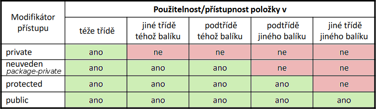

# 15

> Objektově orientované programování, význam a základní principy: zapouzdření, dědičnost a polymorfismus, správa přístupu. Abstraktní třídy a rozhraní. Genericita a její využití.

## OOP – Objektově Orientované Programování

* OOP je programovací paradigma založené na objektech, které obsahují atributy a metody
* Pozn.: Pokud není specifikováno jinak, používaným jazykem v této sekci je Java

### Třída

* Vzor pro instance
* To, co navrhujeme a programujeme
* Vytvořením třídy v podstatě přidáme do našeho programu nový datový typ, instance dané třídy jsou tohoto typu
* Atributy – proměnné pro uchování vnitřního stavu instance
* Metody – podprogramy deklarované uvnitř nějaké třídy, mohou pracovat s atributy

### Instance třídy (objekt)

* Konkrétní datový objekt v paměti odvozený z nějakého vzoru – třídy
* Uchovává svůj vnitřní stav v podobě atributů
* Poskytuje operace v podobě metod
* Ne vždy musíme chtít vytvářet instance (knihovní třída)

### Rozhraní třídy (obecně)

* Popisuje, jak vypadá třída zvenku
* Popisuje její veřejné API, tedy jaké public metody třída obsahuje

### Zapouzdření

* Seskupení souvisejících idejí – atributů a metod – do jediné jednotky, na kterou lze odkazovat jediným odkazem
* Představuje zabalení vnitřního stavu (atributů) a operací (metod) do jednoho objektu tak
* Číst a aktualizovat vnitřní stav objektu mohou pouze jeho operace
* Operace, které jsou součástí rozhraní, jsou přístupné „zvenku“

### Správa přístupu



### Kompozice

* O kompozici mluvíme v případě, kdy třída zapouzdřuje atribut, který odkazuje na instanci jiné existující třídy
* Kompozice – skládání – instance existující třídy se stává členem nové třídy
* Sdružování objektů pomocí kompozice je jedním ze základních přirozených vztahů mezi třídami

### Dědičnost

* Třídu lze odvodit z jiné třídy – `extends`
* Podtřída pak dědí atributy a metody své nadtřídy
* Každá třída může mít pouze jednu nadtřídu (v C++ toto např. neplatí, pak je nutné si dávat pozor na tzv. diamond problem)
* Koncept znovupoužitelnosti – méně redundantního kódu
* Podtřída dědí vše, co je public a protected; k private členům nemá přímý přístup
  * Pokud je ve stejném balíku jako nadtřída, dědí také _package-private_ členy
* Konstruktory se nedědí
* V podtřídě:
  * V konstruktoru lze volat konstruktor nadtřídy – `super`
  * Lze přímo používat zděděné atributy a metody
  * Lze definovat kompletně nové atributy a metody – rozšíření
  * Lze definovat atributy a metody se stejnou signaturou – překrytí nebo skrytí – override nebo hide
* Do proměnné typu nadtřídy můžeme uložit objekt libovolné z podtříd (opačně nikoliv)
  * Pak můžeme přistupovat jen ke členům, které jsou definované už v nadtřídě (instancí je sice podtřída, je ale uložená v proměnné typu nadtřídy)
  * V tomto případě se projevuje rozdíl mezi override a hide:
* Pokud `B extends A` a `A inst = new B();`
  * Při zavolání hidden metody se zavolá původní implementace z `A`
  * Při zavolání overriden metody ze zavolá překrytá implemenatce z `B` – __polymorfismus__
  * Takovéto přiřazení nám může připadat nezvyklé, větší smysl už by mohlo dávat toto:
  
```java
var list = new ArrayList<A>();
list.add(new B());
```

* Co je overriden a co je hidden je dáno pevně:
  * Klasické (instanční) metody jsou vždy overriden
  * Statické metody jsou vždy hidden
  * Atributy jsou vždy hidden
* Overriden metody bychom měli označovat anotací `@override`, lze v nich volat původní metodu pomocí `super`
* Pokud nechceme, aby metoda šla overridovat, označíme ji jako `final`
  * `final` také používáme pro označení třídy, ze které nemá jít dědit

### Polymorfismus

* Umožňuje zpracovávat instance různých tříd, které mají společnou nadtřídu nebo rozhraní, stejným způsobem
* Konkrétně volaní metody se stejným jménem, ale různou implementací
* Volaná metoda je určena až za běhu programu podle toho, jaký typ instance obsahuje příslušná proměnná
* Příkladem je `toString()`:
  * Všechny třídy dědí z obecného `Object`
  * Do proměnné `Object obj;` tedy lze vložit cokoliv
  * Díky polymorfismu se použitím `System.out.println(obj);` zavolá metoda `toString()` třídy takové, jejíž instance je uložena v proměnné `obj`
    * Buď se jedná pouze o zděděnou metodu od `Object`, nebo overriden metodu

### Abstract

* Abstraktní metoda `abstract` neobsahuje tělo, hlavička je ukončená středníkem
* Pokud nějaká třída obsahuje abstraktní metody, musí být také označena jako `abstract`
  * Nelze z ní tvořit instance
  * Je myšlena jako základ pro ostatní (pod)třídy

### Interface

* Datový typ pro rozhraní
* Lze chápat jako „dohodu“ o tom, jak spolu budou části kódu komunikovat (analogie k IEEE 802.11)
* Definice obsahuje především signatury metod
* Třída implementující interface musí implementovat všechny jeho metody
  * Všechny její instance jsou pak kompatibilní s tímto interface
  * Do proměnné typu interface pak lze instanci této třídy přiřadit
  * Pak lze vytvářet polymorfní kód, který pracuje s různými objekty, které implementují stejný interface
* Každá třída může implementovat libovolný počet interfaců – `implements`
* Např. interface `Comparable`
  * Metoda `compareTo()` slouží pro porovnání s jinou instancí
  * Pokud naše třída implementuje toto rozhraní, je zajištěno, že kolekce instancí této třídy půjde seřadit (námi definovaným způsobem)

### Genericita

* Umožňuje upřesnit definici třídy až za běhu
* Při deklaraci třídy/rozhraní a jejich metod lze použít generický datový typ (obvykle `T`, může se jednat i o množinu typů), který je určen až při používání třídy (vytváření instance)
* Zápis do ostrých závorek, typický příklad `ArrayList<int>`, `ArrayList<String>`, ...
  * Bez použití genericity by byly jednotlivé položky ukládány jako `Object` a nešlo by přistupovat k jejich specifickým členům

## Využití

* // TODO

## Rozdíly v C\#

* Neuvedení modifikátoru přístupu znamená private, nikoliv _package-private_
  * V jazyce C# nejsou balíky, tedy ani _package-private_ modifikátor
  * Jazyk přidává modifikátory `protected internal`, `internal`, `private protected` a `file`
* Místo `extends` a `implements` se píše dvojtečka
  * U rozhraní je zvykem, aby jejich název začínal na `I`
* Místo `super` se na nadtřídu odkazuje klíčovým slovem `base`
* U klasických (instančních) metod lze určit, zdali budou overriden nebo hidden
  * Pro override slouží klíčové slovo `override`
  * Pro hide slouží klíčové slovo `new`
* Aby mohla být metoda overriden, musí být v nadtřídě označena jako `virtual`
  * Opačný případ než u Javy, kde je vše automaticky virtuální a lze to změnit pomocí `final`
* Pro označení třídy, ze které nelze dědit, slouží klíčové slovo `sealed`

---
[>>>](./16.MD)
