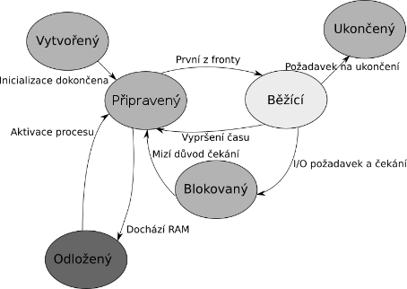
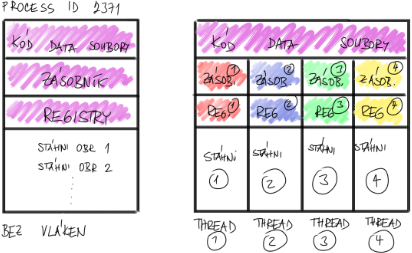

# 19

[<<<](./18.MD)
> Správa procesů v operačním systému, vztah programu a procesu, životní cyklus procesu.

## Proces

* Program je kód přeložený do binární podoby, který se svými daty leží nečinně někde v úložišti
* Proces je konkrétní spuštěný program, který má přidělen prostor v RAM; má zde svůj kód a veškerá svá data
* Proces jsou v podstatě „jen“ data v RAM, rozlišujeme ale data procesu a data __o__ procesu
  * Data procesu jsou jeho kód, hodnoty proměnných, data, ukazatele na soubory, ...; uloženo v nechráněné části
  * Data o procesu si vede jádro OS a jsou uložena ve chráněné části; záznam se často označuje jako PCB – Process Control Block
    * PCB = PID + informace o přidělené paměti a kde se skutečně nachází + seznam zdrojů užívaných procesem

### Životní cyklus procesu

1. Vytvořený
   * Bylo požádáno o spuštění procesu a data se kopírují z úložiště do RAM, jádro přidělí PID a vytvoří si PCB
   * Vyvoláno uživatelem nebo jiným programem, dále aktivitu přebírá jádro
   * Ukončeno po dokončení nastavení, kdy procesu může být přiděleno CPU; jádro zařadí proces do fronty
2. Připravený
   * Nejčastější stav
   * Proces stojí ve frontě a čeká na procesorový čas
   * Poprvé je do fronty proces přidělen po jeho vytvoření; následně vždy, když vyprší jeho procesorový čas; do fronty je také zařazen po jeho odblokování, nebo programem pro přepínání procesů či pro obsluhu událostí od zařízení
   * Ukončeno přidělením procesorového času nebo násilným ukončením procesu
3. Běžící
   * Procesu byl přidělen procesorový čas a je vykonáván jeho kód
   * Vyvoláno, když část jádra odpovědná za přepínání procesů vybere proces z fronty
   * Ukončeno vypršením procesorového času nebo přerušením
4. Odložený
   * Data procesu přesunuta z RAM do úložiště; OS dochází RAM a je nutné uvolnit místo pro jiné procesy
5. Blokovaný (Čekající)
   * Proces na něco čeká (např. požádal o přístup k disku skrz API) a bylo by nevýhodné, kdyby po celou dobu čekání blokoval CPU
   * Jakmile jsou prostředky pro proces připraveny, jádro ho přesune zpět mezi připravené
6. Ukončený
   * Odkaz na proces smazán z fronty, data ale ještě jsou v RAM (proces existuje, ale už nebude spouštěn)
   * Vyvoláno uživatelem nebo jiným procesem
   * Ukončeno po úspěšném smazání procesu
7. Zombie
   * Ukončený proces, jehož záznam zatím nebyl smazán
   * Čeká se, až si rodičovský proces vyzvedne jeho return code

### Plánovací strategie

* Plánovač úloh plánuje, který z procesů dostane v nejbližším kroku přidělen CPU a na jak dlouho
* Při návrhu pořadí fronty na CPU nás zajímá:
  1. Využití procesoru – chceme se přiblížit ideálnímu stavu, kdy CPU na nic nečeká a jen pracuje
  2. Průtok nebo průchodnost – počet procesů obsloužených za jednotku času (nechceme, aby fronta narůstala)
  3. Čas zpracování – celkový čas, který proces potřebuje k dokončení své práce (zahrnuje čekání ve frontách na CPU/IO/RAM a čas v CPU), zlepšení času jednoho procesu ale zhorší čas těm ostatním a klesá průchodnost
  4. Čekání na procesor
  5. Doba odezvy – doba od chvíle, kdy procesu předáme vstupní data, do chvíle, kdy proces zareaguje a začne odpovídat
* Ideálu dosáhnout nelze, existují ale různé strategie pro plánování procesů:
  1. Jednoduchá fronta – first come, first served
     * Výhoda je jednoduchost a tím pádem nenáročnost; nic o procesu nemusíme vědět
     * Nevýhodou je, že pomalý proces může blokovat ty rychlé; používá se tam, kde není dostatek výkonu pro plánování
  2. Shortest job first – řazení podle času potřebného na dokončení procesu
     * Výhoda: velmi dobrá průchodnost
     * Nevýhodou je, že se pomalé procesy nemusí dostat na řadu; také je potřeba nějak zjišťovat, kolik času budou procesy potřebovat; řazení fronty je operace navíc
  3. Round robin – podobné frontě, ale procesy se pravidelně střídají po daném časovém úseku
     * Výhoda: jednoduchá implementace, spravedlivé sdílení CPU
     * Nevýhoda: rychlé procesy musí čekat „celé kolo“
  4. Plánování s prioritou – priorita umožňuje předbíhat ve frontě, její hodnota je uložena v PCB
     * Výhoda: Do CPU se dostane nejdůležitější proces
     * Nevýhoda: Nízkoprioritní procesy se nemusí dostat na řadu (proto se priorita někdy dynamicky navyšuje), řazení fronty je operace navíc

### Vlákna

* Složitější programy lze často rozdělit na dílčí nezávislé činnosti, u kterých by byla výhodná paralelizace
* Autoři programů by si mohli vytvářet vlastní „procesy v procesech“, tím by ale v rámci své aplikace v podstatě programovali část OS
* Proto lze v OS kromě procesů vytvářet také odlehčené procesy zvaná vlákna; autor aplikace s nimi pracuje pomocí OS API
* Procesy mají oddělenou paměť, ale vlákna ji mezi sebou sdílejí
  * Nesdílejí ji ale celou: každé vlákno má úsek paměti, kam ukládá svůj kontext; dále musí mít oddělené zásobníky; ostatní data ale sdílejí

### Souběh a uváznutí v OS

* Souběh i uváznutí vznikají v důsledku chybné synchronizace práce jednotlivých procesů

#### Souběh (Race Condition)

* Dva procesy/vlákna přistupují ke stejným datům, aniž by o sobě věděly a vzájemně ruší výsledky svých operací
* Souběh je vždy chyba autorů kódu
* Oblast dat, o níž víme, že k ní mohou současně přistoupit nejméně dva různé objekty, se nazývá kritická data
* Každý úsek kódu přistupující ke kritickým datům se nazývá kritická sekce
* Důsledkem souběhu jsou nekonzistentní data
* Řešíme pomocí zámku nebo semaforu, to nám poskytuje OS API
  * Zámek poskytuje držiteli výlučný přístup k datům, ostatní procesy musí počkat (buď aktivně ve frontě – _spin lock_, nebo jsou přesunuty mezi blokované – _mutex_)
  * Zámek lze chápat jako semafor s kapacitou jedna

#### Uváznutí (Deadlock)

* Situace, kdy se procesy zastaví, neboť si navzájem blokují zdroje, bez nichž nemohou prokračovat ve své práci
* Procesy na sebe navzájem čekají a zároveň nemohou dostat přidělený procesorový čas
* K uváznutí může dojít, když jsou současně splněny tyto podmínky:
  1. Procesy mají zajištěn výlučný přístup ke zdrojům
     * Nutné kvůli obraně proti souběhu
  2. Proces může zdroj držet po neomezenou dobu a kdykoliv požadovat další zdroj
     * Bez požadování dalších zdrojů by docházelo k jejich plýtvání, všechny prostředky by musely být zabrány během vytvoření procesu
  3. Zdroje nemohou být procesu odebrány násilím (jádrem, jiným procesem)
     * OS nedokáže bez pomoci uživatele poznat, který proces je důležitější než ostatní
  4. Existuje kruh čekajících procesů
     * Jediná šance zabránění uváznutí, systém musí být schopen detekovat práci se zdroji, předvídat uváznutí a mít naprogramovaný nějaký opravný proces

##### Detekce uváznutí

* OS musí v paměti udržovat informaci o stavu přidělených prostředků a jejich vazbách na jednotlivé běžící procesy
* Nejčastěji se používá datová struktura graf přidělelných prostředků (RAG – Resource Allocation Graph)
  * Graf je orientovaný a dojde-li k uváznutí, objeví se v grafu cyklická struktura
  * Detekce je výpočetně i paměťově velmi náročná, graf může mít v praxi i tisíce uzlů a hran

##### Řešení problému

1. Cílené odebrání prostředků jednomu z procesů
   * V praxi se nepoužívá – složitá detekce, kdo bude prostředky odebírat?, komu je odebere?
2. Cílené ukončení jednoho z procesů
   * Když necháme rozhodnutí na správci či uživateli, máme první celkem praktické řešení
3. Watchdog timer, restart systému

##### Obranná opatření

* V malých OS, kde typicky překládáme aplikace i se systémem, lze zabránit druhé z Coffmanových podmínek; může to být dobré a bezpečné řešení, jediným problémem je plýtvání zdrojů
* Čtvrté podmínce lze kromě detekce pomocí grafu předcházet „bankéřovým algoritmem“ (prostředky na příděl podle jejich dostupnosti), je ale také náročný a v praxi se moc nepoužívá

---
[>>>](./20.MD)
