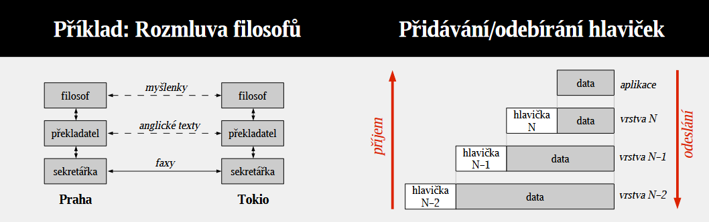

# 20

> Principy vrstvené architektury počítačových sítí, referenční model OSI. Charakteristika lokálních počítačových sítí.

## Vrstvená architektura počítačových sítí

* Architektura sítě je zpravidla organizována do úrovní (vrstev)
* Jedna vrstva řeší vždy vymezenou část problému
* Vrstvená architektura rozkládá komunikaci na jednodušší podproblémy
* Prvky ze stejných vrstev spolu komunikují pomocí protokolů
* __Protokol__
  * Určuje, jak se domlouvají dvě zařízení na stejné vrstvě – hlavičky, dotazy, odpovědi, příkazy, ...
  * Implementačně nezávislý
* Vrstvy jsou navzájem nezávislé, změna protokolu v jedné z nich se nedotkne ostatních

### Komunikace mezi vrstvami

* Skutečný přenos zajišťuje nejnižší vrstva
* Vrstva dostává od nadřízené vrstvy data k doručení, kterým nerozumí a ke kterým přidává vlastní informaci – zapouzdření
  * Tato data pak předává podřízené vrstvě
* __PDU – Protocol Data Unit__
  * Datová jednotka protokolů užívaná v konkrétní vrstvě
  * Skládá se z hlavičky a surových dat – PCI (Protocol Control Information) + SDU (Service Data Unit)
  * Nižší vrstva bere PDU vyšší vrstvy jako své SDU a přidává k nim vlastní PCI

## Referenční model OSI

<table>
    <thead>
        <tr><th colspan=2>OSI</th><th>PDU</th><th>TCP/IP</th></tr>
    </thead>
    <tbody>
        <tr><td><b>7</b></td><td><b>Aplikační</b></td><td rowspan=3>Zpráva</td><td rowspan=3><b>Aplikační</b></td></tr>
        <tr><td><b>6</b></td><td><b>Prezentační</b></td></tr>
        <tr><td><b>5</b></td><td><b>Relační</b></td></tr>
        <tr><td><b>4</b></td><td><b>Transportní</b></td><td>TCP segment / UDP datagram</td><td><b>Transportní</b></td></tr>
        <tr><td><b>3</b></td><td><b>Síťová</b></td><td>Paket</td><td><b>Síťová</b></td></tr>
        <tr><td><b>2</b></td><td><b>Linková</b></td><td>Rámec</td><td rowspan=2><b>Vrstva síťového rozhraní</b></td></tr>
        <tr><td><b>1</b></td><td><b>Fyzická</b></td><td>Bit, symbol</td></tr>
    </tbody>
</table>

* International Organization for Standardization / Open System Interconnection (1983)
* Snaha o vytvoření jednotného standardu pro bezchybnou komunikaci v PC sítích napříč prvky od různých výrobců
* Dekompozice implementace sítě do sedmi vrstev umožňující snadnější pochopení a větší modularitu
* Nedefinuje konkrétní protokoly, jen vymezení funkcí
* V praxi se neujalo, zůstalo ale jako obecný model

### 1. Fyzická vrstva

* Přenáší jednotlivé bity mezi zařízeními pomocí fyzického přenosového média
* Řeší fyzické poslání dat, neřeší jejich význam
* Převádí bity na elektrické/rádio/optické signály (měď/bezdrát/optika)
* Definuje např. vlastnosti média (maximální délka kabelu, hodnoty napětí), kódování signálu (modulace, šířka pásma), rozložení pinů u&nbsp;fyzických konektorů a jejich tvar
* Oznamuje chybové stavy linkové vrstvě
* Na této vrstvě pracuje opakovač a rozbočovač

### 2. Linková (spojová) vrstva

* Využívá spojení z fyzické vrstvy pro přenos větších bloků dat – rámců
* Dolní podvrstva MAC a horní podvrstva LLC
* Ethernet, Wi-Fi, ZigBee, ...
* Na této vrstvě pracuje most a přepínač

### 3. Síťová vrstva

* Propojuje nesousední systémy – komunikace dvou uzlů, které nejsou přímo spojeny, prostřednictvím jiných uzlů
* Logická adresace – IP protokol – IP adresa
* Směrování – určení cesty paketu – hledání cest, vyvažování zátěže
* Na této vrstvě pracuje směrovač a L3 switch

### 4. Transportní vrstva

* Řeší odeslání dat ze zdroje do cíle takovým způsobem, jaký si vyžadují vyšší vrstvy
* Nejnižší vrstva, kterou se nezabývají síťové prvky, ale pouze koncová zařízení (pokud nebereme v potaz Layer 4 switching)
* Přijímá data z relační vrstvy a rozkládá je na pakety pro síťovou vrstvu
* Stará se o (bezchybný) přenos zprávy (kontrola chyb, sestavení zprávy po přenosu)
* TCP / UDP
* Implementována v PC

### 5. Relační vrstva

* Udržuje / obnovuje / uzavírá spojení transportní vrstvy
* Dialogue control – full-duplex / half-duplex / simplex
* Synchronizační body – záchytné body, odkud lze obnovit dialog

### 6. Prezentační vrstva

* Při odesílání transformuje data do standardních formátů vhodných pro přenos
* Při přijímání transformuje data do formátů vhodných pro zobrazení uživateli
* Formátování, šifrování, komprimace, de/serializace...

### 7. Aplikační vrstva

* Vrstva nejblíže k uživateli, která poskytuje uživatelským programům ucelené služby
* Obsahuje jádro aplikací, které má smysl standardizovat (např. přenosové mechanismy elektronické pošty)
* FTP, SSH, SMTP, ...

#### Port

* Zjemňuje IP adresu na úrovně aplikací
* Komunikující aplikace se připojí k portu (služba OS)

<table>
    <tr><td>Well-known</td><td>0 ÷ 1023</td><td>Vyhrazené pro nejběžnější služby</td></tr>
    <td>Registered</td><td>1024 ÷ 49151 (0xBFFF)</td><td>Určitý protokol či aplikace, IANA</td></tr>
    <td>Dynamic (private)</td><td>49152 ÷ 65535 (2**16)</td><td>Porty pro dočasnou krátkou komunikaci</td></tr>
</table>

Číslo portu | Aplikace | ...
:-: | :-: | :--
20, 21 | FTP | File Transfer Protocol
22 | SSH | Secure Shell
23 | Telnet | Teletype Network
25 | SMTP | Simple Mail Transfer Protocol
53 | DNS | Domain Name System
67, 68 | DHCP | Dynamic Host Configuration Protocol
69 | TFTP | Trivial File Transfer Protocol
80 | HTTP | Hypertext Transfer Protocol
110 | POP3 | Post Office Protocol
111 | NFS | Network File System
123 | NTP | Network Time Protocol
161 | SNMP | Simple Network Management Protocol
143 | IMAP | Internet Message Access Protocol
443 | HTTPS | HTTP Secure
445 | SMB | Server Message Block

## Charakteristika lokálních počítačových sítí

* Definováno vzdáleností mezi stroji (místnost až areál) nebo časem přenosu mezi nimi
* Další možné definice:
  * Síť pod jednou administrativní správou
  * Síť, která končí bránou
* Vlastní kabeláž (UTP/fiber/wireless)
* Vysoké rychlosti, nízká chybovost
* Původně zejména pro sdílení prostředků (datových i technických)
* Různé topologie (hvězda, kruh, strom, obecný graf, sběrnice, ...)

---
[>>>](./21.MD)
