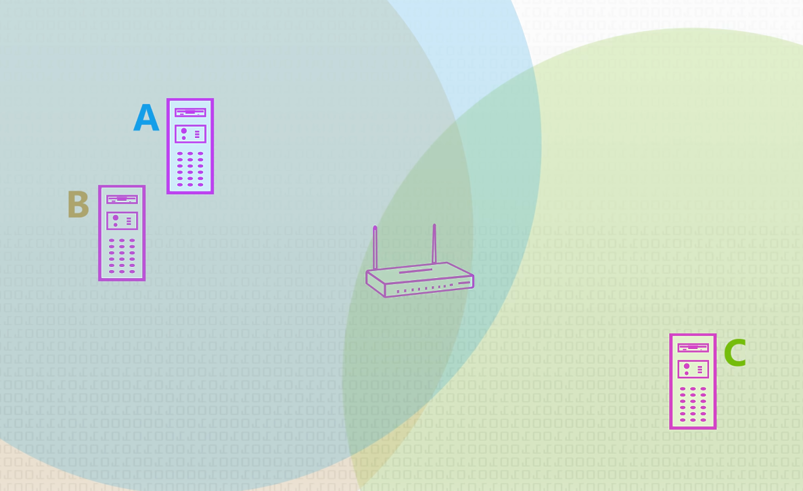
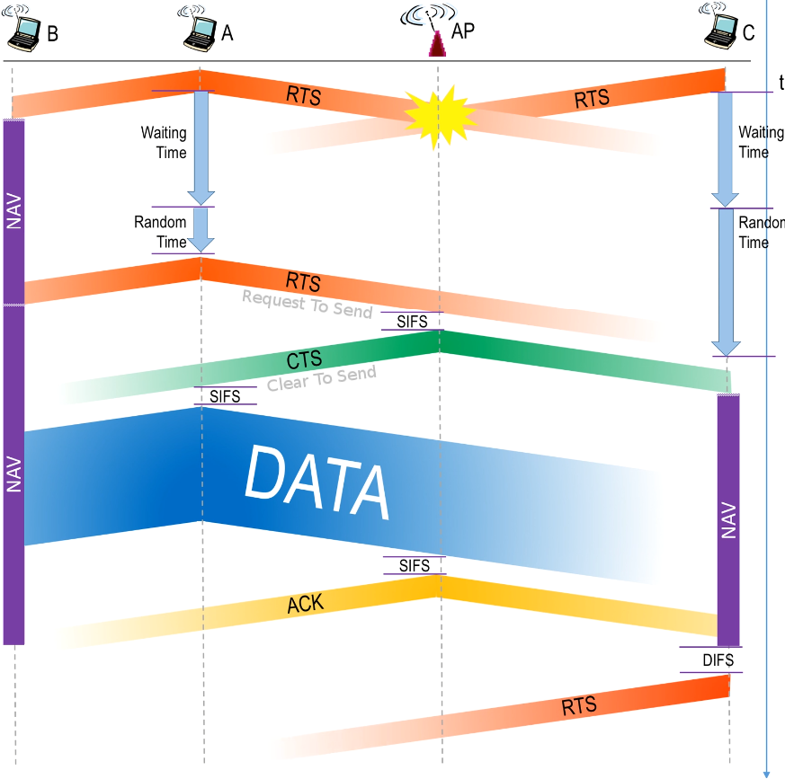
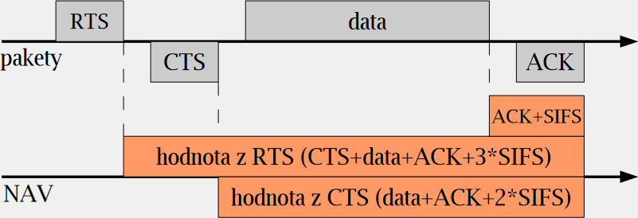
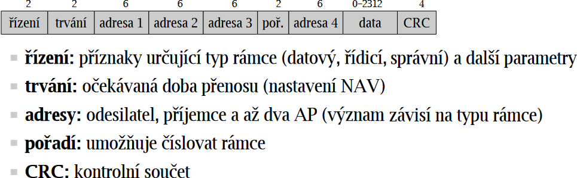
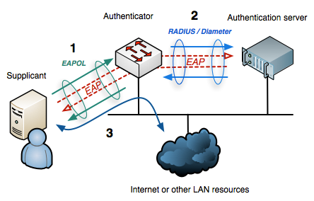

# 21

[<<<](./20.MD)
> Technologie Ethernet, její principy a vývoj, algoritmus CSMA/CD. Bezdrátové lokální sítě standardu IEEE 802.11.

## Ethernet

* Protokol definující přenos dat na lokální síti
* IEEE
  * 802.2 – LLC
  * 802.3 – CSMA/CD, Ethernet
  * 802.11 – bezdrátové sítě
* Formát rámce:
  * Preambule – Vzorek střídajících se bitů 0 a 1, aby zařízení snadno poznalo začátek přicházejícího rámce [7 B]
  * SFD – Start Frame Delimiter – Značí konec preambule a začátek rámce – `10101011` [1 B]
  * Cílová MAC adresa [6 B]
  * Zdrojová MAC adresa [6 B]
  * Délka paketu nebo indikátor protokolu [2 B]
  * Vlastní obsah [46–1500 B]
  * Kontrolní součet CRC [4 B]

### MAC – Media Access Control

* Řízení přístupu k médiu
* Kontrola správnosti přenášených rámců
* Adresace – MAC adresy vázané na síťovou kartu
* Šest dvouciferných hexadecimálních čísel (oddělené dvojtečkou/pomlčkou nebo neoddělené)
* 48 bitů, kontrola pomocí komparátoru
  * Sedmý bit – 0 = unikátní (OUI enforced), 1 = lokálně spravovaná
  * Osmý bit – 0 = unicast, 1 = multicast, (FF:FF:FF:FF:FF:FF = broadcast)
  * První polovina – Organizationally Unique Identifier (OUI), výrobcům přiděluje IEEE
  * Druhá polovina – Přiděluje výrobce a ručí za její jednoznačnost

### LLC – Logical Link Control

* Propojení mezi Ethernetem a síťovou vrstvou
* Zakrývá rozdíly mezi sítěmi 802, poskytuje společný formát a rozhraní pro síťovou vrstvu
* Error-control, flow-control

### CSMA/CD – Carrier-Sense  Multiple Access with Collision Detection

* Popisuje chování vysílajícího zařízení při odesílání rámce
  * Naslouchá a čeká na uvolnění média
  * Je-li volno, začne vysílat
  * Při vysílání zároveň naslouchá – hlídá kolize
* Kolize nastane, pokud vysílá několik stanic najednou, a znamená znehodnocení dat
* Vysílající při zjištění kolize:
  * Vyšle _jam_ signál indikující kolizi
  * Počká náhodnou dobu (v řádech mikrosekund) a opakuje pokus
    * Náhodné číslo je z rozmezí 0 až 2<sup>číslo pokusu</sup> – binary exponential backoff
  * Maximum pokusů je 16, pak případně oznámí neúspěch

#### Kolizní okénko

* Jakmile signál obsadí médium, kolize nemůže nastat
* Ke kolizi může dojít jen od začátku vysílání do obsazení média – __kolizní okénko__
* Velikost okénka musí být menší než doba vysílání nejkratšího rámce

#### Důsledky CSMA/CD

* S opakovanými kolizemi stanice ubírá na intenzitě pokusů – větší šance na úspěch
* Odvysílání není zaručeno
* Každá kolize znamená promarněný čas – data se musí odvysílat znovu
* Vyšší provoz znamená více kolizí a tedy nižší efektivitu

### Kroucená dvojlinka

* Čtyři páry vodičů, kde je každý pár pravidelně zakroucený (odolnější proti rušení)
* U/UTP – Unshielded Twisted Pair
  * Značení `<stínění kabelu>/<stínění páru>TP`, U – nestíněno, F – Fólie, S – Opletení (pouze kabel)
  * Např.: SF/FTP – Kabel stíněn fólií a opletením + páry stíněny fólií
* Různé kategorie Cat1 - Cat8, nejběžnější Cat6, určují fyzikální vlastnosti a přenosovou rychlost
* Koncovka ~RJ45 (unkeyed 8P8C)

### Přepínač

* Narozdíl od rozbočovače přeposílá provoz pouze tam, kde je potřeba
* Odděluje kolizní domény CSMA/CD – počítače na jednom kabelu nesoutěží s počítači jiných kabelech
* CAM – Content Adressable Memory
  * Tabulka, kde jsou přiřazené adresy k portům
  * Pokud cílovou adresu v tabulce nenajde, použije broadcast
* Spanning Tree Protocol
* Připojením všech počítačů k přepínači mizí sdílení média, lze zavést full duplex provoz bez CSMA/CD (po různých vodičích)

### Historie Ethernet

```text
+------+---------+---------------------+---------------+-------------+
| 1990 | 802.3i  |                     |               | UTP         |
+------+---------+ Ethernet            |     10 Mbit/s +-------------+
| 1992 | 802.3j  |                     |               | Optika      |
+------+---------+---------------------+---------------+-------------+
| 1995 | 802.3u  | Fast Ethernet       |    100 Mbit/s | UTP, optika |
+------+---------+---------------------+---------------+-------------+
| 1998 | 802.3z  |                     |               | Optika      |
+------+---------+ Gigabit Ethernet    |   1000 Mbit/s +-------------+
| 1999 | 802.3ab |                     |               | UTP         |
+------+---------+---------------------+---------------+-------------+
| 2002 | 802.3ae |                     |               | Optika      |
+------+---------+ 10 Gigabit Ethernet | 10 000 Mbit/s +-------------+
| 2006 | 802.3an |                     |               | UTP         |
+------+---------+---------------------+---------------+-------------+
|          40, 100, 200, 400, 800 GbE >= 40 000 Mbit/s               |
+--------------------------------------------------------------------+
```

#### Fast Ethernet

* __100BASE-TX__ – UTP Cat5 do 100 m
* __100BASE-FX__ – Optika do 2 km (nebo 400 m pro half-duplex, kde je potřeba detekovat kolize)

#### Gigabit Ethernet

* __1000BASE-T__ – UTP Cat≥5 do 100 m
* __1000BASE-SX__ – Multi-mode do 500 m
* __1000BASE-LX__ – Single-mode do 2 km
* __1000BASE-ZX__ – Single-mode do 70 km

#### 10 Gigabit Ethernet

* __10GBASE-T__ – UTP Cat6 do 50 m nebo Cat6a do 100 m (vzácné, drahé)
* __10GBASE-SR__ – Multi-mode do 300 m
* __10GBASE-LR__ – Single-mode do 10 km
* __10GBASE-ER__ – Single-mode do 40 km

## Bezdrátové sítě IEEE 802.11

* Pokrytí plochy bez kabelů, podpora mobility
* Pomalejší, větší chybovost
* Rychlý vývoj

### BSS – Basic Service Set

* „Buňka“ – skupina navzájem komunikujících stanic
* Typy:
  * Ad Hoc – zařízení komunikují přímo bez prostředníka, v praxi pro krátkodobá spojení
  * Infrastrukturní – řízeno AP, kterým prochází veškerý provoz
  * Mesh

### AP – Access Point

* Řídí buňku, prochází jím veškerý provoz
* Pracuje na druhé vrstvě, zařizuje přechod mezi 802.11 WLAN a 802.3 Ethernet („portál“)
* Pokud je koncové zařízení v _power save sleep state_, AP ukládá rámce určené pro toto zařízení a odešle je po jeho probuzení
* Pravidelně (defaultně ~stokrát za sekundu) vysílá beacon frame s informacemi o síti a pro synchronizaci času

### ESS – Extended Service Set

* Skupina spolupracujících buněk, které se tváří jako jeden celek
* Propojeny distribučním systémem (lokální síť, obvykle Ethernet)

### Fyzická vrstva

#### Mikrovlny

* Bezlicenční pásma 2,4 / 5 / 6 GHz
* Nižší frekvence má lepší dosah a průchodnost, ale nižší rychlost a vyšší rušení
* Nekvalitní médium – rušení, útlum na základě vzdálenosti/překážek
* Důsledek: potvrzování – přenos rámce a jeho potvrzení tvoří atomickou operaci

#### Skrytý uzel



* Scénář:
  * _A_ vysílá
  * _B_ vidí, že právě někdo vysílá, proto čeká
  * _C_ nevidí, že právě někdo vysílá, proto začne také vysílat
  * Do AP přijdou znehodnocená data, zahazuje
* Řešení: CSMA/CA – Carrier-Sense Multiple Access with Collision Avoidance:



* RTC/CTC jsou krátké rámce – malá šance na kolizi
* NAV – Network Allocation Vector
  * Každá stanice si vede NAV
  * Určuje dobu, po kterou je médium považováno za obsazené
  * Hodnota odvozena z hodnot RTS/CTS
* SIFS – Short Interframe Space – Nejkratší doba mezi rámci



* Pokud jsou data krátká, jsou odeslána rovnou
  * NAV je pak pouze SIFS+ACK
* Pokud jsou data dlouhá, je vhodné je rozdělit (fragmentace)
  * Posílání jednotlivých fragmentů, příjemce potvrdí každý fragment pomocí ACK
  * Ostatní si aktualizují NAV po každém fragmentu nebo ACK
* CSMA/CA tedy nemá centrální řízení a stanice soutěží o médium – DCF (Distributed Coordination Function)
  * DIFS – DCF Interframe Space
* Je také možné použít centrální řízení – PCF (Point Coordination Function)
  * AP řídí veškeré přenosy
  * PIFS – PCF Interframe Space
  * Málo implementováno, kombinuje se s DCF
* EIFS – Extended Interframe Space – při přenosové chybě

### Historie 802.11

Standard | Alias | Pásmo | Max. teoretická rychlost | Modulace
--- | :-- | :-: | --: | :--
802.11a | Wi-Fi 2 | 5 GHz | 54 Mbit/s | OFDM
802.11b | Wi-Fi 1 | 2,4 GHz | 11 Mbit/s | DSSS
802.11g | Wi-Fi 3 | 2,4 GHz | 54 Mbit/s | OFDM
802.11n | Wi-Fi 4 | 2,4/5 GHz | 600 Mbit/s | MIMO OFDM
802.11ac | Wi-Fi 5 | ~2,4/5 GHz | 6,9 Gbit/s | MU-MIMO OFDM
802.11ax | Wi-Fi 6 | 2,4/5/6 GHz | 9,6 Gbit/s | MU-MIMO OFDMA
802.11be | Wi-Fi 7 | 2,4/5/6 GHz | 46,1 Gbit/s | MU-MIMO OFDMA

#### DSSS – Direct-Sequence Spread Spectrum

* Umělé zavedení redundance – bity určené k přenosu jsou prokládané pseudonáhodnými bity
* Díky tomu je signál méně citlivý vůči rušení
* Pro zařízení bez znalosti mechanismu vytvoření pseudonáhodných sekvencí se signál jeví jako šum
* Využíván __802.11b__ (a novější zpětně kompatibilní standardy)

#### OFDM – Orthogonal Frequency-Division Multiplexing

* Kódování signálu na více nosných frekvencích, které jsou na sebe ortogonální
* Použití různých modulací
* Využíván __802.11a/g/n/ac__, ADSL

#### OFDMA – Orthogonal Frequency-Division Multiple Access

* OFDM při obsluze více uživatelů používá point-to-point a rychle mezi nimi přepíná
* OFDMA využívá point-to-multipoint – více uživatelů v jednom okamžiku
* Využíván __802.11ax/be__, LTE, 5G

#### MIMO – Multiple-Input Multiple-Output

* Využívá více antén pro paralelní přenos signálů
* Zařízení příjemce musí také podporovat MIMO a paralelní signály si převede do signálu původního
* Značení např. _4x4_ znamená 4 spojení na 4 anténách

#### MU-MIMO – Multi-User MIMO

* Dokáže v jeden okamžik komunikovat s více zařízeními najednou
* Např. 4 antény se rozdělí mezi 4 zařízení

### Formát rámce



### Bezpečnost

* Dva okruhy problémů:
  * Neoprávněný přístup do sítě
  * Odposlech dat
* Vstup do buňky:
  * Autentizace – ověření, zda může být zařízení vpuštěno
    * Volný přístup – výchozí nastavení
    * Slabá – pomocí MAC adres (obtížná údržba, snadný průlom)
    * Silná – IEEE 802.1X
  * Asociace – technické začlenění do buňky

#### IEEE 802.1X

* Standard popisující autentizaci pro přístup do sítí (W)LAN
* Autentizuje uživatele, nikoliv hardware
* U neautentizovaných zařízení blokuje provoz kromě 802.1X rámců
* Na zařízení je suplikant (klient), ten předá údaje AP, který je porovná s autentizačním serverem pomocí protokolu RADIUS
* Vychází z EAP – Extensible Authentication Protocol



#### WEP – Wired Equivalent Privacy

* Šifrování komunikace pomocí RC4
* Symetrická šifra, na obou koncích nastaven statický klíč
* Klíč obvykle zadáván v hexadecimálních číslech, několik pevně daných délek
* Snadno prolomitelné

#### IEEE 802.11i a WPA (Wi-Fi Protected Access)

* __IEEE 802.11i__ je standard přinášející vylepšené zapezpečení včetně TKIP a CCMP
* __WPA__ bylo zavedeno jako přechodné řešení, které implemetuje některé prvky standardu (TKIP)
* __WPA2__ je plnou implementací standardu
* __TKIP__ – Temporal Key Integrity Protocol
  * Každý rámec má svůj vlastní dočasný klíč
* __CCMP__ – Counter Mode Cipher Block Chaining Message Authentication Code Protocol
  * Šifra AES

### Wi-Fi Alliance

* Konsorcium, nezisková organizace
* Certifikace produktů – zaručuje kompatibilitu mezi certifikovanými produkty
* Postupem času krom certifikování začali vyvíjet i vlastní technologie/specifikace:
  * Miracast
  * WPA, WPA2, WPA3
  * Wi-Fi Direct
  * [...](https://www.wi-fi.org/discover-wi-fi/specifications)

---
[>>>](./22.MD)
