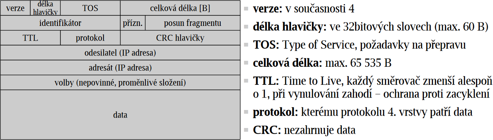
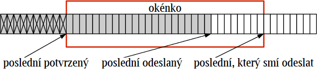
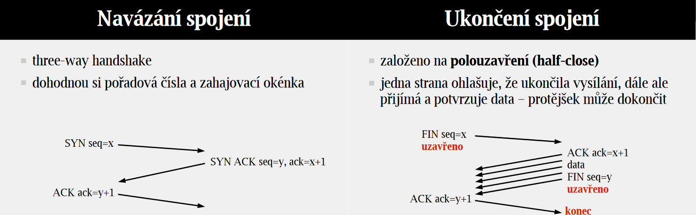
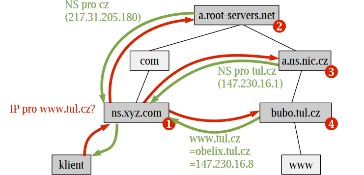

# 22

[<<<](./21.MD)
> Základní principy činnosti protokolů sítě Internet – IP, TCP, UDP. Domain Name System, jeho role a činnost, DNS servery, postup řešení dotazu, reverzní DNS.

## Spojované a nespojované služby

* Spojované služby
  * Naváže spojení, kterým pak protékají data (přirovnání: telefon)
  * Dodržuje pořadí
* Nespojované služby
  * Každý paket přepravován samostatně (přirovnání: dopisy)
  * Univerzálnější, pružnější a robustnější, reaguje na změny v síti
* Pozn.: Pakety nespojované služby bývají označovány jako _datagramy_, i když se nutně nemusí jednat o UDP

## IP – Internet Protocol

* Drží Internet pohromadě – jednotný způsob komunikace jakýchkoliv zařízení
* IP je nespojovaný a bez záruk

### IP adresa

* Délka 4 bajty; zápis v desítkové soustavě, jednotlivé bajty oddělené tečkou
* Každé rozhraní má svou IP adresu, celosvětově jednoznačné
* Distribuované přidělování (IANA → RIR → LIR (ISP) → zákazník)
* Hierarchická struktura adresy
  * Prefix – použití při přidělování adres, směrování, ...

#### CIDR – Classless Inter-Domain Routing

* Maska sítě je určena počtem kladných bitů, nikoliv příslušností ke třídě (A/B/C)
* Variable-Length Subnet Masking ⇒ jemnější dělení na podsítě
* Zavedeno, aby se méně plýtvalo IPv4 adresami a aby se zpomalilo plnění routovacích tabulek

#### Privátní adresy

* `10.0.0.0/8`, `172.16.0.0/12` a `192.168.0.0/16`
* Nejsou směrovány v Internetu, nesmí překročit lokální síť
* Dnes využívány pro rozšíření adresního prostoru pomocí NAT

### Směrování

* Směrovací tabulka, dvě nejdůležitější hodnoty řádku:
  * Cíl – definovaný prefixem
  * Next hop – komu předat pakety pro daný cíl (soused)
* Směrovač se rozhodne podle cílové adresy v IP datagramu, vybere nejkonkrétnější záznam (s nejdelším prefixem), který odpovídá cílové adrese

#### Distribuované směrování

* Směrovací informace si vyměňují sousední směrovače
* __Autonomní systém (AS)__ – část Internetu se společnou směrovací politikou (např. ISP + zákazníci)
* __Interior Gateway Protocol__ – směrování uvnitř AS, důraz na rychlost (RIP, OSFP, EIGRP)
* __Exterior Gateway Protocol__ – směrování mezi AS, důraz na stabilitu (BGP)

### IP datagram

* Pokud je datagram větší než MTU (Maximum Transmission Unit, různá pro různé fyzické sítě), pak je rozdělen na fragmenty
  * Všechny fragmenty mají stejný identifikátor
  * Kromě posledního fragmentu mají všechny nastaven příznak _more fragments_
  * Posun fragmentu je vzdálenost od startu původního datagramu
* Fragmenty jsou přepravovány nezávisle a mohou být dále fragmentovány, složeny jsou až u příjemce
* Fragmentace snižuje efektivitu

### NAT – Network Address Translation

* Mění IP adresy a porty v procházejících IP datagramech mezi dvěma částmi sítě
* Typicky odděluje lokální síť od Internetu, kde celá LAN je adresovatelná jednou veřejnou IP adresou
* Pokud zařízení odesílá paket z LAN do světa, vytvoří se záznam v konverzní tabulce
  * Více zařízení pod stejnou veřejnou adresou se rozliší pomocí portů
* Komunikaci je nutné navazovat zevnitř – dokud není záznam v tabulce, jsou zařízení nedosažitelná – pozitivní dopad na bezpečnost

### ICMP – Internet Control Message Protocol

* Servisní hlášení IP, součást třetí vrstvy
  * Chybové zprávy – nedosažitelný cíl, vypršení TTL, chybný datagram, ...
  * Informační zprávy – aktuální čas, maska podsítě, ...
  * Opravy směrování
  * ping, tracert
* Někdy blokováno kvůli ICMP útokům (ping flood, ping of death, ...)

### ARP – Address Resolution Protocol

* Objevování MAC adres na základě IP adres
* Situace, kdy je třeba odeslat IP datagram na adresu ležící ve stejné podsíti a odesílatel zná pouze IP adresu cíle
* Průběh:
  * ARP request – broadcast – obsahuje tázanou IP adresu + IP a MAC adresu tazatele
    * Všichni příjemci si tato data zapíší do ARP cache
  * ARP reply – tázané zařízení odesílá zpět svou IP a MAC adresu

### DHCP – Dynamic Host Configuration Protocol

* Protokol, který koncovým zařízením v síti automaticky přiřazuje IP adresu, masku podsítě, default gateway a adresu DNS serveru
* Základem je DHCP server

1. `klient → server` __DISCOVERY__
    * Snaha objevit DHCP server
    * Broadcast
2. `klient ← server` __OFFER__
    * Server rezervuje adresu a nabídne ji klientovi
    * Zašle tedy odpověď obsahující nabízenou IP adresu a svou IP adresu
3. `klient → server` __REQUEST__
    * Klientovi může přijít víc nabídek z více serverů
    * Vybere si jednu a o tu zažádá příslušný server
4. `klient ← server` __ACKNOWLEDGE__
    * Server posílá potrvrzení + dodatečné informace

* Každá adresa má svůj lease time („doba pronájmu“), poté zařízení žádá o prodloužení, nebo může být adresa přiřazena jinému

## TCP – Transmission Control Protocol

* Spojovaná služba
* _Výhody_ – Je zajištěno správné pořadí odeslaných dat (pořadová čísla), ztracená/poškozená data jsou odeslána znovu (potvrzování), na konci se provádí konečný kontrolní součet, full-duplex
* _Nevýhody_ – Neodesílá další data, dokud všechna předchozí data nejsou úplně v pořádku – blokuje frontu, velikost hlavičky a potvrzování doručení znamená vyšší zatížení sítě
* _Použití_ – HTTP(S), SSH, e-mail, FTP

### Řízení toku

* TCP je protokol s posuvným (plovoucím) okénkem
* Je důležité předejít tomu, aby odesílatel posílal data příliš rychle a zahltil tak příjemce
* Příjemce specifikuje, kolik dat navíc ještě dokáže zpracovat

### TCP segment

* Zdrojový port [2 B]
* Cílový port [2 B]
* Pořadové číslo _seq_ [4 B]
* Potvrzovací číslo _ack_ [4 B] – Následující pořadové číslo, které je očekáváno; zároveň potvrzuje příjem všech předchozích dat
* Příznaky, velikost okna, kontrolní součet, ...
* Volby (jsou-li)
* Data (jsou-li)

## UDP – User Datagram Protocol

* Nespojovaná služba
* _Výhody_ – Rychlost a malá hlavička
* _Nevýhody_ – Nezaručuje se úplné správné odeslání – ztráta, poškození, duplikace, špatné pořadí (žádné pořadí)
* _Použití_ – DHCP, ~DNS, real-time přenos dat (VoIP, video stream, online hry)

### UDP datagram

<table>
    <tr align="center"><td>Zdrojový port [2 B]</td><td>Cílový port [2 B]</td></tr>
    <tr align="center"><td>Délka [2 B]</td><td>CRC [2 B]</td></tr>
    <tr align="center"><td colspan=2>Data</td></tr>
</table>

## DNS – Domain Name System

* Řeší překlad doménového jména na IP adresu
* `stag.tul.cz.` – `cz` je top level doména, `tul` je second level doména
* Správa domén je distribuovaná, DNS servery spolupracují při řešení dotazů
* Typy DNS serverů ke konkrétní doméně:
  * __Primární__ – autoritativní – obsahuje všechny informace pro danou doménu (1 pro každou doménu)
  * __Sekundární__ – autoritativní – automatická kopie primárního (≥1 pro každou doménu)
  * __Pomocný__ – neautoritativní – po určitou dobu uchovává předchozí odpovědi (cache)
* Kořenové servery
  * Zná adresy DNS serverů, které mají na starost top level domény
  * 13 _logical root name_ serverů, realizovány více stroji (+ distribuováno po světě s využitím anycast)
  * www.root-servers.org
  * Jejich adresy zná každý DNS server – lze se k nim dostat jedním krokem

### Řešení dotazu

* __Rekurzivní zpracování__
  * Server se chopí vyřízení a pošle až odpověď
  * Typické pro lokální servery, zároveň si budují cache
* __Nerekurzivní zpracování__
  * Server odpoví odkazem, kde hledat dál
  * Typické pro vrcholové servery, na rekurzivní zpracování nemají čas
* Každý server po cestě může poskytnout neautoritativní odpověď ze své cache

### Reverzní DNS

* Z IP adresy chceme získat doménové jméno
* Kořen rDNS databáze je součástí top level domény `.arpa`
* Problém obráceného pořadí významnosti
  * Klasické DNS projíždí doménové jméno odzadu – od nejobecnější (nejvýznamnější) informace
  * IP adresa má ale nejobecnější část vlevo
  * Řešením je zrcadlit bajty a přidat `.in-addr.arpa`
  * `147.230.16.8` → `8.16.230.147.in-addr.arpa`

### Bezpečnost DNS

* DNS odpovědi lze podvrhnout – různé formy útoků
* DNSSEC – DNS Security Extensions
  * Umožňuje ověřit platnost odpovědi
  * Elektronický podpis, asymetrická šifra

---
[>>>](./23.MD)
