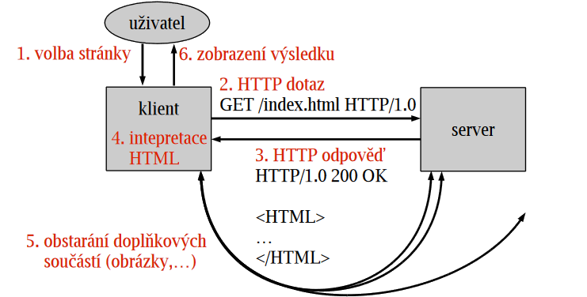

# 23

> Základní principy WWW, HTTP, HTML. Jazyk (X)HTML, jeho charakteristika, možnosti a omezení.

## WWW – World Wide Web

* Architektura klient-server (např. chrome-apache)
  * Klient zpracovává kód poskytnutý serverem (HTML/CSS/JS)
  * Server klientům vydává aktuální verzi webové stránky/aplikace

## HTTP – HyperText Transfer Protocol

* __TCP/80__
* WWW protokol pro komunikaci mezi klientem a serverem
* Bezstavový
  * Jakmile je zodpovězen dotaz, transakce pro server končí
  * Server si neudržuje stavové informace o klientech a následující dotazy nedává do souvislosti s předchozími
  * Stav si musí udržovat klient
  * _Výhody_ – robustní; snadnější implementace
  * _Nevýhody_ – větší režie
* Kešovatelný, široce podporovaný



### HTTP Resource

* Identifikovatelný digitální/fyzický/abstraktní objekt na webu

### URL – Uniform Resource Locator

* Univerzální adresa resource
* Před dvojtečku se píše schéma/protokol (`http:`, `mailto:`, ...)

### HTTP Request (of resource)

* Klientský požadavek o provedení akce s resource, protokol HTTP definuje metody:
  * GET – přečti
  * HEAD – vrať pouze hlavičku odpovědi na GET
  * POST – vytvoř (URL určuje až server)
  * PUT – nahraď (URL určuje už klient)
  * PATCH – aktualizuj
  * DELETE – smaž
  * CONNECT
  * OPTIONS
  * TRACE
* SSR aplikace obvykle používají pouze GET a POST (limit prohlížeče), SPA+API mohou používat vše
* Request může být synchronní (zadání adresy, kliknutí na odkaz, ...) a asynchronní (AJAX) – pro server jsou oba přístupy ekvivalentní

```text
GET /index.html HTTP/1.1
Host: www.example.org
User-Agent: Gecko...
Accept-Charset: UTF-8,*
...
```

### HTTP Response (representation of resource)

* Odpověď serveru
* Status code, hlavičky, vlastní objekt (data)
  * 1xx – Informační
  * 2xx – OK
  * 3xx – Přesměrování
  * 4xx – Chyba klienta
  * 5xx – Chyba serveru

## HTTPS – HTTP Secure

* __TCP/443__
* HTTP + SSL/TLS
* Většina uživatelů nechodí na HTTP weby (prohlížeč je od toho odrazuje)
* Potřebujeme certifikát – Let's encrypt je zdarma, nutné často obnovovat
* Certifikační autorita vydává digitální certifikáty, jedná se o důvěryhodnou třetí stranu
  * Certifikát obsahuje údaje o subjektu, jeho veřejný klíč, podpis certifikační autority, dobu platnosti, ...

## HTML – HyperText Markup Language

* Jazyk pro definici obsahu webové stránky
* XHTML je HTML přeformulováno do XML
* Vývoj koordinuje WWW konsorcium

---
[>>>](./24.MD)
