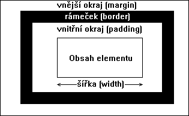

# 24

> CSS – vlastnosti, hodnoty, dědění, kaskádování. Blokový model CSS.

## CSS – Cascading Style Sheets

* Jazyk pro definici stylu zobrazení HTML obsahu
* Oddelění prezentace od obsahu

```css
selektor {
    vlastnost1: hodnota;
    vlastnost2: hodnota;
}
```

* Některé vlastnosti potomek dědí od rodiče (`font-size`), jiné ne (`margin`)

### Selektory

* Element – `h1 {}`, `h2 {}`, `h1, h2 {}`
* Potomek – `ul li em {}`, nemusí být přímý potomek `ul em {}`
* Přímý potomek – `ul > li {}`
* Následovník – `h1 ~ h2 {}`
* První následovník – `h1 + h2 {}`
* Zúžení na atributy
  * `a[href^="mailto"]`
  * `a[href$=".pdf"]`
  * `a[href*=".github."]`
* Pseudoelementy / pseudotřídy
  * `:first-line`, `:first-letter`
  * `:link`, `:hover`, `:active`, `:visited`, `:focus`, ...
* `.class`, `#id`
* `<div>` a `<span>` – neutrální prvky, měli bychom dávat přednost sémantickým prvkům

### Kaskáda

* Pravidla pro přidělování hodnot vlastnostem
* Řeší „konflikty“ mezi pravidly, které se vztahují na stejný prvek
* Rozhoduje dle konkrétnosti a dědičnosti, v krajním případě rozhoduje pořadí
* `!important` > inline CSS > `<style>` CSS > `<link>` CSS > user default > browser default
* Váha konkrétnosti:
  * `0 0 0 1` – elementy, pseudoelementy
  * `0 0 1 0` – třídy, pseudotřídy, atributy
  * `0 1 0 0` – indentifikátory
  * `1 0 0 0` – inline stylování

### Blokový model



---
[>>>](./25.MD)
