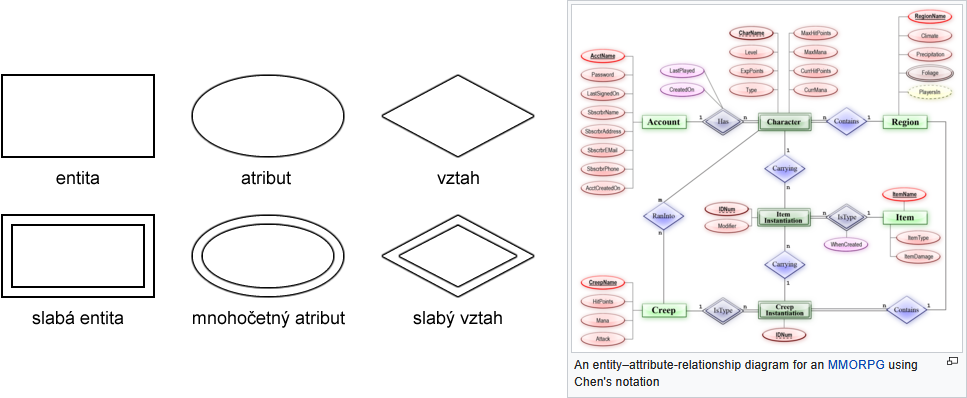
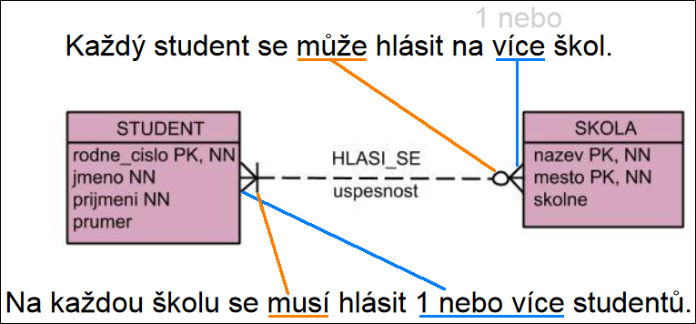
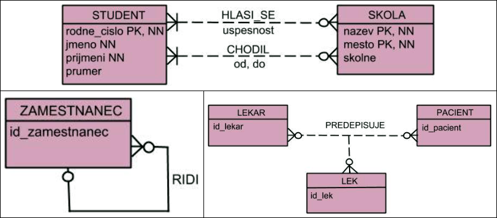

# 27

[<<<](./26.MD)
> Konceptuální návrh relačních databází, základní konstrukty, ER diagram, kardinalita, parcialita, závislost.

## Databázový systém DBS

* 1960s, řeší problémy zpracování dat na souborové úrovni
* Centralizované úložiště dat – řeší izolaci dat a získávání informací, definice dat už není součástí aplikace
* Vytvoření mezivrstvy – řeší nezávislost mezi aplikací a daty (aplikace pracuje s mezivrstvou, konkrétní fyzické uložení dat ji nezajímá)
* Kontrola přístupu se odehrává mimo aplikaci – integritní omezení, transakce, přístupová práva, pohledy, ...

### Definice DBS

* DBS = DB + SŘBD
* DB – databáze
  * _Sdílená kolekce dat popisující aktivity jedné nebo více organizací_
  * Společně se surovými daty uchovává také metadata (data o datech) v tzv. databázovém katalogu
* SŘBD – systém řízení báze dat
  * Softwarový systém, který poskytuje kontrolovaný přístup k DB
  * Umožňuje uživatelům definovat, vytvářet a udržovat DB
* DBS – databázový systém
  * _Poskytuje efektivní, spolehlivé, praktické a bezpečné úložiště a přístup k obrovskému množství perzistentních dat pro více uživatelů_

## Návrh datové vrstvy

1. Analýza – specifikace požadavků, informace od klienta
2. Design – konceptuální schéma → relační schéma
3. Implementace – vytvoření databázové struktury pomocí SQL DDL
4. Testování – naplnění testovacími daty

## Datový model

* __Datový model__ je sada konceptů pro popis dat, vztahů mezi daty a omezení kladená na data v dané organizaci
* Určen ke komunikaci mezi zákazníkem a návrhářem databáze
* Obsahuje popis struktury a integritní omezení
* Ideálně by měl být jednoduchý, expresivní, rozšiřitelný, ...
* Výsledkem modelování je __schéma__
* Schéma se často zobrazuje formou __diagramu__

## Konceptuální model

* Zachycuje požadavky klienta ve formě entit a vztahů mezi nimi
* Nezávislý na implementačních detailech (SŘBD, HW, jazyk, databázový model (relační/hierarchický/síťový/objektový))

### Entita

* Objekt reálného světa (fyzický nebo konceptuální), o kterém je potřeba uchovávat data
* Abstrakce, název pro množinu podobných věcí
* Je dána jménem a množinou atributů – E(A) „entita E má množinu atributů A“
* Instance entity je konkrétním výskytem entity a je jednoznačně odlišitelná
* Entitní množina E* je množina všech instancí dané entity
* Pozn.: Entita někdy bývá nazývána _entitní typ_ a instance entity je pak nazývána _entita_

### Atribut

* Vlastnost entity, která nás zajímá a jejíž hodnotu chceme mít uloženou v DB
* Má datový typ
* Může být proměnlivý (věk) nebo stálý (datum narození, vhodnější)
* Může být atomický nebo složený (adresa = psč + město + ulice)
* Může být jednohodnotový nebo vícehodnotový (telefonní číslo/a)
* Může být odvozený od jiných atributů

### Vztah

* Vazba, asociace mezi entitami
* Stupeň – binární/ternární/rekurzivní
* Instance vztahu – např. zaměstnanec pracuje na projektu
* Atribut vztahu – např. jakou roli má zaměstnanec u projektu
* Neidentifikační (mezi dvěma silnými entitami) nebo identifikační (mezi silnou a slabou entitou/ami)

### Integritní omezení

* Jednotné zabezpečení integrity dat
* __Explicitně vyjádřené podmínky, které má databáze splňovat__

#### Entitní IO

* Doména atributu – množina přípustných hodnot (rozsahy, kusovníky, datový typ, délka atributu, výchozí hodnota)
* Povinnost atributu (NN – not null)
* Jedinečnost atributu (U – unique)
* Identifikační klíč – atribut nebo kombinace atributů, jejichž hodnoty jednoznačně odliší jednu instanci dané entity od druhé
* Primární klíč – nejvhodnější identifikační klíč
* Složený klíč – identifikační klíč složený z více atributů

#### Vztahová IO

* __Kardinalita__ popisuje, kolik instancí daných entit se může podílet na dané vazbě
  * 1:1 (oddělení a vedoucí) / 1:N (oddělení a zaměstnanci) / M:N (herec a filmy)
* __Parcialita__ popisuje, zdali se všechny instance entit musí účastnit vazby – totální (povinný, musí) nebo parciální (nepovinný, může)
* __Silná entita__ je identifikačně a existečně nezávislá
* __Slabá entita__ je identifikačně a existečně závislá na jiné entitě (např. sál v kině, kopie knihy)
  * Její instance nelze rozlišit pouze podle svých vlastních atributů
  * Je v povinném identifikačním vztahu k rodičovské entitě
  * Její PK je složený a obsahuje i PK rodičovské entity

#### Závislost

* Identifikační závislost
  * PK podřízené entity obsahuje PK nadřazené entity
  * Podřízená entita nemůže existovat bez nadřazené entity
* Existenční závislost
  * PK podřízené entity neobsahuje PK nadřazené entity
  * Podřízená entita nemůže existovat bez nadřazené entity, ale její identita je nezávislá
* Z identifikačně závislé entity lze udělat pouze existenčně závislou entitu tím, že jí vytvoříme umělý identifikační klíč
  * Z identifikačního vztahu mezi touto entitou a její nadřazenou entitou se pak stane vztah neidentifikační

## Entity-relationship Model

* V základu jednoduchý datový model, který popisuje entity, jejich atributy, vztahy mezi nimi, kardinalitu a parcialitu
* Peter Chen, 1970s

* S takovýmto diagramem, kde se nachází obdélníky, kosočtverce a ovály, se běžně moc nesetkáme, lze to chápat takto:
  * ER model je obecná myšlenka rozdělení problému na entity a vztahy mezi nimi – lze jej použít pro konceptuální návrh databáze
  * Takovýto diagram je jeden ze stylů notací ER modelu (ten původní)
  * Notací existuje několik – neexistuje jeden preferovaný standard
  * Diagram ER modelu v určité notaci bývá nazýván _ER diagramem_

## Možná notace konceptuálního návrhu DB

* Základní pravidla
  * Nezávislý na typu databáze
  * Tvořen množinami entit s atributy, vztahů a integritních omezení
  * _Smí obsahovat:_ vazby M:N, N-ární/rekurzivní vazby, více vazeb mezi stejnými entitami, atributy vztahu, kardinalitu (muří nohy), parcialitu (kolečka a čárky)
  * _Nesmí obsahovat:_ cizí klíče (relační záležitost)

### Čtení konceptuálního schématu

### Specifické případy konceptuálního schématu

## Konceptuální návrh databáze

1. Identifikovat entity
2. Identifikovat vztahy mezi entitami (matice každý s každým)
3. Určit kardinalitu, parcialitu a silné/slabé entity
4. Přiřadit k entitám a vztahům atributy
5. Určit domény atributů
6. Zvolit identifikační klíče
7. Nakreslit diagram
8. Zkonzultovat se zákazníkem

---
[>>>](./28.MD)
