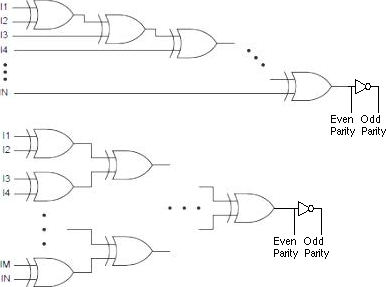

# 34

[<<<](./33.MD)
> Kombinační logické obvody – jejich charakteristika, možnosti realizace pomocí logických hradel, multiplexorů a dekodérů.

## Kombinační obvody

* Nemají žádnou vnitřní paměť
* Výstup je ovlivněn pouze hodnotami na vstupu; je jimi jednoznačně určen
* Odezva ideálního kombinačního obvodu je okamžitá
  * Při jejich zjednodušeném popisu nebereme v potaz zpoždění při průchodu signálu obvodem

* Umožňují realizovat logické a aritmetické funkce
* Popis pravdivostní tabulkou nebo logickým výrazem

## Základní logické funkce

* Pro dvě proměnné existuje celkem 16 možných funkcí – 22<i>n</i>
* Libovolná funkce lze sestavit z několika základních funkcí, takováto skupina funkcí se nazývá _úplný soubor logických funkcí_, např.:
  * AND a NOT
  * OR a NOT
  * NAND
  * NOR

## Booleova algebra

* Úplný, komplementární a distributivní svaz
* Lze pomocí ní upravovat logické výrazy
* Operace binární logický součet a součin, unární negace; konstanty 0 a 1

Axiom / Odvozený zákon|Součet|Součin
:--|:-:|:-:
Komutativita|<i>a + b = b + a</i>|<i>ab = ba</i>
Asociativita|<i>a + (b + c) = (a + b) + c</i>|<i>a(bc) = (ab)c</i>
Distributivita|<i>a + bc = (a + b)(a + c)</i>|<i>a(b + c) = ab + ac</i>
Neutralita 0 a 1|<i>a + 0 = a</i>|<i>a1 = a</i>
Agresivita 0 a 1|<i>a + 1 = 1</i>|<i>a0 = 0</i>
Vlastnosti komplementu|<i>a + ā = 1</i>|<i>aā = 0</i>
Idempotence|<i>a + a = a</i>|<i>aa = a</i>
Dvojí negace|$\bar{\bar{a}} = a$|&nbsp;
Absorpce|<i>a + ab = a</i>|<i>a(a + b) = a</i>
Absorpce negace|<i>a + āb = a + b</i>|<i>a(ā + b) = ab</i>
De Morgan|$\overline{(a+b)} = \bar{a}\cdot\bar{b}$|$\overline{a\cdot b}=\bar{a}+\bar{b}$
Consensus|<i>ab + āc + bc = ab + āc</i>|<i>(a + b)(ā + c)(b + c) = (a + b) + (ā + c)</i>

* __Kanonický tvar__ – součet součinů
* __term__ – výraz tvořený pouze proměnnými v přímém a negovaném tvaru a operací logického součtu nebo součinu
* __P-term__ – term s operací součinu (product)
* __S-term__ – term s operací součtu (sum)
* __minterm__ – P-term obsahující všechny nezávislé proměnné
* __maxterm__ – S-term obsahující všechny nezávislé proměnné
* __vstupní písmeno__ – kombinace hodnot vstupních proměnných (celkem 2_n_)
* Každou logickou funkci je možno vyjádřit pomocí součtu mintermů nebo součinu maxtermů
* __Úplná normální disjunktivní forma__ – logický výraz tvořený součtem mintermů
  * Obsahuje tolik mintermů, kolik je počet vstupních písmen, pro které nabývá logická funkce hodnoty 1
* __Úplná normální konjunktivní forma__ – logický výraz tvořený součinem maxtermů
  * Obsahuje tolik maxtermů, kolik je počet vstupních písmen, pro které nabývá logická funkce hodnoty 0

## Minimalizace logických výrazů

* Kritéria minimality (od nejdůležitějších po méně důležité):
  1. Minimální počet termů
  2. Minimální počet nezávislých proměnných v každém termu
  3. Minimální počet negovaných proměnných
* __Součinový implikant logické funkce__ – P-term, pro který funkce nabývá hodnoty 1
* __Přímý součinový implikant__ – implikant, který po vypuštění libovolné proměnné přestává být implikantem
* __Minimální normální disjunktivní forma__ – součet přímých součinových implikantů (součet minimálního počtu minimálních P-termů)
* Možnosti minimalizace – Booleova algebra / Karnaughova mapa / Quine–McCluskey / ESPRESSO
* Technologie TTL umožňuje maximálně osmivstupová hradla a CMOS maximálně dvouvstupová hradla – vícevstupová hradla nahrazena kaskádou

### Karnaughova mapa

## Sestavení obvodů pomocí základních hradel

1. Zjistit možnosti předpokládaných součástek (technologie a možnosti jejich kombinování, typy hradel a jejich parametry)
1. Sestavit pravdivostní tabulku (někdy možno vynechat nebo redukovat)
1. Sestavit UNDF, UNKF, nebo smíšené formy
1. Minimalizovat (možno vynechat)
1. Překonvertovat výsledný logický výraz do tvaru vhodného pro realizaci (De Morganova pravidla)
1. Vytvořit schéma zapojení
1. Zkontrolovat počty vstupů jednotlivých hradel, případně nahradit kaskádou
1. Propojit konstrukční prvky vodiči

## Realizace obvodů pomocí standardních funkčních celků

* Některá zapojení se při návrhu kombinačních obvodů často opakují; mohou být připravena ve formě integrovaného obvodu
* Např. AND-OR-INVERT, parita, majorita/minorita/práh

### AND-OR-INVERT

* Propojením vstupů !_B_ a _D_ vznikne jednobitová výhybka přepínající mezi !_A_ a !_C_
  * Z více jednobitových výhybek lze vytvořit vícebitovou výhybku – propojený vstup musí být pro všechny výhybky společný

### Parita

* Obvod pro generování/kontrolu parity
* Odhalí chybu v libovolně velkých datech, ale neodhalí sudý počet chyb
* Generátor sudé parity vrací 1, pokud je vstupní kód v liché paritě (a obráceně)
* Realizace pomocí XORů, dva způsoby kaskády

### (De)kodér

* Kodér převádí informaci z méně komprimovaných kódů na více komprimované kódy (1zN → bin)
* Dekodér dělá opak (bin → 1zN)
* __Z dekodéru lze vytvořit libovolnou funkci__ (pokud má dostatečný počet vstupů)
  * Dekodér přiřazuje každému řádku pravdivostní tabulky jeden výstup
  * Vstup dekodéru je vstup naší funkce
  * Výstupy dekodéru, které odpovídají řádkům pravdivostní tabulky s nenulovou funkční hodnotou, připojíme do ORu
    * Výstup ORu je výstup naší funkce

### Multiplexor

* Na výstup přivádí jeden z datových vstupů v závislosti na řídících vstupech (jednobitová výhybka je jednobitový multiplexor)
* Serializace paralelního signálu
* Demultiplexor (inverzní funkce) se v praxi moc nepoužívá
* __Z multiplexoru lze vytvořit libovolnou funkci__ (pokud má dostatečný počet adresních bitů)
  * Na datové vstupy multiplexoru dáme napevno jedničky a nuly podle pravdivostní tabulky (nastavíme výstupy naší funkce)
  * Výběr adresy multiplexoru je vstup naší funkce

## Programovatelné obvody

* Přeprogramováním těchto obvodů lze změnit funkci, kterou vykonávají

1. __PLD__ – Programmable Logic Device
   * Pevně daná struktura – vstup + pole ANDů + pole ORů + výstup
   1. __PROM__ – Programmable Read Only Memory – 1960s
      * PROM s _n_-bitovou adresovou sběrnicí lze použít jako generátor libovolné logické funkce o _n_ proměnných
      * Pevné pole ANDů, programovatelné pole ORů
      * Použití jako paměť konstant
   1. __PLA__ – Programmable Logic Array – 1970s
      * Programovatelné pole ANDů i ORů
   1. __PAL__ – Programmable Array Logic – late 1970s
      * Pevné pole ORů, programovatelné pole ANDů (P-termů) 
      * Omezeno počtem výstupních ORů a počtem jejich vstupů
   1. __GAL__ – Generic Array Logic
      * PAL + klopný obvod, lze vytvořit automat
1. __CPLD__ – Complex PLD – 1980s
   * Více PALů propojených reprogramovatelnou maticí
1. __FPGA__ – Field Programmable Gate Array – dodnes

---
[>>>](./35.MD)
