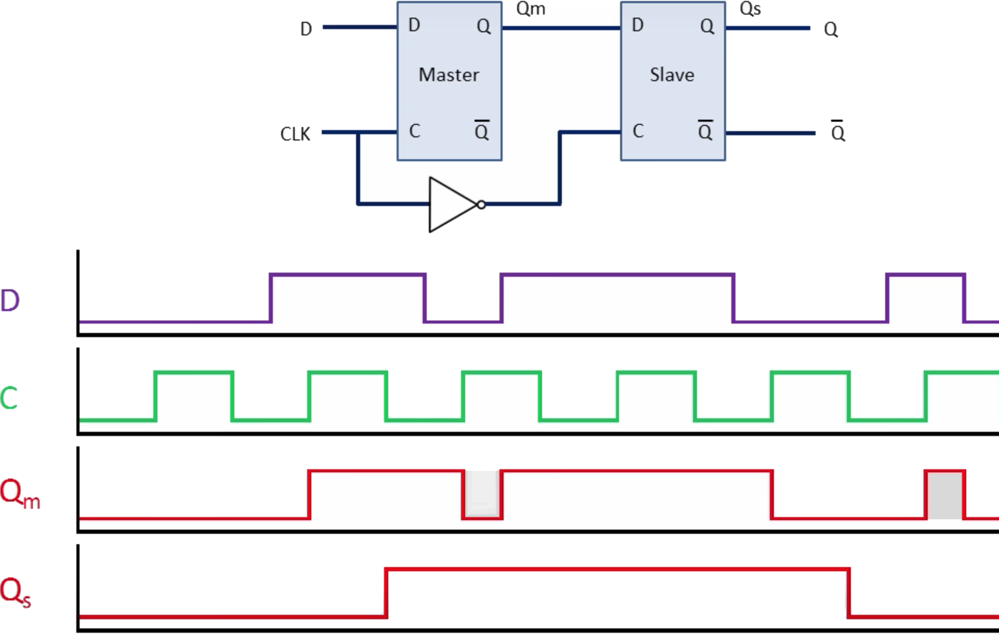

# 35

> Sekvenční obvody (základní vlastnosti a typy klopných obvodů, registry, posuvné registry, čítače, návrh automatů typu Mealy a Moore).

## Sekvenční obvody

* Výstupy jsou určeny hodnotou vstupů a vnitřním stavem
* Zpětné vazby kombinačního obvodu by měly vést přes paměťové členy

## Klopné obvody (KO)

* Skokově se překlápí mezi dvěma napěťovými stavy
* Astabilní KO generují periodický signál (využití např. pro synchronizaci)
* Monostabilní KO upravují zachycené impulzy na umpulzy s pevně danou délkou (_monoflop_)
* Bistabilní KO na základě podnětu přepínají mezi dvěma stabilními stavy
  * Synchronní – reagují pouze pokud je aktivní hodinový signál
  * Asynchronní – reagují na všechny změny vstupního signálu
    * Jednodušší koncept, ale složitější návrh – nestabilní vstupy obvodu / hazardy mohou zavinit nechtěná překlopení
  * Jednostupňový (Latch) je transparentní, pokud jsou aktivní hodiny
  * Dvoustupňový (Master-Slave) reaguje na hranu hodin (náběžnou/sestupnou/obě)

### RS

* RS: `01` Set, `10` Reset, `00` Pamatuje, `11` Zakázaný stav (nevíme, co přijde po něm)
* Lze realizovat pomocí NANDů, nutno znegovat vstupy a ještě je prohodit

### D Latch

* RS vstupy `00` a `11` jsou nedosažitelné
* Základní prvek pro konstrukci statických pamětí
* Jednostupňové obvody nelze použít při návrhu složitějších sekvenčních schémat
  * Nemají definovanou dobu trvání rozšíření vnitřního stavu na výstup
  * Problém, pokud jsou aktivní hodiny a rychle se mění vstup
  * Je potřeba použít dvoustupňové obvody, které mají definovaný okamžik rozšíření vnitřního stavu na výstup

### D Master-Slave reagující na sestupnou hranu

* Dvoustupňový D se používá především pro realizaci (posuvných) registrů
* Může být realizován i pomocí dvoustupňového JK, kde D je propojením J a !K

### JK

* JK přidává do obvodu RS zpětnovazební signály
  * Q je připojeno do ANDu s R
  * !Q je připojeno do ANDu s S
* Díky tomu vstup `11` místo zakázaného stavu převrací hodnotu výstupu
* Ve verzi Latch je ale k ničemu, `11` nekontrolovatelně osciluje, [viz simulace](https://tinyurl.com/yklcfzcn)
* JK dává smysl pouze ve verzi Master-Slave, [viz simulace](https://tinyurl.com/ykbw4xk2)
* J==S a K==R (pomůcka Jump, Kill)

### T

* Vznikne propojením J a K u dvoustupňového JK

## Registr

* Pro přenos/uchování vícebitové informace (počet obvodů D == počet bitů)
* Může obsahovat nulovací, případně nastavovací vstup

## Posuvný registr

* Lze využít pro násobení/dělení dvěma
* Umožňuje přenést paralelní informaci pomocí jednoho voidče

### Johnsonův čítač

* V podstatě posuvný registr s jednou negací
  * Na začátku samé nuly, pak se začnou šířít jedničky, pak zase nuly ... ⇒ 2N stavů
* Žádná kombinační logika ⇒ extrémně rychlý
* Malý počet stavů (2N)
* V praxi se používá na nejnižších bitech čítače

### LFSR

* Lineární zpětnovazebný posuvný registr
* Jeden nebo více XORů uvnitř nebo vně
* Lze použít jako čítač, generátor pseudonáhodných čísel, ...
* HW jednoduché, nevýhodou je délka vodiče mezi posledním a prvním klopným obvodem

## Čítač

* Zjišťuje/uchovává počet došlých hodinových impulzů
* Čítání nahoru/dolů
* Nemusí čítat v běžném binárním kódu (např. Grayův kód)
* Může mít možnost omezení rozsahu
* Dále dělíme podle počtu bitů a frekvence
* Využití: automaty, řadič CPU, měření frekvence/periody, osciloskopy, dělení frekvence, WDT, ...
* Asynchronní čítač
  * Jednotlivé hodinové vstupy nejsou synchronizovány stejným signálem
  * Realizace kaskádovým zapojením KO typu T
    * Na všechny přivedeme 1, na první C přivedeme hodiny, následující C jsou Q předchozího KO
  * Zpoždění – jednotlivé bity čítače jsou nastavovány do patřičné bitové hodnoty v nestejných okamžicích
* Synchronní čítač
  * Hodnota se mění pouze tehdy, pokud na všech předchozích hodnotách byly jedničky

<!---->

## Automat

* __X__ – množina vstupních symbolů
* __Y__ – množina výstupních symbolů
* __Q__ – množina vnitřních stavů
* __δ__ – přechodová funkce – určuje, za jakých podmínek automat přechází mezi jendotlivými stavy
* __λ__ – výstupní funkce – určuje, jaké výstupní symboly jsou určeny jednotlivým stavům a vstupům
* Zpětná vazba přivádí hodnoty výstupů a/nebo stavů k dalšímu zpracování kombinačnímu podobvodu, který je blíže vstupům
* Systém je doplněn o synchronní klopné obvody, aby se zabránilo hazardům (různým zpětnovazebním drátům by to mohlo trvat různě dlouho, takhle se čeká na hodiny)
* __Mooreův automat__
  * Výstupní stav je závislý na vnitřním stavu automatu
  * _Qt_ = _δ_(_Xt_, _Q__t_-1)
  * _Yt_ = _λ_(_Qt_)
  * Lepší synchronizace než Mealy
* __Mealyho automat__
  * Výstupní stav je závislý na vnitřním stavu automatu a na vstupech
  * _Qt_ = _δ_(_Xt_, _Q__t_-1)
  * _Yt_ = _λ_(_Xt_, _Q__t_-1)
  * Nejobecnější automat, konstrukčně jednodušší
  * Oproti Moore reaguje dříve na vstupní sekvenci – to může být nevýhoda, protože vnější vstupní signál, na který automat reaguje, nemusí být synchronizován s hodinami (nelze určit přesný okamžik)
* Při popisu automatu grafem je výstup u Moore vlastností vrcholu a u Mealy vlastností hrany
* Pokud mají tyto dva typy automatů stejnou vstupní a výstupní abecedu, lze je mezi sebou převádět

### Syntéza automatu

1. Volba typu automatu (Moore/Mealy)
1. Sestavení grafu přechodů automatu
1. Sestavení tabulky přechodů a výstupů
1. Redukce stavů
1. Přiřazení stavů automatu vnitřním proměnným navrhovaného obvodu
1. Sestavení budící tabulky pro zvolené typy klopných obvodů
1. Návrh propojení obvodu

---
[>>>](./36.MD)
