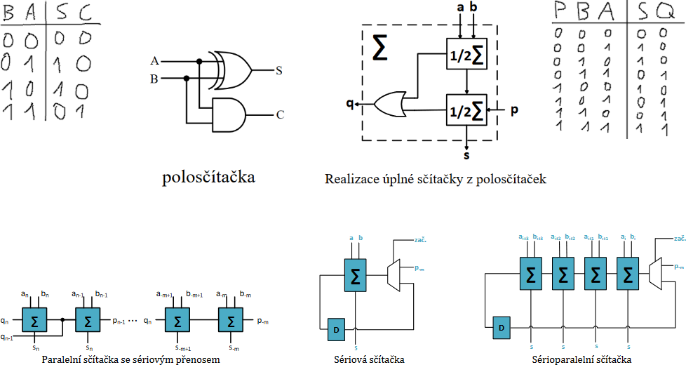
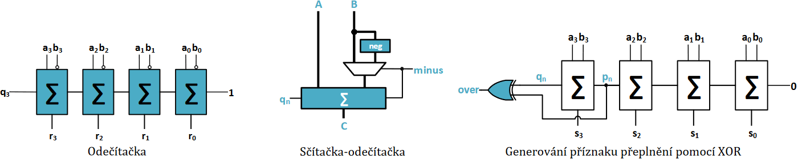
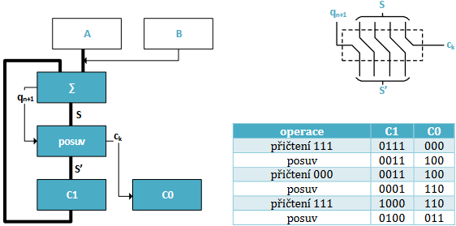

# 36

> Aritmetické obvody (výpočet aritmetických operací pomocí číslicových obvodů).

## Sčítání



* Vícebitové paralelní sčítačky ⇒ zpoždění
  * Řešením sčítačka s predikcí přenosu, která obsahuje rozsáhlý obvod pro paralelní výpočet přenosů
* Sériová sčítačka je nejjednodušší
  * Díky malému zpoždění v kombinační logice (v tomto případě) lze počítat ve vysokých frekvencích
  * Součet dvou _n_-bitových čísel trvá _n_ taktů
  * Kompromis – sérioparalelní sčítačka

## Odečítání

* Druhé číslo je převedeno do dvojkového doplňku (znegovat a přičíst jedna)
* Používají se sčítačky, kde _B_ je znegováno a na _P_ nejnižší sčítačky je přivedena horká jednička, která zajistí přičtení jedničky v nejnižším řádu



## Násobení

* Časté použití u zpracování signálů (konvoluční filtry, ...)
* V binární soutavě odpovídá aritmetické násobení dvou bitů funkci AND
* Násobení vícebitových čísel je docíleno pomocí sčítání a posuvů
* U násobení záporných čísel lze násobit absolutní hodnoty a vyhodnotit znaménko

```text
        111     (7)
×       101     (5)
-------------------
        111
+      000
+     111
-------------------
     100011    (35)
```

### Sériová násobička



---
[>>>](./37.MD)
