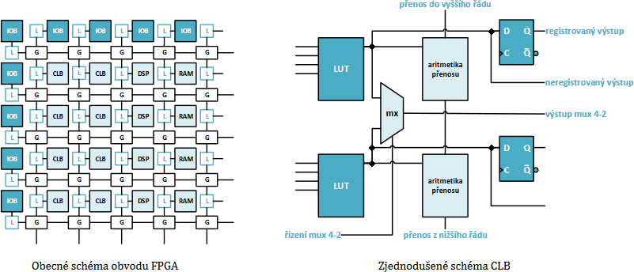

# 37

[<<<](./36.MD)
> Procesory, FPGA obvody (realizace automatů pomocí procesorů a FPGA).

## Procesor

* Sekvenční logický obvod, univerzální
* Obsahuje ALU, registry, řadič instrukcí, řadič přerušení, a další obvody usnadňující realizaci kompletního počítače

### Rozdělení CPU

1. Podle oblasti použití (Personal/Embedded/Server)
2. Podle šířky datové sběrnice (8–64 bit); Datová a adresní sběrnice nemusí být nutně stejně široké
3. Podle přístupu k paměti (Harvard / Von Neumann)
4. Podle typu instrukční sady (CISC/RISC)

### Harvardská architektura

* __Oddělené paměti pro data a program__
* Není nutné použít stejný typ paměti (různá šířka dat a adres / časování / kapacita)
* Pro program obvykle ROM (levnější) / FLASH, pro data SRAM
* Program není nutné číst z externího média (disku) a je chráněný proti přepisu
* CPU může k oběma pamětem přistupovat naráz (často se to ale nepoužívá)
* Typické pro jednočipové CPU

### Von Neumannova architektura

* __Společná paměť pro data a program__
* Univerzálnější koncepce, program je ale nutné nejdříve načíst z externího média
* Pomalejší přístup, rychlost pamětí je slabým článkem, proto CPU obvykle obsahují rychlou cache
* Klasický desktop je Von Neumann – v DRAM je nahrán jak program, tak potřebná data

### Možné CPU alternativy pro řídící aplikace

* Tranzistory, relé
* Logické integrované obvody / hradla
* __FPGA – Field Programmable Gate Array__
* PLC – Programmable Logic Controller

## FPGA – Hradlová pole



* Hradlová pole jsou tvořena do matice uspořádanou soustavou programovatelných bloků, ta je obklopena vstupně-výstupními bloky IOB; vše je vzájemně propojeno propojovací maticí
* CLB/PLB – Configurable (Programmable) Logic Block; tvořeno:
  * LUT – Look Up Table
    * V podstatě paměť s _n_-bitovou adresou a _m_ výstupy
    * Umožňuje realizovat _m_ libovolných funkcí pro _n_ vstupních proměnných
    * V praxi obvykle _n_=6 a _m_=2
  * Sekvenční obvod
    * Nejčastěji D, lze nastavit reakci na hladinu/náběžnou/sestupnou
  * Aritmetická logika
    * Umožňuje spojení programovatelných bloků do vyšších celků (např. sčítačka)
* FPGA dále obsahují obvody, které by při realizaci pomocí LUT příliš vyčerpávaly jeho zdroje:
  * Násobičky (DSP)
  * RAM
  * Případně řadiče externí paměti / sběrnice
  * Někdy i bloky procesorů
* Propojovací matice a její řízení zabírá většinu celého obvodu
* Nastavení prvků hradlového pole je obvykle řízeno z konfigurační paměti SRAM
  * Volatilní → možno přeprogramovat za běhu, ale při zapnutí je nutné odněkud konfiguraci nahrát

## Realizace automatů

¯\\\_(ツ)\_/¯

### Pomocí CPU

```c
#define btn 7
#define led1 13

unsigned long time;
int state;

void setup()
{
    pinMode(led1, OUTPUT);
    pinMode(btn, INPUT_PULLUP);  
    time = 0;
    state = 1;
    digitalWrite(led1, 0);
}

void loop()
{
    if (state == 1) {        
        if (!digitalRead(btn)) {state = 2; digitalWrite(led1, 1);}
    }
    else if (state == 2) {
        if (digitalRead(btn)) {state = 3;}
    }
    else if (state == 3) {
        if (!digitalRead(btn)) {state = 4; time = millis();}
    }
    else if (state == 4) {
        if (digitalRead(btn)) {state = 5;}
        else if (millis() > time + 200) {state = 2;}
    }
    else if (state == 5) {        
        if (!digitalRead(btn)) {state = 6; digitalWrite(led1, 0);}
        else if (millis() > time + 200) {state = 3;}
    }
    else if (state == 6) {
        if (digitalRead(btn)) {state = 1;}
    }
}
```

### Pomocí FPGA

```vhdl
library IEEE;
use IEEE.STD_LOGIC_1164.ALL;
use IEEE.NUMERIC_STD.ALL;

entity moore is
    Port(
        clk : in  std_logic;
        rst : in  std_logic;
        en  : in  std_logic;
        x   : in  std_logic;
        q   : out std_logic
    );
end moore;

architecture Behavioral of moore is
    type fsm_t is (SXXX, S1XX, S11X, S110);
    signal current_state, next_state : fsm_t;
begin

    fsm_mem : process(clk)
    begin
        if rising_edge(clk) then
            if rst = '1' then
                current_state <= SXXX;
            elsif en = '1' then
                current_state <= next_state;
            end if;
        end if;
    end process;
    
    fsm_transfer : process(current_state, x)
    begin
        case current_state is
            when SXXX =>
                if x = '1' then
                    next_state <= S1XX;
                else
                    next_state <= SXXX;
                end if;                                
            when S1XX =>
                if x = '1' then
                    next_state <= S11X;
                else
                    next_state <= SXXX;
                end if; 
            when S11X =>
                if x = '1' then
                    next_state <= S11X;
                else
                    next_state <= S110;
                end if; 
            when S110 =>
                if x = '1' then
                    next_state <= S1XX;
                else
                    next_state <= SXXX;
                end if; 
            when others => next_state <= SXXX;
        end case;
    end process;
    
    process(current_state)
    begin
        case current_state is
            when S110 => q <= '1';
            when others => q <= '0';
        end case;
    end process;

end Behavioral;
```

---
[>>>](./01.MD)
