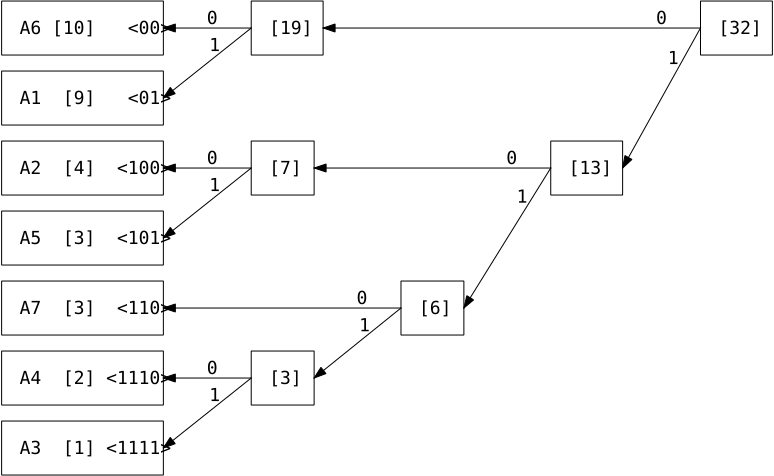

# 06

[<<<](./05.MD)
> Minimální kódy – základní pojmy (Kraftova nerovnost, nejkratší kód), Huffmanova konstrukce, aritmetické kódy. Adaptivní metody (Huffman).

## Šifrování a kódování

Při nakládání s daty řešíme tři okruhy problémů:

1. __Množství__ dat
   1. → kompresní metody (bez/ztrátové)
      * Statistické (pravděpodobnostní)
        * Nultého řádu
        * Řádu 𝑘 ∈ ℕ⁺ (u četností bere v úvahu 𝑘 předcházejících symbolů)
      * Slovníkové
        * Pevný slovník (využívaný např. kompilátorem)
        * Adaptivní slovník (např. metoda sliding window)
   2. → minimální kódy
2. __Spolehlivost__ dat – ochrana před šumem → detekční/opravné kódy
   * Chyba – bylo přijato nekódové slovo
   * Oprava – hledání kódového slova co nejméně odlišného od přijatého
3. __Bezpečnost__ dat – ochrana před neautorizovaným přístupem → šifrování

## Kódování

### Základní pojmy kódování

* __Zdrojová abeceda__ 𝐴 = {𝑎₁, ..., 𝑎𝑟} a její prvky zvané zdrojové znaky
  * Množina znaků používaných k zápisu původní nezakódované zprávy
* __Kódová abeceda__ 𝐵 = {𝑏₁, ..., 𝑏𝑛} a její prvky zvané kódové znaky
  * Množina znaků používaných k zápisu zakódované zprávy
  * Podle počtu znaků mluvíme o 𝑛-znakovém kódu, speciálně 𝑛=2 binární kód, 𝑛=3 ternární kód, ...
  * Pokud máme 𝑛-znakový kód, tak dokážeme vytvořit 𝑛𝑑 slov o délce 𝑑
* __Kódování__
  * Kódování je prosté zobrazení zdrojové abecedy 𝐴 do množiny všech konečných slov nad kódovou abecedou 𝐵
  * 𝐾: 𝐴 → 𝐵\*
  * Slovo 𝐾(𝑎) vytvořené ze znaků kódové abecedy nazýváme _kódové slovo_ příslušné zdrojovému znaku 𝑎
  * Prosté zobrazení znamená, že každý obraz má maximálně jeden vzor; ∀𝑎₁,𝑎₂ ∈ 𝐴 kde 𝑎₁ ≠ 𝑎₂ platí 𝐾(𝑎₁) ≠ 𝐾(𝑎₂)
* __Kódování zdrojových zpráv__
  * Je-li __prosté__ zobrazení 𝐾: 𝐴 → 𝐵\* kódování, potom:
    * Kódování zdrojových zpráv je zobrazení 𝐾\*: 𝐴\* → 𝐵\*
    * 𝐾\* je definované pro libovolné slovo 𝑎𝑖₁…𝑎𝑖𝑘 nad 𝐴 vztahem 𝐾\*(𝑎𝑖₁…𝑎𝑖𝑘) = 𝐾(𝑎𝑖₁)…𝐾(𝑎𝑖𝑘)
    * Jedná se tedy o zřetězení kódových slov 𝐾(𝑎𝑖₁), ..., 𝐾(𝑎𝑖𝑘)
    * To, že 𝐾 je prosté, nemusí nutně znamenat, že 𝐾\* je prosté
* __Jednoznačně dekódovatelné kódování__
  * Řekneme, že 𝐾 je jednoznačně dekódovatelné kódování, pokud 𝐾\* je prosté
* __Prefixový kód__
  * Kód, kde žádné kódové slovo není prefixem jiného slova
  * Prefixový kód je vždy jednoznačně dekódovatelný a navíc ho lze dekódovat průběžně („znak po znaku“, netřeba čekat na celou zprávu)
* __Blokový kód__
  * Kód, kde mají všechna kódová slova stejnou délku (počet použitých znaků kódové abecedy)
  * Délka blokového kódu je délka všech jeho kódových slov
  * Každý blokový kód je zároveň prefixový, a tedy jednoznačně dekódovatelný

Obvykle se snažíme konstruovat kódy s co nejkratšími kódovými slovy. Jaké podmínky musí splňovat délky slov konstruovaného (prefixového) kódu?

### Kraftova nerovnost

Mějme 𝑟-znakovou zdrojovou abecedu, potom existuje 𝑛-znakový prefixový kód dané abecedy s délkami kódových slov 𝑑₁, …, 𝑑𝑟 právě tehdy, jestliže platí:

### McMillanova věta

Pro každé jednoznačně dekódovatelné kódování platí Kraftova nerovnost.
 ⇒ Nemá smysl se zabývat neprefixovými kódy, nemají žádnou výhodu.

Při přiřazování kódových slov znakům zdrojové abecedy je vhodné znakům s vyšší pravděpodobností výskytu přiřazovat kratší kódová slova než znakům s nízkou četností. Proto pro znak 𝑎𝑖 uvádíme pravděpodobnost výskytu 𝑝𝑖, kde (1 > 𝑝𝑖 > 0) ∧ (Σ𝑝𝑖 = 1).

### Střední délka kódového slova

Mějme zdrojovou abecedu se znaky 𝑎𝑖, kde kódová slova 𝐾(𝑎𝑖) mají délky 𝑑𝑖 a četnosti 𝑝𝑖, pak střední délkou kódového slova nazýváme:

Jedná se v podstatě o vážený průměr a nižší znamená lepší.

### Nejkratší kód

Nejkratší 𝑛-znakový kód zdrojové abecedy je takový kód, který má ze všech 𝑛-znakových prefixových kódů dané abecedy nejmenší střední délku kódového slova. Existuje vždy, ale není určen jednoznačně (může jich pro danou abecedu existovat více).

Jak zkonstruovat nejkratší kód? Postupů je více, ale obvykle používáme Huffmanovu konstrukci nejkratšího kódu.

### Huffmanova konstrukce (binární varianta)

* Není jednoznačná, jednoznačně je určena pouze střední délka kódového slova
* 2 fáze: redukce a rekonstrukce
* Fáze redukce – Opakované nahrazování dvou nejméně četných znaků zdrojové abecedy jedním znakem
  * Abeceda určená k redukci musí mít znaky seřazeny dle pravděpodobnosti jejich výskytu nerostoucím způsobem
  * Z abecedy {𝑎₁, ..., 𝑎ᵣ₋₂, 𝑎ᵣ₋₁, 𝑎ᵣ} dostáváme {𝑎₁, ..., 𝑎ᵣ₋₂, 𝑎*}, kde 𝑝* = 𝑝ᵣ₋₁ + 𝑝ᵣ
  * Redukovanou abecedu je nutno znovu seřadit podle pravděpodobností výskytu
  * Takto redukujeme, dokud nemáme dvouznakovou abecedu (ke které umíme sestrojit nejkratší binární kód)
* Fáze rekonstrukce je založena na tvrzení:
  * Jestliže {𝑎₁, ..., 𝑎ᵣ₋₂, 𝑎*} má nejkratší kód {𝐾(𝑎₁), ..., 𝐾(𝑎ᵣ₋₂), 𝐾(𝑎*)},
  * pak {𝑎₁, ..., 𝑎ᵣ₋₂, 𝑎ᵣ₋₁, 𝑎ᵣ} má nejkratší kód {𝐾(𝑎₁), ..., 𝐾(𝑎ᵣ₋₂), 𝐾(𝑎*)0, 𝐾(𝑎*)1}.
* Konstrukce pomocí stromu
  * Znaky původní abecedy jsou listy; zapsány do sloupce s nejvyšší četností nahoře
  * Redukujeme vždy dva uzly s nejnižší četností, případně preferujeme ty více vespod
  * Redukujeme, dokud nevznikne kořen
  * Při ohodnocování hran vždy přiřazujeme jedničku znakům s menším 𝑝, případně preferujeme ty více vespod
  * Zapisováním ohodnocení směrem od kořenu k listu zjistíme dané kódové slovo
* Obecná 𝑛-ární varianta konstrukce je analogická, jen v prvním kroku neredukujeme všech 𝑛 znaků, ale jen 𝑠, kde (2 ≤ 𝑠 ≤ 𝑛) ∧ ((𝑛-1)|(𝑟-𝑠))

### Aritmetické kódy

* Aritmetické kódy jsou metody bezztrátové komprese nultého řádu
* Obecný postup:
  * Předpokládáme zdrojovou abecedu se znaky 𝑎𝑖 seřazenými podle pravděpodobnosti výskytu nerostoucím způsobem
  * __1.__ Konstrukce intervalů pro prefixy
    * Pro jednotlivé prefixy kódového slova 𝑥 = 𝑎𝑖1…𝑎𝑖𝑛 ∈ 𝐴* postupně konstruujeme posloupnost do sebe vnořených intervalů, které jednoznačně reprezentují daný prefix
    * <0,1) ⊃ 𝐼(𝑎𝑖1) ⊃ 𝐼(𝑎𝑖1𝑎𝑖2) ⊃ ... ⊃ 𝐼(𝑎𝑖1…𝑎𝑖𝑛)
    * (Všechna slova nad 𝐴 mající pevnou délku tvoří rozklad intervalu <0,1)
  * __2.__ Určení vhodného reprezentanta posledního intervalu, tedy číslo, které jednoznačně reprezentuje daný interval
  * __3.__ Určení vhodné binární reprezentace reprezentanta, ta je kódem slova 𝑥
* Jednotlivé metody aritmetického kódování se liší v druhém a třetím kroku
* Reprezentant nezaručuje jednoznačnou rekonstrukci ve smyslu délky rekonstruovaného slova, pro jednoznačnou rekonstrukci je nutná znalost délky původního slova

### Adaptivní metody komprese

Stanovují četnosti průběžně na základě již zpracovaných dat.

#### Faller-Gallagher-Knuth (FGK, Adaptivní Huffmanovo kódování)

Zakódování slova o délce 𝑛 znaků probíhá v 𝑛 na sebe navazujících fázích. Každá fáze tedy „řeší“ jeden zdrojový znak. V první fázi se předpokládají stejné četnosti všech znaků. V každé fázi provedeme standardizovanou Huffmanovu konstrukci a na výstup odešleme kódové slovo právě řešeného znaku. Následně zvýšíme četnost řešeného znaku o jedna a můžeme přejít do další fáze (kde tvoříme nový strom s&nbsp;aktualizovanými četnostmi a zajímá nás kódové slovo dalšího znaku). Znaky se stejnou četností jsou seřazeny podle toho, kdy byla jejich četnost zvýšena („nejstarší nahoře“). Dekódování je analogické.

### Příklad Huffman

Nalezněte nejkratší kód abecedy:

<table><tr><th>Znak</th><td>A1</td><td>A2</td><td>A3</td><td>A4</td><td>A5</td><td>A6</td><td>A7</td></tr><tr><th>Četnost</th><td>9/32</td><td>1/8</td><td>1/32</td><td>1/16</td><td>3/32</td><td>5/16</td><td>3/32</td></tr><tr><th>×32</th><td>9</td><td>4</td><td>1</td><td>2</td><td>3</td><td>10</td><td>3</td></tr></table>

  

Střední délka slova = 1/32[2(10+9) + 3(4+3+3) + 4(2+1)] = 5/2 = 2,5

---
[>>>](./07.MD)
