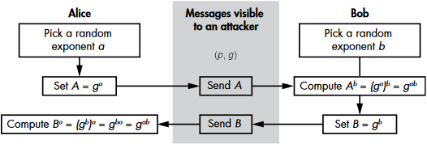

# 08

[<<<](./07.MD)
> Symetrické a asymetrické kryptosystémy – základní principy, vlastnosti. Hybridní kryptosystémy. Elektronický podpis, certifikáty. Hashovací funkce pro kryptografii.

## Kryptografie

```text
                   <Eva👀>

<Alice> 𝑍 --→ [ENC] --𝐶--> [DEC] --> 𝑍 <Bob>
                ↑            ↑
                𝐾ᴱ           𝐾ᴰ

 Zašifrovaná ciphertext zpráva: 𝐶 = ENC(𝑍, 𝐾ᴱ)
Nezašifrovaná plaintext zpráva: 𝑍 = DEC(𝐶, 𝐾ᴰ)
```

Kryptografie je nauka o šifrování, zabývá se tedy metodami ochrany dat před neautorizovaným přístupem. Cílem je utajit obsah zprávy před Evou (neřeší utajení existence zprávy a jejích metadat) a zaručit Bobovi, že zpráva pochází opravdu od Alice a nikdo ji nezměnil (autentizační kryptosystémy). Zašifrovaná zpráva 𝐶 cestuje po komunikačním kanále (pošta, telegram, internet, ...), který má omezenou kapacitu, chybovost, lze jej odposlouchávat atd. Šifry dělíme do dvou hlavních kategorií:

* Symetrické: `𝐾ᴰ == 𝐾ᴱ` nebo lze jednoduše odvodit; dělíme na blokové (__BŠ__) a proudové (__PŠ__)
* Asymetrické: `𝐾ᴰ != 𝐾ᴱ` a prakticky ho nelze odvodit

### Základní funkce šifrování

#### Caesarova šifra

* Posun abecedy, klíčem je počet posunů
* Triviální, málo možných klíčů
* První doložená substituční šifra

#### Monoalfabetická šifra

* Každému znaku je přiřazen jiný znak
* Klíčů je 26! ≈ 10<sup>26</sup>
* Slabé – zachovává statistické vlastnosti zprávy (lze použít frekveční analýzu)

#### Homofonní šifra

* Znaky, které se vyskytují častěji, mají více šifrovaných znaků (A → 31, 18, 25, 44; B → 24; C → 5, 11, ...)

#### Polyalfabetická šifra

* Více abeced, které měníme podle nějakého klíče
* Např. Vigenèrova šifra

#### Polygrafická šifra

* Nepracuje s jednotlivými písmeny, ale skupinami znaků

### Vermanův kryptosystém (jednorázová tabulka)

* `len(klíč) == len(zpráva)`
  * Každý znak klíče určuje posunutí daného znaku zprávy v abecedě
  * V binární variantě pak lze použít XOR
* Pokud je klíč dokonale náhodný a není používán opakovaně, pak je šifra nerozluštitelná
* Problémem je spotřeba a náhodnost klíče

### Kerckhoffův princip

Bezpečnost šifrovacího systému nesmí záviset na utajení de/šifrovacího algoritmu, ale pouze na utajení klíče.

### nonce

Číslo, na jehož hodnotě nezáleží (obvykle náhodné/čítač/...), které může být použito pouze jednou během kryptografické komunikace. Dvojice `(klíč, nonce)` se nikdy nesmí opakovat. Hodnota nonce nemusí být utajena.

### Výpočetní bezpečnost

* Co se dá provést v rozumném čase rozumnými prostředky
* Příklad: Znám 𝐶, 𝑍 a hledám 128bitový 𝐾; po 2<sup>128</sup> vyhodnoceních ho jistě získám; to je ale hodně
* 𝑛-bitová bezpečnost znamená, že je potřeba 2<sup>𝑛</sup> operací
* Klíč o délce 𝑛 zajistí __NANEJVÝŠ__ 𝑛-bitovou bezpečnost
  * Může existovat lepší útok než bruteforce, nebo
  * Jedná se o vlastnost šifry jako takové (typické pro asymetrické šifry)
    * Např. RSA klíč o délce 2048 bitů odpovídá zhruba 90 bitům bezpečnosti
* Rozumnou hodnotou v dnešní době je bitová bezpečnost 𝑛 = 128, (192, 256)
  * ≤ 128 je potřeba odůvodnit (např. stačí při velmi krátké platnosti klíče)
* Další faktory bezpečnosti:
  * Paralelismus – šifry se většinou škálují lineárně (2 jádra znamenají dvojnásobné zrychlení)
  * Rychlost přístupu do paměti: registr >> L3 cache >> RAM
  * Předpočítání
  * Počet cílů – více klíčů jedním útokem

### Modely útoku na šifru a cíle bezpečnosti

* Pasivní
  * __COA (Ciphertext Only Attack)__ – Útočník má pouze zachycené šifrované texty 𝐶
  * __KPA (Known Plaintext Attack)__ – Útočník k některým 𝐶<sub>𝑖</sub> zná i 𝑍<sub>𝑖</sub>, tomu by měla dobrá šifra odolat
* Aktivní
  * _Oracle_ chápeme jako black box funkci, která dokáže de/šifrovat zprávy právě používaným klíčem
  * __CPA (Chosen Plaintext Attack)__ – Útočník má přístup k šifrovacímu oracle, může si nechat šifrovat libovolné zprávy
  * __CCA (Chosen Ciphertext Attack)__ – Útočník má přístup i k dešifrovacímu oracle
    * Může dešifrovat libovolné texty 𝐶 kromě toho, který se snaží prolomit
    * Dešifrovací funkce by mohla vyzradit nějakou vlastnost klíče
* „Alternativní“
  * __Side channel attack__ – Neútočí se na šifru jako takovou, ale na okolnosti její implementace (čas vykonání, peměťová náročnost, spotřeba energie, elektromagnetické vyzařování, akustická emise, ...)
  * __Validita šifry__ – Útočník zkouší dešifrovat různé texty, zdali to půjde, nebo hodí chybu typu _nelze dešifrovat_
  * __Invazivní útok__ – Útok na HW zařízení např. odbroušením čipu apod.
  * __Sociální útok__ – Úplatek, vydírání, násilí, ...

Důležitým cílem bezpečnosti je IND (Indistinguishability – „Nerozlišitelnost“), kdy 𝐶 musí být nerozlišitelné od náhodného řetězce. Také lze chápat takto: Pokud útočník dostane dvě 𝑍 a jedno 𝐶, nesmí být schopen zjistit, k jakému ze dvou 𝑍 toto 𝐶 patří. Kombinací IND a CPA pak vzniká IND-CPA (Indistinguishability under Chosen Plaintext Attack – „Sémantická bezpečnost“). Šifra splňující tuto vlastnost musí mít nějak zakomponovanou náhodu, opakující se zprávy jsou totiž hrozbou. Stejné 𝑍 zašifrované stejným klíčem tedy musí mít různé výsledky, proto se ke klíči přidává nonce, která se odesílá společně s 𝐶.

## Symetrické kryptosystémy

* Konfuze – vztah mezi 𝑍 a 𝐶 by měl být co nejsložitější
* Difuze – každý bit 𝑍 by měl ovlivňovat co nejvíce bitů 𝐶

### BŠ

* `Blok dat velikosti 𝑛 (& klíč) --→ [ENC] --→ Ciphertext velikosti 𝑛`
* Skládá se z vlastního algoritmu (využití např. transpozic) a módu použití
* Velikost bloku 𝑛:
  * _Tak akorát_ – používáme 64, 128, 256 bitů
  * Shora omezeno, aby se blok vešel do registrů CPU (žádné kilobajty)
  * Zdola omezeno, aby byl bezpečný proti codebook attack (64 bitů a více)
* Pracují v rundách (iteračně)
  * Jedna runda je sama o sobě kryptograficky slabá a teprve její opakování zajistí bezpečnost
  * Proč? Jedna runda je slabá – dá se dobře analyzovat a snadno implementovat
* Problém konstrukce šifry se tedy zjednodušil na konstrukci rundy
* Rundy – stejný algoritmus, různé rundové klíče odvozené od hlavního klíče
  * `𝐶 = R(R(R(𝑍, 𝐾₁), 𝐾₂), 𝐾₃)`
* 2 přístupy aplikování rund:

#### Feistelova síť

* Např. Blowfish, Twofish, DES, Lucifer

```text
Rozdělit blok na půlky 𝑥 a 𝑦
for i = 1 až 15:
    𝑥 ⊕= R(𝑦, 𝐾ᵢ)
    swap 𝑥, 𝑦
𝐶 = 𝑥 .. 𝑦
```

* Viz [wikimedia/FeistelCipherDiagram](https://upload.wikimedia.org/wikipedia/commons/f/fa/Feistel_cipher_diagram_en.svg), ([archived](https://web.archive.org/web/20260505072339/https://upload.wikimedia.org/wikipedia/commons/f/fa/Feistel_cipher_diagram_en.svg))

#### Substitučně permutační sítě

* Např. AES
* Každý krok má dvě části:
  1. Substituce – záměna bajtů – vnešení nelinearity
     * Linearita by znamenala (𝑍₁ → 𝐶₁) ∧ (𝑍₂ → 𝐶₂) ⇒ (𝑍₁+𝑍₂ → 𝐶₁+𝐶₂)
  2. Permutace (zamíchat) – rozptýlení informace – vnešení difuze
* Po každém kroku XORovat s rundovním klíčem
* Viz [wikimedia/SubstitutionPermutationNetwork](https://upload.wikimedia.org/wikipedia/commons/a/ab/SubstitutionPermutationNetwork-en.svg), ([archived](https://web.archive.org/web/20260503014320/https://upload.wikimedia.org/wikipedia/commons/a/ab/SubstitutionPermutationNetwork-en.svg))

##### AES – Advanced Encryption Standard

* Náhrada za DES (Data Encryption Standard) od roku 2000
* 3 varianty: 128/192/256 bitů klíče s 10/12/14 rundami
* Jeden blok převede 128bitový plaintext na 128bitový ciphertext (16 bajtů)
  * Blok je po bajtech rozdělen na čtverec 4×4, jednotlivé buňky nazýváme stavy S₀–S₁₅, číslováno po sloupcích

```text
                   K
 Z                 ↓             [ARK] – Add Round Key
 ↓               .----.            * XOR rundovního klíče Kᵢ na stav
[ARK] ← K₀ ←-----|    |            * Jediný krok závislý na klíči
 ↓               |    |          [SB] – Substitute Bytes
[SB]             |    |            * Náhrada dle tabulky, vložení nelinearity
[SR]             |    |            * 4 KB veřejně známých tabulek nezávislých na klíči
[MC]             |    |          [SR] – Shift Rows
[ARK] ← K₁ ←-----|    |            * Rotace řádků doleva
 .               |    |            * První řádek rotován o 0 pozic, druhý o 1, třetí o 2, čtvrtý o 3
 .               | KE |          [MC] – Mix Columns
 .               |    |            * Lineární transformace sloupce
 ↓               |    |            * Vynásobení konstantní maticí, kde násobení probíhá v GF a součet je ⊕
[SB]             |    |            * Vložení rozptýlení do celého sloupce
[SR]             |    |            * Chybí v poslední rundě
[ARK] ← Kᵣ ←-----|    |          [KE] – Key Expansion
 ↓               |    |            * Klíče jsou odvozovány pomocí SBoxů (substituce) a XORů
 C               '----'
```

* Pozn.: GF je Galoisovo těleso, násobení je v něm modulováno určitým polynomem

##### Bezpečnost

* Publikovány různé teoretické útoky, ale ne žádný praktický
* Kvantově odolná pro velikost klíče ≥256
* Rizika může přinést špatná implementace algoritmu, nebo nevhodně zvolený mód použití
* Pro módy použití viz [wikimedia/BlockCipherModesOfOperation](https://upload.wikimedia.org/wikipedia/commons/thumb/e/ef/BlockCipherModesofOperation.svg/1920px-BlockCipherModesofOperation.svg.png), ([archived](https://web.archive.org/web/20250827193756/https://upload.wikimedia.org/wikipedia/commons/thumb/e/ef/BlockCipherModesofOperation.svg/1920px-BlockCipherModesofOperation.svg.png))

##### Mód použití ECB – elektronická kódová kniha

* Rozdělíme zprávu 𝑍 na bloky příslušné délky (16 bajtů) a šifrujeme je zvlášť
* Opakující se bloky jsou viditelné – __nikdy__, za žádných okolností, nepoužívat
* Klasický příklad s obrázkem tučňáka, viz [wikimedia/TuxEncryptedECB](https://upload.wikimedia.org/wikipedia/commons/9/96/Tux_encrypted_ecb.png), ([archived](https://web.archive.org/web/20241214185855/https://upload.wikimedia.org/wikipedia/commons/9/96/Tux_encrypted_ecb.png))

##### Mód použití CBC – Cipher Block Chaining

* K ECB přidáme zřetězení, blok zprávy je nejprve XORován se ciphertextem předchozího bloku:

```text
𝐶₁ = ENC(𝑍₁ ⊕ IV)
𝐶₂ = ENC(𝑍₂ ⊕ 𝐶₁)
𝐶₃ = EMC(𝑍₃ ⊕ 𝐶₂)
...
```

* `IV` (_initialization vector_) je v tomto případě 16bajtová nonce
* Výsledek bloku závisí na všech předchozích výsledcích
  * Šifrování nelze paralelizovat (problém)
  * Dešifrování paralelizovat lze
* Zprávu je potřeba doplnit na délku dělitelnou 16 bajty
  * Buď přidáním „výplně“ (pro tento způsob dříve existoval devastující útok _padding oracle_)
  * Nebo se na doplnění 𝑍<sub>𝑛</sub> použije část bitů z 𝐶<sub>𝑛-1</sub> (metoda _ciphertext stealing_)

##### Mód použití CTR – Counter

Režim Counter (CTR) z blokové šifry v podstatě dělá šifru proudovou: Do každého bloku vstupuje klíč, nonce a čítač. Čítač je inkrementován pro každý blok a nonce s klíčem mohou zůstat stejné. Trojice `(klíč, nonce, čítač)` se nesmí opakovat. Pro potřeby šifrování jsou výstupní bity XORovány s částí plaintext zprávy.

##### Mód použití GCM – Galois Counter Mode

Problém režimu CTR je, že nijak nechrání ciphertext – změna bitu 𝐶<sub>𝑖</sub> se po dešifrování projeví změněným bitem 𝑍<sub>𝑖</sub>. Útočník sice nemůže zjistit obsah původní zprávy, ale může ho změnit. Tento problém je nutno vyřešit přidáním nějaké formy autentizace/kontroly integrity zpráv. Je potřeba autentizovat nonce, všechny bloky ciphertextu a délku zprávy; případně ještě tzv. _associated data_, která nejsou šifrována, ale chceme je autentizovat (např. hlavičky). Režim GCM vytváří otisk 𝑇 postupným násobením hodnotou 𝐻 = AESₖ(128 × 0) a XORováním. Násobení probíhá v&nbsp;GF¹²⁸ (polynomiální modulo).

𝑇 = ENC(nonce) ⊕ (𝐻 ⋅ (Len ⊕ ( … 𝐻 ⋅ (𝐶₂ ⊕ (𝐻 ⋅ 𝐶₁)))))

Viz [wikimedia/GCM](https://upload.wikimedia.org/wikipedia/commons/2/25/GCM-Galois_Counter_Mode_with_IV.svg), ([archived](https://web.archive.org/web/20250712105041/https://upload.wikimedia.org/wikipedia/commons/2/25/GCM-Galois_Counter_Mode_with_IV.svg)).

### PŠ

Proudová šifra využívá deterministický generátor náhodných bitů, který musí být „nastartován“ konkrétní hodnotou, aby bylo možné de/šifrovat. Generované bity se pak XORují s bity zprávy, a tím vzniká ciphertext. Druhá strana pak stejnými bity vyXORuje ze ciphertextu původní zprávu.

* Určitá podobnost k šifře jednorázovou tabulkou
* Vstupem generátoru je dvojice `(klíč, nonce)`
* PŠ dělíme na stavové a s počítadlem
  * __Stavové__ – tajný vnitřní stav, ze kterého se odvozuje budoucí stav a výstup; potenciální riziko
  * __S počítadlem__ – vstupem je trojice `(klíč, nonce, čítač)`
* PŠ mohou být realizovány softwarově nebo hardwarově
  * __HW PŠ__: Zpětnovazební posuvný registr
  * __SW PŠ__: AES v režimu CTR nebo Salsa20 a její nástupce ChaCha

## Hashovací funkce

* Hashovací funkce pro libovolný vstup vrací omezený výstup ve smyslu pevného počtu bitů
* `𝑍 → [ℎ()] → 𝐻`

### Požadavky na kryptografickou hashovací funkci

* Nutné
  1. __Jednosměrnost__
     * Ke známému hashi je těžké najít jeho původní zprávu
  2. __Nenalezení konkrétní kolize__
     * Ke známé 𝑍₁ je těžké najít 𝑍₂ takovou, že mají stejný hash
     * |𝐻| = 256 ⇒ ~2²⁵⁶ pokusů bez jistoty
     * Pokud splňuje toto, pak automaticky splňuje i.
  3. __Nenalezení libovolné kolize__
     * Je těžké najít libovolné 𝑍₁ a 𝑍₂ takové, že mají stejný hash
     * |𝐻| = 256 ⇒ ~2¹²⁸ pokusů s jistotou („narozeninový útok“)
     * Pokud splňuje toto, pak automaticky splňuje i. a ii.
* Doporučené
  1. 100% nekorelovatelnost vstupů a výstupů
  2. Odolnost proti skoro-kolizím
     * Je těžké najít libovolné 𝑍₁ a 𝑍₂ takové, že se jejich hash liší v malém počtu bitů
  3. Lokální vůči získání předlohy
     * Z daného hashe je těžké odvodit i jen část původní zprávy

Proto by 𝐻 mělo rovnoměrně záviset na všech bitech 𝑍 a změna jednoho bitu 𝑍 by měla statisticky změnit polovinu bitů 𝐻.

### Útoky na HF

#### Narozeninový útok

* [Narozeninový paradox](https://cs.wikipedia.org/wiki/Narozeninov%C3%BD_probl%C3%A9m)
  * (zjednodušeně) Pravděpodobnost, že dva lidé v místnosti budou mít narozeniny ve stejný den, rychle stoupá s přibývajícím počtem lidí, protože rychle stoupá počet porovnávání, které musíme provést.
* Narozeninový útok „využívá“ narozeninového paradoxu
  * Namísto hledání konkrétní kolize se hledá libovolná kolize
  * S přibývajícími vypočtenými hashi opět stoupá počet porovnávání a tedy šance na kolizi
  * I přesto je paměťová náročnost 2<sup>_počet\_bitů_/2</sup>

#### ρ útok

* Opakované aplikování hashovací funkce
  * 𝐻₁ = ℎ(𝑍)
  * 𝐻₂ = ℎ(𝐻₁) = ℎ(ℎ(𝑍))
  * 𝐻₃ = ℎ(𝐻₂) = ℎ(ℎ(ℎ(𝑍)))
* Za nějaký čas vznikne cyklus
* Jak detekovat cyklus bez ukládání všeho do paměti?
  * Finta s dvěma závodníky, kdy jeden je rychlejší a setkání znamená kolizi (cyklus). Špatně paralelizovatelné.

### Konstrukce HF

Vstup je rozdělen na bloky stejné délky a na ně je aplikována funkce. Existují dva principy: _Kompresní konstrukce_ a _Houba_.

Kompresní konstrukce využívá kompresní funkce, která ze dvou vstupů pevné délky udělá jeden výstup pevné délky (pro tento účel lze použít blokovou šifru). První blok zprávy je kompresován s pevnou počáteční hodnotou, výsledek této operace je kompresován s dalším blokem zprávy. Takto se pokračuje, dokud není zpráva vyčerpána (délka zprávy musí být dělitelná velikostí bloku, případně přidat výplň). Viz [wikimedia/MerkleDamgårdHashConstruction](https://upload.wikimedia.org/wikipedia/commons/e/ed/Merkle-Damgard_hash_big.svg), ([archived](https://web.archive.org/web/20250725125328/https://upload.wikimedia.org/wikipedia/commons/e/ed/Merkle-Damgard_hash_big.svg)).

Houba má svůj vnitřní stav, který je na začátku nulový a který lze rozdělit na dvě části _rate_ a _capacity_. Využívá se zde permutačních funkcí fixní délky. Ve fázi nasávání je zpráva rozdělena na několik částí, ty jsou postupně XORovány s _rate_ a permutovány s celým vnitřním stavem (_rate_ + _capacity_). Ve fázi ždímání je část _rate_ poslána na výstup a celý vnitřní stav je permutován; toto se opakuje, dokud nemáme požadovaný počet výstupních bitů. Čím vyšší capacity, tím bezpečnější houba je (menší šance na kolize atd., o to je ale zase pomalejší). Viz [keccakteam/Sponge](https://keccak.team/images/Sponge-150.png), ([archived](https://web.archive.org/web/20250404134309/https://keccak.team/images/Sponge-150.png)). SHA-3 má vnitřní stav o velikosti 1600 bitů, permutační funkce provádí operace na pomyslném kvádru o velikosti 5×5×64. _Capacity_ má velikost dvakrát větší, než je velikost požadovaného hashe (zbytek je _rate_).

### Používané HF

* MD5 – prolomeno; rychlá, ale nepoužívat pro utajení informace
* SHA-1 – prolomeno
* SHA-2 – současnost
* SHA-3 – využívá konstrukci Houba
* Blake2 – rychlost a bezpečnost ≥ SHA-3, ale není standardizováno; využívá šifru ChaCha

### Hashování s klíčem

Protože nemají žádné tajemství, u běžných hashovacích funkcí může kdokoliv vypočíst hash nějaké zprávy a tedy i zkontrolovat, zdali určitá zpráva vede na určitý hash. Jsou ale situace, kdy nechceme, aby toto mohl provést kdokoliv. Proto existuje hashování s klíčem, které je základem dvou kryptografických algoritmů: MAC (_message authentization code_), který autentizuje zprávy a zaručuje jejich integritu, a PRF (_pseudorandom function_), který produkuje náhodně vypadající _hash-sized_ hodnoty.

#### MAC

* 𝑇 = MAC(𝐾, 𝑍)
  * Odesílatel odešle 𝑍 a 𝑇
  * Příjemce z klíče a obdržené zprávy vypočte 𝑇', pokud 𝑇 == 𝑇', pak je zaručeno:
    * Integrita (zpráva nebyla po cestě změněna)
    * Autenticita odesílatele
    * Pokud 𝑍 bylo zašifrováno, je zajištěna důvěrnost
* Podmínka bezpečnosti:
  * Klíč musí zůstat v tajnosti
  * Útočník nesmí být schopen vyrobit padělek bez znalosti klíče (padělek je platná dvojice 𝑍 a 𝑇)
* Možný útok:
  * Zachytit 𝑍 a 𝑇 a později je poslat znovu; obranou je číslovat zprávy (běžná součást většiny protokolů)

#### PRF

* 𝑇 = PRF(𝐾, 𝑍), kde 𝑇 je nerozlišitelné od náhodné sekvence nul a jedniček
* „Silnější“ než MAC
* Obvykle se používá k jiným účelům než MAC
  * Tvorba blokových šifer
  * Server nám odešle náhodnou 𝑍 a my odpovědí PRF(𝐾, 𝑍) prokážeme, že známe klíč
  * Generace náhodných hodnot

Klíčovaný hash lze sestrojit tak, že vezmeme kryptografickou HF a do ní pošleme nějakým způsobem spojený klíč se zprávou (symbol `||` zde chápeme jako zřetězení). Nebo existují specializovaná řešení.

* Tajná předpona – `ℎ(𝐾 || 𝑍)`, možný útok prodloužením
* Tajná přípona – `ℎ(𝑍 || 𝐾)`
* Sandwich – `ℎ(𝐾 || 𝑍 || 𝐾)`
* Hash based MAC – `ℎ( (𝐾 ⊕ 0x5c5c5c5c...) || ℎ((𝐾 ⊕ 0x36363636...) || 𝑍) )`

## Asymetrické kryptosystémy

* Zásadní nevýhoda symetrického schématu je nutnost předání klíče po zabezpečeném kanále
* Asymetrická kryptografie:
  * Veřejný a soukromý klíč
  * Co se zašifruje jedním, dešifruje se __jedině__ druhým klíčem
  * Klíče nejsou libovolné, je mezi nimi matematický vztah, který musí mít charakter jednosměrné funkce
  * → Ze znalosti veřejného klíče je těžké odvodit soukromý klíč (obráceně je to obvykle snadné)

```text
Alice zná As, Av, Bv
  Bob zná Bs, Bv, Av

A → B
* Alice může zašifrovat svým soukromým, ale rozšifruje každý, kdo zná veřejný
    → zajistí integritu a autenticitu, ale NE důvěrnost
* Pokud zašifruje svým veřejným, nikdo to nerozšifruje
* Bobův soukromý nezná
* Zbývá Bobův veřejný – zajistí důvěrnost

⇒ Šifrujeme veřejným klíčem protistrany
```

* Problém výkonu: až stotisícina výkonu stejně bezpečné symetrické šifry (⇒ hybridní kryptosystémy)
* Délka klíče není rovna bezpečnosti: 2048bitový klíč dává zhruba 90 bitů bezpečnosti
* Problém distribuce a ověření pravosti klíče

### Diffieho–Hellmanova výměna klíčů (1976)

Diffie–Hellman je způsob ustanovení společného tajemství po nezabezpečeném kanále. Z tohoto tajemství pak lze vytvořit symetrický klíč.

* Základem je počítání na grupě ℤ<sub>𝑝</sub>
  * 𝑝 je „bezpečné“ prvočíslo (~4000 bitů)
  * 𝑔 je základ, ve kterém se budou počítat mocniny (malé prvočíslo, skoro vždy 2)
* Alice, Bob:
  * Domluva 𝑝 a 𝑔
  * Alice si zvolí tajné číslo 𝑎, Bob zvolí tajné číslo 𝑏 (to jsou jejich privátní klíče, měly by být velké – 2<sup>80-ish</sup> bitů)
  * Všechny výpočty jsou __modulo 𝑝__:
    * Alice vypočte 𝐴 = 𝑔<sup>𝑎</sup>, Bob vypočte 𝐵 = 𝑔<sup>𝑏</sup> (to jsou jejich veřejné klíče)
    * Vymění si po nezabezpečeném kanále 𝐴 a 𝐵
    * Alice vypočte 𝐵<sup>𝑎</sup> a Bob vypočte 𝐴<sup>𝑏</sup>
      * 𝐵<sup>𝑎</sup> = (𝑔<sup>𝑏</sup>)<sup>𝑎</sup> = 𝑔<sup>𝑏𝑎</sup> = 𝑔<sup>𝑎𝑏</sup>
      * 𝐴<sup>𝑏</sup> = (𝑔<sup>𝑎</sup>)<sup>𝑏</sup> = 𝑔<sup>𝑎𝑏</sup>
      * 𝑔<sup>𝑎𝑏</sup> je společné tajemství



* Samotný DH není autentizovaný a je náchylný na MITM
* Společné tajemství 𝑔<sup>𝑎𝑏</sup> není dobrý šifrovací klíč, použijeme ho jako vstup PRF pro vytvoření klíče

### RSA (Rivest, Shamir, Adleman; 1977)

* Princip: násobení na konečné grupě
* Soukromý klíč: trojice čísel (𝑝₁, 𝑝₂, __𝑑__)
  * 𝑝₁,₂ jsou prvočísla kryptografické velikosti: ~1000 bitů, 300 číslic
  * 𝑑 je soukromý exponent závislý na 𝑝₁,₂
* Veřejný klíč: dvojice čísel (𝑛, 𝑒)
  * 𝑛 je součin 𝑝₁ ⋅ 𝑝₂
  * 𝑒 je veřejný exponent, často 2¹⁶ + 1 = 65537
* Princip: ze znalosti 𝑛 neumíme určit 𝑝₁,₂
* Platí:
  * ϕ(𝑛) = (𝑝₁ - 1)(𝑝₂ - 1) &emsp; (Eulerova funkce ϕ(𝑛) vrací počet čísel v řadě 1 až 𝑛, která jsou nesoudělná s 𝑛)
  * NSD(𝑒, ϕ(𝑛)) = 1
  * 𝑒 ⋅ 𝑑 ≡ 1 (mod ϕ(𝑛)) → odsud je odvozen soukromý exponent 𝑑
* Šifrování:
  * __𝐶 = 𝑍<sup>𝑒</sup> mod 𝑛__
* Dešifrování:
  * __𝑍 = 𝐶<sup>𝑑</sup> mod 𝑛__<br>&emsp;= (𝑍<sup>𝑒</sup>)<sup>𝑑</sup> mod 𝑛<br>&emsp;= 𝑍<sup>𝑒𝑑</sup> mod 𝑛 &emsp; (Eulerova věta, pro nesoudělná čísla 𝑎,𝑚 platí 𝑎<sup>ϕ(𝑚)</sup> ≡ 1 (mod 𝑚) ↴)<br>&emsp;= 𝑍 mod 𝑛

## Elektronický podpis & certifikáty

* Samostatně neexistuje, vždy patří k nějakému dokumentu
* Otisk dokumentu (výsledek kryptografické hashovací funkce) zašifrovaný soukromým klíčem podepisujícího
  * Veřejným klíčem rozšifrujeme a ověříme, že se jedná o dokument dané osoby
* Problém: jak ověřit, že veřejný klíč patří konkrétní osobě

### → Certifikáty

* Svazuje veřejný klíč s osobou / firmou / serverem / ...
* Části: veřejný klíč, osvědčení (na koho, kdo vydal), elektronický podpis certifikační autority
* Certifikační autority (CA) jsou hierarchicky organizované
  * Kořenové CA – certifikáty jsou součástí instalace OS
  * _CA je v podstatě veřejný klíč natvrdo nastavený hluboko v OS/browseru_

### Právo a pořádek

* Elektronický podpis (EP) (bez přívlastku) – nemá význam, pokud nemám informace o veřejném klíči protistrany
* Zaručený EP – založen na certifikátu vydaným CA, tu si ale může založit kdokoliv
* Uznávaný EP – založen na certifikátu vydaným akreditovanou CA (záruka ze strany státu, jako jediný má právní váhu)
* EP je vždy akt lidské vůle („tohle chci podepsat“), jinak hovoříme o elektronické značce (automaticky vytvořený EP)

## Hybridní kryptosystémy

Hybridní kryptosystémy kombinují výhody symetrického a asymetrického šifrování. Symetrické šifry jsou rychlejší, ale je potřeba nějak předat klíč po nezabezpečeném kanále. K předání dočasného klíče slouží právě asymetrická šifra.

### TLS – Transport Layer Security

TLS je skupina protokolů, které tvoří standard dnešní komunikace. Jedná se o dostatečné zabezpečení pro většinu použití, často se setkáme s&nbsp;kombinací `TLS_AES_128_GCM_SHA256`. TLS leží mezi transportní a aplikační vrstvou, na kterých je nezávislá (obvykle `[HTTP] ↔ [TLS] ↔ [TCP]`). V&nbsp;TLS komunikaci jsou vždy dvě strany: klient a server (nemusí nutně odpovídat reálnému vztahu dvou daných zařízení). Komunikace je založena na certifikátech – server má certifikát, který vydala certifikační autorita. TLS se dělí na _handshake protocol_, který se stará o ustanovení klíče (založeno na DH, „klient navrhuje a server si vybírá“), a _record protocol_, který pak řeší převoz samotných dat.

#### TLS handshake protocol

```text
Klient
======
* Vygeneruje dvojici DH (Diffie–Hellman) klíčů 𝑐, 𝐶 = 𝑔ᶜ mod 𝑝
* Posílá "Client Hello":
  * Podporované šifry
  * Jednorázový veřejný DH klíč 𝐶
  * Náhodné 32 byte číslo (slouží jako nonce, aby Client Hello vypadal pokaždé jinak)

Server
======
* Obdrží "Client Hello"
* Vygeneruje dvojici DH klíčů 𝑠, 𝑆 = 𝑔ˢ mod 𝑝
* Vygeneruje tajemství = DHF(𝐶,𝑠)
* Klíč¹ = KDF(tajemství) (key derivation function – hash / CS-PRNG / ...)
* Posílá "Server Hello":
  * Vybraná šifra
  * Veřejný DH klíč 𝑆
  * Náhodné 32 byte číslo
  * Certifikát (klíčový prvek bezpečnosti TLS)
  * Digitální podpis trojice (Client Hello, Server Hello, Certifikát)
    * Založen na soukromém klíči k danému certifikátu
  * MAC čtveřice (Client Hello, Server Hello, Certifikát, Digitální podpis)
    * Založeno na klíči¹

Klient
======
* Ověří certifikát (zná nebo si hierarchicky zjistí veřejný klíč certifikační autority)
* Ověří podpis
* Vypočte tajemství = DHF(𝑆,𝑐)
* Odvodí klíč¹ = KDF(tajemství)
* Ověří MAC
```

#### Kryptografie v TLS 1.3

* Autentizované šifrování, jedna z těchto možností:
  1. AES-GCM
  2. AES-CCM (Counter with CBC-MAC)
  3. ChaCha20-Poly1305
* Klíč 128 nebo 256 bitů
* Odvozovací funkce: HMAC SHA-256 nebo SHA-384
* DH funkce: prvočíselná grupa nebo eliptická křivka
* Podepisování založené na RSA

#### Bezpečnost TLS

Důvodem kritiky TLS je, že předpokládá, že jsou všechny 3 strany korektní. Tedy že server, klient i certifikační autorita nejsou kompromitované. Dalším problémem pak může vždy být samotná implementace algoritmů, v minulosti se objevila např. chyba _Heartbleed_, viz [wikimedia/SimplifiedHeartbleedExplanation](https://upload.wikimedia.org/wikipedia/commons/1/11/Simplified_Heartbleed_explanation.svg), ([archived](https://web.archive.org/web/20260428174544/https://upload.wikimedia.org/wikipedia/commons/1/11/Simplified_Heartbleed_explanation.svg)).

---
[>>>](./09.MD)
