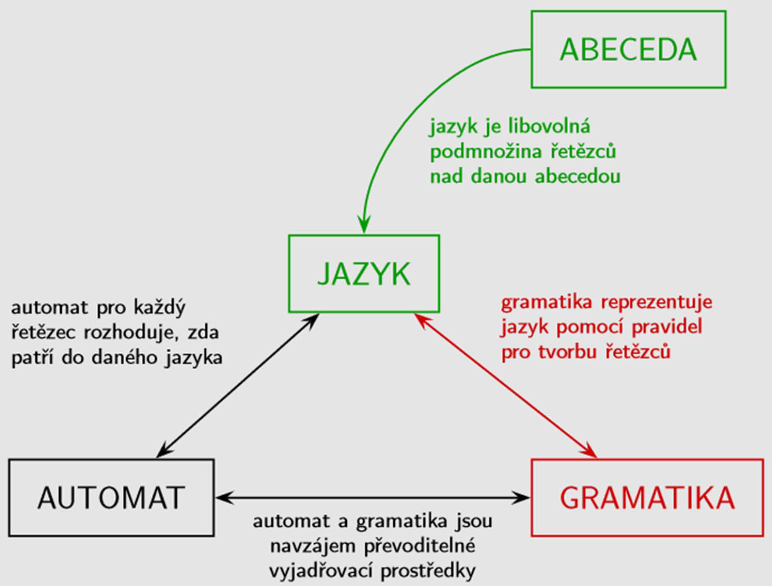
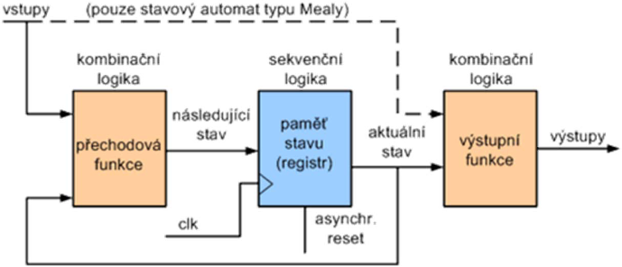
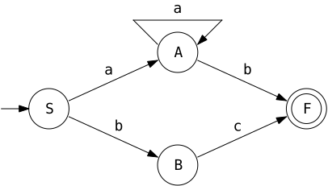
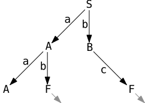

# 12

[<<<](./11.MD)
> Deterministické a nedeterministické konečné automaty, význam, ekvivalence a ukázky konkrétních návrhů.

## Jazyk, Gramatika, Automat

__Abeceda Σ__ je libovolná neprázdná konečná množina prvků, které nazýváme symboly. Při výkladu teorie automatů to bývají písmena, číslice či jiné znaky. V praxi jsou to pak: V přirozeném jazyce všechny slovní druhy ve všech tvarech a interpunkce. V programovacím jazyce klíčová slova, příkazy, operátory, interpunkce (mezery, středníky, ...).

__Řetězec/Slovo _α___ prvků z abecedy Σ je libovolná konečná posloupnost jejích symbolů. Prázdný řetězec označujeme _ε_. V praxi je pak řetězec tedy: V přirozeném jazyce celá věta. V programovacím jazyce celý zdrojový kód.

__Uzávěr abecedy Σ<sup>\*</sup>__ je množina všech řetězců sestavených z prvků abecedy Σ. Uzávěry jsou tedy všechny možné kombinace spojení symbolů dané abecedy libovolněkrát za sebou. Uzávěry jsou vždy nekonečné spočetné množiny. Kladný uzávěr Σ⁺ neobsahuje _ε_.

__Formální jazyk__ nad abecedou Σ je podmnožina uzávěru Σ<sup>\*</sup>. Podle jejich mohutnosti je dělíme na prázdné, konečné a nekonečné.

__Gramatika__ je popis formálního jazyka pomocí pravidel pro tvorbu všech jeho slov. Každý jazyk je generován určitou gramatikou.

__Automat__ je zařízení rozpoznávající formální jazyky.



## Konečný automat (KA)

* Rozpoznávací KA = (𝑄, Σ, _δ_, 𝑞₀, 𝐹):
  * 𝑄 je množina stavů
  * Σ je množina vstupních symbolů
  * _δ_ je přechodová funkce 𝑄 × Σ → 𝑄
  * 𝑞₀ ∈ 𝑄 je počáteční stav
  * 𝐹 ⊆ 𝑄 je množina koncových stavů
* Vydá jednoznačné rozhodnutí, zdali vstupní slovo patří či nepatří do daného jazyka
  * Pokud se dostane do koncového stavu, pak vstupní slovo do daného jazyka patří

### Vlastnosti KA

* Má konečnou neprázdnou množinu stavů a vždy se nachází právě v jednom z nich
* Stav se mění na základě vnějšího podnětu – zpracování konkrétního vstupního symbolu
* Nemá žádnou speciální „paměť“ – aktuální stav je jeho paměť
* Z aktuálního stavu lze určit, zdali vstupní řetězec má či nemá prověřovanou vlastnost, nejsme ale schopni tento řetězec zpětně rekonstruovat
* Pokud automat splňuje tyto vlastnosti, pak mluvíme o DKA – deterministickém KA:
  * `1)` Cílový stav každého definovaného přechodu je určen jednoznačně
  * `2)` S každým přechodem je přečten jeden vstupní symbol
* Oproti tomu NKA – nedeterministický KA:
  * `1)` Přechodová funkce není zobrazením do stavu, ale do potenční množiny 𝑃(𝑄) (množina všech podmnožin 𝑄)
    * V aktuálním stavu nemusí být pro vstupní symbol definován jednoznačný následující stav, ale i podmnožina stavů
    * _Z jednoho vrcholu může vést více hran se stejným ohodnocením_
  * `2)` Povoluje _ε_-přechody, které lze použít bez přečtení vstupního symbolu
    * (Někdy bývá NKA povolující _ε_-přechody označován jako ZNKA – zobecněný NKA)
  * `⇝` Může mít více počátečních stavů
  * Každý NKA lze převést na DKA

### Konfigurace KA

* Dvojice <𝑞, 𝑤> ∈ 𝑄 × Σ<sup>\*</sup> je konfigurace automatu, kde 𝑞 je aktuální stav a 𝑤 je dosud nepřečtená část vstupního slova
* Počáteční konfigurace je pak <𝑞₀, 𝑤>, v tomto případě je 𝑤 celé vstupní slovo
* Krok výpočtu je relace (𝑄 × Σ<sup>\*</sup>) → (𝑄 × Σ<sup>\*</sup>)
  * Např. pokud _δ_(𝑞₁, 𝑤₀) = 𝑞₂, pak platí relace <𝑞₁, 𝑤₀𝑤₁…𝑤<sub>𝑛</sub>> → <𝑞₂, 𝑤₁…𝑤<sub>𝑛</sub>>
* Automat přijímá slovo 𝑤 právě tehdy, pokud existuje takový stav 𝑞<sub>𝑓</sub> ∈ 𝐹, že <𝑞₀, 𝑤> →<sup>\*</sup> <𝑞<sub>𝑓</sub>, _ε_>

### Význam KA

Libovolný jazyk je regulární právě tehdy, když je rozpoznatelný konečným automatem.

### Ekvivalence KA

Konečné automaty jsou ekvivalentní, pokud rozpoznávají stejný jazyk. Ekvivalenci dvou automatů lze zjistit buď jejich _normováním_ a následným porovnáním, nebo _analýzou přechodů pro dvojice stavů_.

#### Normovaný KA

1. Odstraníme _nedosažitelné_ stavy, do kterých se nelze dostat ze startovního stavu
2. Odstraníme _nadbytečné_ stavy, ze kterých se nelze dostat do koncového stavu
3. Sloučíme _ekvivalentní_ stavy, které rozpoznávají stejný jazyk
   * Změníme-li počáteční stav KA na nějaký jiný stav a spočítáme jazyk přijímaný tímto automatem, získáme jazyk tohoto stavu
4. Zbylé stavy automatu označíme jednoznačným způsobem

#### Analýza přechodů pro dvojice stavů

* Začínáme s dvojicí počátečních stavů
* Pro každý vstupní symbol aplikujeme přechodovou funkci na dvojici, a tím nám vzniká nová dvojice
* Všechny vzniklé dvojice opět rozvíjíme pro každý vstupní symbol
* Takto rozvíjíme, dokud nezískáme všechny možné dvojice
* Pro ekvivalentní automaty platí:
  1. Všechny dvojice jsou tvořeny buď dvěma „nekoncovými“ stavy, nebo dvěma koncovými stavy
  2. Pokud je v prvním automatu počáteční stav zároveň koncový, musí tomu tak být i v automatu druhém

## Další dělení KA

Dosud zmíněné informace se týkaly především rozpoznávacího konečného automatu, který vydá jednoznačné rozhodnutí, zdali určité vstupní slovo patří či nepatří do daného jazyka. Konečné automaty můžeme dále dělit na:

### Klasifikační KA

* Klasifikační KA = (𝑄, Σ, _δ_, 𝑞₀, {𝑄<sub>𝑖</sub>}):
  * {𝑄<sub>𝑖</sub>} je rozklad množiny stavů
* Zobecnění rozpoznávacího KA – vstupní řetězec zařadí do jedné z klasifikačních tříd
* Každý stav z 𝑄 se nachází právě v jedné klasifikační třídě
* Každé klasifikační třídě odpovídá jeden prvek z {𝑄<sub>𝑖</sub>}; prvky jsou navzájem disjunktní podmnožiny, jejichž sjednocení dá 𝑄

### Dvousměrný KA (2KA)

* 2KA = (𝑄, Σ, _δ_, 𝑞₀, 𝐹):
  * _δ_ je zobrazení 𝑄 × Σ → 𝑄 × {-1, 0, 1}
    * -1 značí přechod na předcházející pozici vstupu
    * 0 značí čtení stejného vstupu
    * 1 značí přechod na následující pozici vstupu
* Může se libovolně pohybovat po vstupu, tím se blíží k Turingově stroji, ten ale může na vstupní pásku i zapisovat
* Možnost pohybu po vstupní pásce nedělá 2KA silnějším, stále rozpoznává pouze regulární jazyky
* Každý 2KA lze převést na NKA

### KA s výstupní funkcí

* KA s výstupní funkcí vytvoří z množiny výstupních symbolů výstupní řetězec
* KA s výstupní funkcí = (𝑄, Σ, 𝑂, _δ_, _λ_, 𝑞₀)
  * 𝑄 je stavový prostor
  * Σ je vstupní abeceda
  * 𝑂 je konečná neprázdná množina výstupních symbolů
  * _δ_ je přechodová funkce 𝑄 × Σ → 𝑄
  * _λ_ je výstupní funkce
  * 𝑞₀ ∈ 𝑄 je počáteční stav

#### Moore

* ___λ_: 𝑄 → 𝑂__
  * Výstup je definován pouze aktuálním stavem
  * `len(out) == len(in) + 1`, první znak výstupu odpovídá počátečnímu stavu, kdy ještě nebyl přečten žádný vstupní symbol
  * Přechodová funkce 𝑄<sub>𝑡+1</sub> = _δ_(𝑄<sub>𝑡</sub>, Σ<sub>𝑡</sub>)
  * Výstupní funkce 𝑂<sub>𝑡</sub> = _λ_(𝑄<sub>𝑡</sub>)
  * Může vést na větší počet stavů (oproti typu Mealy)

#### Mealy

* ___λ_: 𝑄 × Σ → 𝑂__
  * Výstup je definován aktuálním stavem a aktuálním vstupním symbolem
  * `len(out) == len(in)`
  * Přechodová funkce 𝑄<sub>𝑡+1</sub> = _δ_(𝑄<sub>𝑡</sub>, Σ<sub>𝑡</sub>)
  * Výstupní funkce 𝑂<sub>𝑡</sub> = _λ_(𝑄<sub>𝑡</sub>, Σ<sub>𝑡</sub>)
  * Výstup se může měnit asynchronně (ihned po změně vstupů) – nebezpečí hazardů a přechodových jevů
  * Vlivem menšího počtu stavů může mít složitější přechodovou a výstupní funkci (oproti typu Moore)

#### Společné vlastnosti Moore a Mealy



* Používají se především v HW formě pro řízení číslicových systémů, samy jsou řízené hodinovým signálem
* Jsou mezi sebou převoditelné
* Výstupní funkce je u obou automatů kombinační → možnost hazardů → za výstup se někdy doplňují registry

#### Kódování vnitřních stavů

* Bez kódování / [Grayův kód](https://cs.wikipedia.org/wiki/Gray%C5%AFv_k%C3%B3d) / [Johnsonův kód](https://web.archive.org/web/20160913172205/http://plc-automatizace.cz/knihovna/data/kodovani/johnson-code.htm) / one-hot / ...
* Pro zakódování 𝑛 stavů je třeba 𝑘 bitů, kde 2<sup>𝑘</sup> ≥ 𝑛 ≥ 𝑘
* Kódování stavů je mnohoznačná úloha, vzniká při syntéze, často ji řeší návrhový systém
* Volba kódování má významný vliv na složitost a dynamické parametry
* Spolehlivý automat: 𝑛 = 2<sup>𝑘</sup> (netřeba ošetřovat nevyužité stavy, žádné totiž nejsou)
* Nespolehlivý automat: 𝑛 ≠ 2<sup>𝑘</sup> (ošetření nevyužitých stavů způsobuje nárůst logiky zejména u přechodové funkce)

## Příklad KA

### Gramatika

```text
𝐺 = ({𝑆,𝐴,𝐵}, {𝑎,𝑏}, 𝑃, 𝑆)

𝑃 = {
        𝑆 → 𝑎𝐴 | 𝑏𝐵,
        𝐴 → 𝑏 | 𝑎𝐴,
        𝐵 → 𝑐
    }
```

### Diagram



### Tabulka

&nbsp;|__𝑄 \ Σ__|__𝑎__|__𝑏__|__𝑐__
:-:|:-:|:-:|:-:|:-:
→|__𝑆__|𝐴|𝐵|–
&nbsp;|__𝐴__|𝐴|𝐹|–
&nbsp;|__𝐵__|–|–|𝐹
←|__𝐹__|–|–|–

### Stavový strom



---
[>>>](./13.MD)
