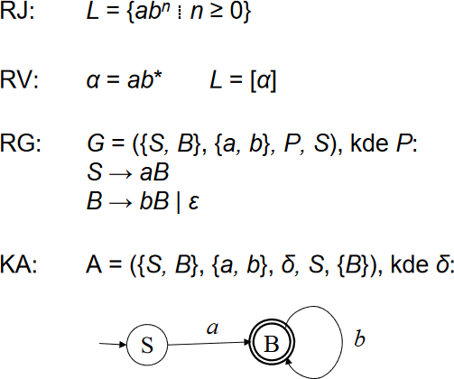

# 13

[<<<](./12.MD)
> Regulární výrazy a rovnice, jejich význam a způsoby řešení.

Pro základní přehled _Jazyk, Gramatika, Automat_ viz [12](./12.MD).

## Regulární výraz (RV)

Regulární výraz reprezentuje určitý regulární jazyk.

### Formální definice

* Regulární výrazy se skládají z:
  * __Konstant__, které značí množiny řetězců
  * __Operátorů__, které značí operace nad těmito množinami

* Mějme abecedu Σ, pak jsou tyto konstanty definovány jako regulární výrazy:
  1. __∅__ je prázdná množina, která neobsahuje žádné řetězce
  2. __{_ε_}__ je množina obsahující pouze prázdný řetězec _ε_
  3. __{𝑎}__ je množina obsahující jeden konkrétní symbol z abecedy, platí pro všechna 𝑎 ∈ Σ

* Mějme regulární výrazy 𝑅 a 𝑆, výsledky těchto operací jsou opět regulárním výrazem (seřazeno podle priority od nejvyšší po nejnižší):
  1. __Iterace__ `𝑅*`
  2. __Zřetězení__ `𝑅𝑆`
  3. __Sjednocení__ `𝑅 + 𝑆`

* Jestliže 𝑅 reprezentuje jazyk 𝐿₁ a 𝑆 reprezentuje jazyk 𝐿₂, pak:
  * `𝑅*` reprezentuje jazyk (𝐿₁)*, tedy iteraci jazyka
    * Obsahuje všechna slova vzniklá zřetězením libovolného počtu libovolných slov z 𝐿
    * Včetně prázdného řetězce _ε_
  * `𝑅𝑆` reprezentuje jazyk 𝐿₁𝐿₂, tedy zřetězení jazyků, které obsahuje všechny možné „dvojice“: slova z 𝐿₁ následovaná slovy z 𝐿₂
  * `𝑅 + 𝑆` reprezentuje jazyk 𝐿₁ ∪ 𝐿₂, tedy sjednocení jazyků, které obsahuje všechna slova z 𝐿₁ a 𝐿₂

Každý regulární jazyk je vytvořen z elementárních množin ∅, {_ε_}, {𝑎} aplikací konečného počtu operací sjednocení, zřetězení a iterace.

Závorky `()` umožňují definovat, na jakou část výrazu se mají operátory vztahovat.

### Příklad 1

```text
Zapište RV pro jazyk
𝐿 = {
        𝑤 ∈ {0, 1}* ⁞ 𝑤 = 𝑎𝑏𝑐𝑑,
        𝑎 končí symbolem 1,
        𝑏 obsahuje podslovo 101, nebo končí podslovem 00 předcházeným libovolným počtem trojic 011,
        𝑐 obsahuje sudý počet symbolů 0,
        𝑑 obsahuje podslovo 11
    }.

α = (0 + 1)*1((0 + 1)*101(0 + 1)* + (011)*00)(1*01*01*)*(0 + 1)*11(0 + 1)*

Píšeme 𝐿 = [α] a říkáme, že „Regulární výraz α reprezentuje regulární jazyk 𝐿“.
```

### Pravidla pro operace s RV

* Sjednocení:
  * 𝑅 + 𝑆 = 𝑆 + 𝑅
  * 𝑅 + ∅ = ∅ + 𝑅 = 𝑅
  * (𝑅 + 𝑆) + 𝑇 = 𝑅 + (𝑆 + 𝑇)
  * 𝑅 + 𝑅 = 𝑅
* Zřetězení:
  * 𝑅<i>ε</i> = <i>ε</i>𝑅 = 𝑅
  * 𝑅∅ = ∅𝑅 = ∅
  * (𝑅𝑆)𝑇 = 𝑅(𝑆𝑇)
* Distribuce:
  * 𝑅(𝑆 + 𝑇) = 𝑅𝑆 + 𝑅𝑇
  * (𝑅 + 𝑆)𝑇 = 𝑅𝑇 + 𝑆𝑇
* Iterace:
  * 𝑅* = { 𝑅<sup>𝑛</sup> ⁞ 𝑛 ≥ 0 }
  * 𝑅<sup>0</sup> = _ε_
  * 𝑅<sup>𝑛+1</sup> = 𝑅<sup>𝑛</sup>𝑅
  * 𝑅𝑅\* = 𝑅\*𝑅
  * 𝑅\* = 𝑅\*𝑅\* = (𝑅\*)\* = (_ε_ + 𝑅)\*
  * ∅\* = _ε_\* = _ε_
* Cyklické závislosti:
  * 𝑅 = 𝑆𝑅 + 𝑇 &ensp;⇔&ensp; 𝑅 = 𝑆*𝑇
  * 𝑅 = 𝑅𝑆 + 𝑇 &ensp;⇔&ensp; 𝑅 = 𝑇𝑆*
* A další...

### KA ↔ RG ↔ RV



#### RV → KA

* Metoda postupné konstrukce
* Bezpečné je začít na `→ O -ε→ O -RV→ O -ε→ Ⓞ`
* RV postupně rozkládáme na menší části podle regulárních operací
* Pracujeme s pomocnými pseudoautomaty, které místo vstupních symbolů obsahují celé části regulárního výrazu, a ty postupně dekomponujeme
* Vznikne nám zobecněný nedeterministický konečný automat ZNKA (obsahující _ε_-pravidla), který pak lze převést na DKA

#### KA → RV

* Nejprve (D/N)KA převedeme na ZNKA:
  1. Vytvoříme nový počáteční stav 𝑞<sub>𝑠</sub>, z něhož vede _ε_-přechod do původního počátečního stavu (ten už počáteční není)
  2. Vytvoříme nový koncový stav 𝑞<sub>𝑓</sub>, do kterého vedou _ε_-přechody ze všech původních koncových stavů (ty už koncové nejsou)
  3. Vícenásobné přechody sloučíme do jednoho operátorem sjednocení (`+`)
* Poté odstraňujeme stavy a správně upravujeme RV na přechodových funkcích, abychom nezměnili přijímaný jazyk automatu

#### RG → RV

* Z pravidel gramatiky sestavíme regulární rovnice (`→` ⇝ `=` a `|` ⇝ `+`)
* Vzniklou soustavu rovnic řešíme pro proměnnou odpovídající počátečnímu neterminálu (𝑆)
  * Cyklické závislosti v rovnicích nahradíme RV:
    * 𝑋 = 𝑎𝑋 + 𝑏 &ensp;⇝&ensp; 𝑋 = 𝑎\*𝑏
    * 𝑋 = 𝑋𝑎 + 𝑏 &ensp;⇝&ensp; 𝑋 = 𝑏𝑎\*
  * Pozor při vytýkání apod. – zřetězení není komutativní

### Příklad 2

```text
Převeďte regulární gramatiku 𝐺 = ({𝑆, 𝐴}, {𝑎, 𝑏, 𝑐}, 𝑃, 𝑆)
𝑃 = {
        𝑆 → 𝑎𝑆 | 𝑏𝐴 | 𝑏 | 𝑎,
        𝐴 → 𝑐𝐴 | 𝑏𝐴 | 𝑎
    }
na regulární výraz.

» Z pravidel gramatiky sestavíme regulární rovnice. «

𝑆 = 𝑎𝑆 + 𝑏𝐴 + 𝑏 + 𝑎
𝐴 = 𝑐𝐴 + 𝑏𝐴 + 𝑎

» V druhé rovnici vytkneme 𝐴 a následně použijeme axiom „𝑋 = 𝑎𝑋 + 𝑏 ⇝ 𝑋 = 𝑎*𝑏“. «

𝐴 = (𝑐 + 𝑏)𝐴 + 𝑎
  = (𝑐 + 𝑏)*𝑎

» Upravenou druhou rovnici dosadíme do té první a použijeme stejný axiom. «

𝑆 = 𝑎𝑆 + 𝑏(𝑐 + 𝑏)*𝑎 + 𝑏 + 𝑎
  = 𝑎*(𝑏(𝑐 + 𝑏)*𝑎 + 𝑏 + 𝑎)
```

### Význam/vlastnosti RV

* Využití pro _pattern matching_ v textu: funkce vyhledej a nahraď, validace vstupu, lexikální analýza, ...
* RV reprezentují regulární jazyky, které jsou přijímané KA
  * Popis jazyka pomocí RV může být v některých případech dosti kompaktnější, někdy [ne](https://s3.boskent.com/divisibility-regex/divisibility-regex.html)
* Poznat, zdali dva RV reprezentují stejný jazyk, může být složité
  * Existuje algoritmus, který oba RV převede na minimální DKA a zjistí, zdali jsou ekvivalentní
* Není jeden standard zápisu, často se používá POSIX nebo Perl

### Prakticky používané syntaxe

* Symbol `|` se často používá pro sjednocení namísto symbolu `+`, který bývá vyhrazen pro jedno a více opakování
* `.` – libovolný znak
* `[]` – jeden z uvedených znaků v závorkách, lze použít rozsah, např. `[a-z0-9]`
* `[^]` – vše kromě uvedených znaků v závorkách (doplněk množiny)
* `?` – nepovinná část, `𝑅? = 𝑅 | ε`
* `+` – jedno a více opakování, `𝑅+ = 𝑅𝑅*`
* `\s`, `\d` apod.
* `^` pro začátek řetězce a `$` pro jeho konec

---
[>>>](./14.MD)
