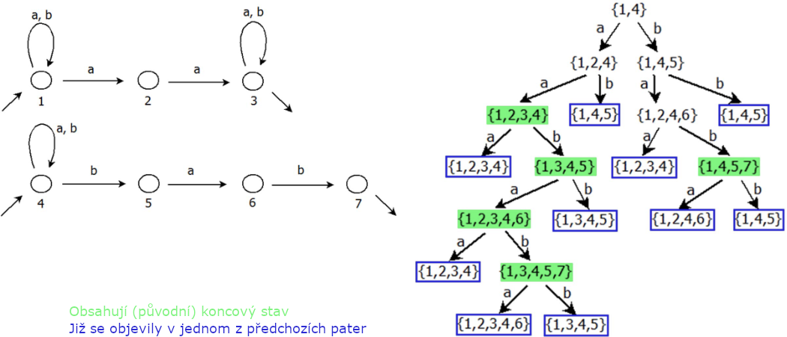

# 14

[<<<](./13.MD)
> Standardní uzávěrové vlastnosti na třídě regulárních jazyků, jejich využití.

Pro základní přehled _Jazyk, Gramatika, Automat_ viz otázka [12](./12.MD).

## Uzávěrové vlastnosti na třídě regulárních jazyků

Mějme libovolnou množinu 𝐴 s binární operací ∗. Řekneme, že 𝐴 je uzavřená na operaci ∗, pokud ∀𝑎,𝑏 ∈ 𝐴 platí 𝑎 ∗ 𝑏 ∈ 𝐴. Třída regulárních jazyků je uzavřena na tyto operace:

* Sjednocení
* Průnik
* Doplněk
* Rozdíl
* Zřetězení
* Iterace
* Pozitivní iterace
* Zrcadlový obraz

Pokud tedy máme libovolné dva regulární jazyky 𝐿 a 𝐾, pak jazyk ...:

* 𝐿 ∪ 𝐾 je regulární
* 𝐿 ∩ 𝐾 je regulární
* 𝐿𝐶 je regulární
* 𝐿 - 𝐾 je regulární
* 𝐿𝐾 je regulární
* 𝐿* je regulární
* 𝐿⁺ je regulární
* 𝐿𝑅 je regulární

### „Důkazy“

Konečný automat rozpoznává právě regulární jazyky, pokud dokážeme sestrojit KA rozpoznávající jazyk, který je výsledkem jedné ze zmíněných operací, znamená to, že tento jazyk je také regulární. Mějme automat 𝐴 rozpoznávající jazyk 𝐿 a automat 𝐵 rozpoznávající jazyk 𝐾:

#### Sjednocení 𝐴 ∪ 𝐵

* Tvoříme strom:
  * Kořenem je dvojice počátečních stavů obou automatů
  * Patra stromu vytváříme aplikací přechodových funkcí obou automatů (každá na „svůj“ prvek ve dvojici; pokud jsou ale automaty nedeterministické, nemusí být uzly stromu nutně dvojice)
  * Počet větví každého uzlu je počet symbolů vstupní abecedy
  * Hodnotou uzlu je množina stavů, do kterých se dá dostat z libovolného stavu množiny předka (přechodem se stejným ohodnocením, jako je ohodnocení dané hrany stromu)
  * Množiny (nezáleží na pořadí prvků), které se už v předchozích patrech vyskytly, znovu nerozvíjíme (měli bychom identické podstromy a nikdy bychom neskončili)
  * Strom rozvíjíme, dokud to jde
* Jakmile máme hotový strom:
  * Uzly stromu jsou stavy (𝐴 ∪ 𝐵), hrany stromu definují přechody mezi nimi
  * Vstupní (startovní) stav je kořen stromu
  * Pokud množina nějakého uzlu obsahuje alespoň jeden původní výstupní stav, pak je stav, který množina reprezentuje, označen za výstupní (koncový)
  * Pokud máme uzel s prázdnou množinou `{}`, pak se jedná o stav, ze kterého vede přechod do sebe sama reagující na všechny vstupní symboly
* Výsledný automat rozpoznává slova z jazyků 𝐿 a 𝐾 (nezáleží, z jakého jazyka slovo je, nebo zdali se nachází v obou jazycích)

#### Průnik 𝐴 ∩ 𝐵

* Stejné jako sjednocení, ale výstupní stavy jsou pouze ty, kde jsou všechny původní stavy v množině daného uzlu výstupní
* Výsledný automat rozpoznává slova, která patří do jazyka 𝐿 a zároveň do jazyka 𝐾

#### Doplněk 𝐴𝐶

* Vzniká prohozením výstupních a nevýstupních stavů
* Pro doplněk NKA nutno nejprve převést na DKA
* Výsledný automat rozpoznává Σ\* ∖ 𝐿

#### Rozdíl 𝐴 - 𝐵

* Rozdíl vypočteme pomocí doplňku a průniku: 𝐴 - 𝐵 = 𝐴 ∩ 𝐵𝐶
* Výsledný automat rozpoznává slova z 𝐿, která nejsou v 𝐾

#### Zřetězení 𝐴𝐵

* Výstupní stavy 𝐴 navážeme pomocí _ε_-přechodů na vstupní stavy 𝐵
* Výsledný automat rozpoznává všechny možné „dvojice“: slova z 𝐿 následovaná slovy z 𝐾

#### Iterace 𝐴*

* Iterace je v podstatě zřetězení sebe sama s tím, že je možné zřetězit se nula a vícekrát
* Nejdříve napojíme pomocí _ε_-přechodů výstupní stavy na ty vstupní
* Pro správnou iteraci jazyka 𝐿, tedy 𝐿\*, by měl automat rozpoznat i prázdný řetězec; je proto potřeba přidat nový vstupní stav, který je zároveň výstupní a navazuje přes _ε_-přechody na původní vstupní stavy (ty už vstupní nejsou)
* Výsledný automat rozpoznává slova vzniklá zřetězením libovolného počtu libovolných slov z 𝐿 včetně prázdného řetězce _ε_
  * Prázdný řetězec je rozpoznán vždy nehledě na jeho existenci v 𝐿

#### Pozitivní iterace 𝐴⁺

* Pozitivní iterace je v podstatě zřetězení sebe sama s tím, že je možné zřetězit se jednou a vícekrát
* Mělo by stačit pomocí _ε_-přechodů napojit výstupní stavy na ty vstupní
* Zároveň víme, že `𝐿⁺ = 𝐿𝐿*` – zřetězení a iterace jsou uzávěrová operace, proto musí být i pozitivní iterace uzávěrovou operací
* Výsledný automat rozpoznává slova vzniklá zřetězením libovolného počtu libovolných slov z 𝐿
  * Pokud 𝐿 obsahuje _ε_, pak jej automat rozpozná, jinak ne

#### Zrcadlový obraz 𝐴𝑅

* U všech přechodů změnit směr, prohodit vstupy a výstupy
* Výsledný automat rozpoznává slova z jazyka 𝐿𝑅, který obsahuje zrcadlové obrazy všech slov z 𝐿
  * Zrcadlový obraz slova _α_ = 𝑎1…𝑎𝑛 je _α_𝑅 = 𝑎𝑛…𝑎1
  * Nazýváme také reverzní slovo
  * (_α_𝑅)𝑅 = _α_
  * _ε_𝑅 = _ε_

---
[>>>](./15.MD)
