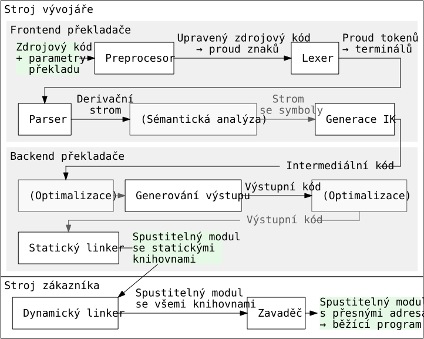

# 16

[<<<](./15.MD)
> Konstrukce překladače. Frontend a backend. Lexikální analýza. Syntaktická analýza. Sémantická kontrola. Intermediální jazyky. Generování kódu. Optimalizace kódu. Křížový překlad.

* Syntax – pravopis
* Sémantika – význam
* Překlad, _compilation_ – proces převodu z jednoho jazyka do druhého; překlad kódu je podobný překladům přirozeného jazyka
* Překladač, _compiler_ – program, který převádí kód zapsaný v jazyce A do kódu v jazyce B se zachováním sémantiky
* Parsing – slang pro syntaktickou analýzu

## Konstrukce překladače

### Frontend a backend překladače (obecně)

Frontend překládá zdrojový kód do nějakého mezikódu. Backend pracuje s tímto mezikódem (optimalizace apod.) a nakonec vytváří strojový kód. Některé překladače jako GCC umožňují vybírat z různých frontendů (parsování různých zdrojových jazyků) a různých backendů (generování strojového kódu pro různé architektury).

### Struktura překladače a jeho okolí



### Preprocesor

* Textový procesor – manipuluje s textem zdrojového kódu v první fázi překladu
* Neparsuje, pouze si text rozdělí na tokeny, aby našel volání maker apod.
* Např. C preprocesor
  * Makra a konstanty před překladem doplněny do kódu (šetříme paměť)
  * Hodnoty kontrolované v `#ifdef` definovány až v okamžiku překladu – např. členění kódu pro různé architektury
* Masivní užití např. v konfiguraci OS Linux

### Lexer – Lexikální analýza

Cílem lexikální analýzy je ze zdrojového kódu v podobě proudu znaků získat syntax v podobě proudu tokenů a zahodit nepotřebnosti jako netisknutelné znaky, komentáře, formátovací znaky apod.

* Co je to token/lexem?
  * „Slovní druhy“ – identifikátory, číselné/string hodnoty, klíčová slova, volání funkcí, interpunkce, operátory apod.
  * Odpovídají nějakým vzorcům a jsou nahrazovány identifikátory tokenů ⇒ použití regulárních výrazů
  * Tokeny jsou terminály gramatiky daného jazyka

Regulární výraz lze použít pro definici vzorů, regulárních jazyků a konečných automatů. Syntaktický vzorec `(ⁿ)ⁿ` nepatří do regulárního jazyka, nelze na něj tedy použít regulární výraz a závorky `(` & `)` jsou proto samostatné tokeny.

Výstupem lexikální analýzy je proud tokenů pro syntaktickou analýzu, první verze tabulky symbolů a případná chybová hlášení.

#### Tabulka symbolů

* Propojuje identifikátory s tokeny
* V tabulce se ukládají různé typy identifikátorů:
  * Proměnné a konstanty
  * Procedury a funkce
  * Překladačem generované dočasné symboly
  * Návěstí
* Do tabulky se k jednotlivým identifikátorům ukládá:
  * Název a datový typ
  * Pro deklarace/volání procedury/funkce:
    * Počet a typy argumentů
    * Zda se parametry předávají hodnotou či odkazem
    * Základní adresa kvůli skoku a návratu
  * Offset v úložišti
  * Ukazatel na začátek objektu/struktury

### Parser – Syntaktická analýza

* Analýza – ověření, zdali jde slovo odvodit (pojmem _slovo_ se myslí celý zdrojový kód)
* Analýza shora (top-down) – od počátečního symbolu ke slovu
* Analýza zdola (bottom-up) – od slova k počátečnímu symbolu
* Zásobník – probíhá v něm odvození – přepisují se v něm symboly dle typu analýzy
* Rozkladová tabulka – pravidla gramatiky přepsaná do řeči zásobníkového automatu (různá pro analýzu shora/zdola)

### Analýza shora

* Startem je počáteční symbol a cílem je slovo
* Levá derivace – v aktuálním řetězci se vždy přepisuje (rozvíjí) první neterminální symbol zleva
* LL analýza:
  * Vstupní slovo analyzujeme z<b>L</b>eva a používáme <b>L</b>evou derivaci
  * Přesně určuje volbu pravidel při analýze a umožňuje tedy jednoznačný postup při odvození
* LL gramatika – jednoznačná gramatika, kterou lze odvozovat pomocí LL analýzy
  * LL(𝑘) – pro analýzu slova je potřeba znát 𝑘 následujících symbolů, všechny gramatiky s 𝑘>1 lze převést na LL(1)
  * LL(1) – nejpoužívanější, stačí nám „koukat“ na jeden vstupní symbol
  * LL(0) – umožňuje jen jazyky s konečným počtem slov

#### Zásobníkový automat pro analýzu shora

* Automat má pouze jeden vnitřní stav
* Abeceda vstupních symbolů je stejná jako abeceda gramatiky (terminály)
* Abeceda zásobníku jsou terminály i neterminály gramatiky
* Automat rozpoznává do prázdného zásobníku
* Přechodová funkce odpovídá rozkladové tabulce
  * Jejím vstupem je pouze dvojice symbolu na vrcholu zásobníku a právě čteného vstupního symbolu, protože aktuální stav je vždy stejný

#### Rozkladová tabulka při analýze shora

* Zobrazení (𝑁 ∪ 𝑇 ∪ _#_) × (𝑇 ∪ _ε_ ∪ _$_) → { Expand 𝑖, Pop, Accept, Error }
* _#_ – symbol konce zásobníku
* _$_ – symbol konce řetězce
* Expand 𝑖 – na vrcholu zásobníku je neterminál 𝑌, který je přepsán na pravou stranu pravidla 𝑖, které má neterminál 𝑌 na levé straně
* Pop – terminál na vrcholu zásobníku se shoduje s terminálem na vstupu, _popujem_ a čteme další vstupní symbol
* Accept – máme prázdný zásobník – konec rozpoznávání s přijetím
* Error – chyba při rozpoznávání – vstupní řetězec do jazyka nepatří

#### First(𝑁) – množina možných začátků pravé strany 𝑁

* First(𝑁) je množina, která pro každý řetězec odvoditelný z 𝑁 obsahuje jeho první terminální symbol
* Pokud lze 𝑁 přepsat na prázdný řetězec, pak First(𝑁) obsahuje i prázdný znak

#### Follow(𝑁) – množina možných pokračování neterminálu 𝑁

* Follow(𝑁) je množina obsahující všechny terminály, které se při libovolném odvození mohou ocitnout bezprostředně za neterminálem 𝑁
* Jestliže za symbolem 𝑁 v nějakém odvození nic nenásleduje, pak do Follow(𝑁) patří také _$_
  * Follow(𝑆) vždy obsahuje _$_
* Množina Follow(𝑁) nemůže obsahovat prázdný znak

#### Jak poznat gramatiku LL(1)?

* Pro všechna pravidla typu 𝑌 → 𝑋₁ | 𝑋₂ | … | 𝑋<sub>𝑛</sub> musí platit:
  * Vlastnost First-First:&emsp; ∀𝑖≠𝑗&ensp; First(𝑋<sub>𝑖</sub>) ∩ First(𝑋<sub>𝑗</sub>) = ∅

  * Vlastnost First-Follow:&emsp; 𝑋<sub>𝑖</sub> →<sup>*</sup> _ε_&ensp;  ⇒&ensp;  First(𝑋<sub>𝑖</sub>) ∩ Follow(𝑌) = ∅

#### Konstrukce rozkladové tabulky

* Tabulka určuje, podle kterého pravidla provést expanzi neterminálu na vrcholu zásobníku
  * Určení závisí na aktuálně zkoumaném symbolu vstupního řetězce, který chceme získat
* Řádky jsou vše, co se může objevit na zásobníku – 𝑁, 𝑇, _#_
* Sloupce jsou vše, co se může být vstupem – 𝑇, _$_
* Buňky:
  * Pro každé pravidlo s číslem 𝑖 ve tvaru 𝑌 → 𝑋:
    * Najdeme množinu 𝑈 = First(𝑋 .. Follow(𝑌))
    * Buňky { (𝑌, 𝑢) ⁞ ∀𝑢 ∈ 𝑈 } jsou Expand 𝑖
  * Buňky (𝑡<sub>𝑖</sub>, 𝑡<sub>𝑖</sub>) jsou Pop
  * Buňka (_#_, _$_) je Accept
  * Zbylé buňky jsou Error

##### Příklad

```text
                First(𝑁)        Follow(𝑁)
𝑆 → 𝑎𝐴𝐵𝑏        { 𝑎 }           { $ }
𝐴 → 𝑐 | ε       { 𝑐, ε }        { 𝑏, 𝑑 }
𝐵 → 𝑑 | ε       { 𝑑, ε }        { 𝑏 }
```

```text
    𝑌 → 𝑋           First(𝑋 .. Follow(𝑌))
(1) 𝑆 → 𝑎𝐴𝐵𝑏        { 𝑎 }
(2) 𝐴 → 𝑐           { 𝑐 }
(3) 𝐴 → ε           { 𝑏, 𝑑 }
(4) 𝐵 → 𝑑           { 𝑑 }
(5) 𝐵 → ε           { 𝑏 }
```

&nbsp;|__𝑎__|__𝑏__|__𝑐__|__𝑑__|___$___
:-:|:-:|:-:|:-:|:-:|:-:
__𝑆__|Expand(1)|<sub><sup>Error</sup></sub>|<sub><sup>Error</sup></sub>|<sub><sup>Error</sup></sub>|<sub><sup>Error</sup></sub>
__𝐴__|<sub><sup>Error</sup></sub>|Expand(3)|Expand(2)|Expand(3)|<sub><sup>Error</sup></sub>
__𝐵__|<sub><sup>Error</sup></sub>|Expand(5)|<sub><sup>Error</sup></sub>|Expand(4)|<sub><sup>Error</sup></sub>
__𝑎__|Pop|<sub><sup>Error</sup></sub>|<sub><sup>Error</sup></sub>|<sub><sup>Error</sup></sub>|<sub><sup>Error</sup></sub>
__𝑏__|<sub><sup>Error</sup></sub>|Pop|<sub><sup>Error</sup></sub>|<sub><sup>Error</sup></sub>|<sub><sup>Error</sup></sub>
__𝑐__|<sub><sup>Error</sup></sub>|<sub><sup>Error</sup></sub>|Pop|<sub><sup>Error</sup></sub>|<sub><sup>Error</sup></sub>
__𝑑__|<sub><sup>Error</sup></sub>|<sub><sup>Error</sup></sub>|<sub><sup>Error</sup></sub>|Pop|<sub><sup>Error</sup></sub>
___#___|<sub><sup>Error</sup></sub>|<sub><sup>Error</sup></sub>|<sub><sup>Error</sup></sub>|<sub><sup>Error</sup></sub>|Accept

Zásobník na začátku zpracování obsahuje `𝑆$`. Pokud je vstup např. `𝑎𝑑𝑏#`, tak se podíváme na řádek 𝑆 (vrchol zásobníku) a sloupec 𝑎 (právě čtený symbol). Podle tabulky provedeme Expand(1) a zásobník nyní obsahuje `𝑎𝐴𝐵𝑏$`. Další instrukcí je proto Pop – odebereme 𝑎 ze zásobníku a čteme další symbol na vstupu... Takto pokračujeme, dokud nedojdeme k Accept nebo Error. Během tohoto procesu nám vzniká derivační strom.

### Sémantická analýza

Sémantická analýza pomáhá najít sémantické chyby. Kód se sémantickou chybou je syntakticky správně, ale nedává smysl. Kontroluje se např., zdali byla používaná proměnná již deklarována, nebo zdali jsou dosazeny správné datové typy. Využívá se tabulky symbolů, derivačního stromu, [atributové gramatiky](https://en.wikipedia.org/wiki/Attribute_grammar), ...

### Intermediální kódy

Intermediální kód (IK) je výstup frontendu překladače. Jedná se o mezikód generovaný z výstupního stromu syntaktické (případně sémantické) analýzy. Backend překladače provádí na IK optimalizace a nakonec jej převede na výstupní kód pro cílovou architekturu. IK zachovává význam, ale syntax už je jiná a nemusí být nutně čitelná. Optimalizace často probíhají ve stromové sktruktuře (AST – Abstract Syntax Tree). Dalším typem IK je tříadresní kód, který je podobný jazyku symbolických adres.

### Optimalizace

Optimalizace je úprava kódu s cílem vylepšit jeho určité parametry.

* Cílem optimalizace je typicky jedno z:
  1. __Rychlejší výkon kódu za běhu__
     * Vkládání funkcí (minimalizace skoků a ukládání kontextu), rozbalení krátkých cyklů (pod 20 iterací), předpočítání konstant, vyloučení opakovaných výpočtů, vektorizace operací, ...
  2. __Menší nároky na operační paměť za běhu__
     * Závisí na HW – souvisí s cache, predikcí kódu, využitím registrů, ...
     * Opakovaný výpočet hodnot namísto ukládání mezivýsledků
     * Optimalizace uložení polí
  3. __Menší stopa v paměti pro celý kód__
     * Odstranit vše nepotřebné, všechny duplicity, výpočet všech dílčích výrazů, ...
     * Malá paměťová stopa často implikuje dlouhé trvání kódu, protože nás nutí vynechat vkládání funkcí a rozbalování cyklů
  4. __Menší spotřeba energie za běhu__
     * Hodně závislé na konkrétní architektuře
     * Nejdůležitější asi minimalizace přenosu dat mezi CPU a RAM → tlak na využití cache
     * Upravuje se pipeline, pořadí instrukcí, každá instrukce něco stojí
* Vždy vybíráme jeden hlavní cíl, některé cíle si protiřečí

<br>

* Optimalizace práce s úložištěm:
  * Analýza toku, minimalizace přenosu dat mezi registry, pamětí a úložištěm
  * Úprava pořadí operací
* Trimovací optimalizace:
  * V závěru podrobně zkoumáme kód a nahrazujeme více instrukcí jednou
  * Např. násobení dvojkou nahradíme bitovým posunem vpravo
* Pro matematické operace existují často specializované knihovny, stále méně často se toto optimalizuje ručně
* Některé optimalizace jsou HW závislé, typicky práce s registry (AMD64 vs. ARM vs. RISC-V)
* Důležité závěry:
  * Optimalizace velmi zásadně mění výsledný kód
  * Silná optimalizace znamená těžké ladění (nelze krokovat) → pro ladění se optimalizace obvykle vypíná
  * Optimalizovaný kód je nutné znovu testovat

### Linker (Link Editor)

* Vytváří spustitelný kód z produktů překladu, spojuje dohromady jednotlivé části
* Static linking:
  * Pracuje v době překladu
  * Vytváří spustitelný modul připravený pro načtení do libovolného místa v paměti
  * Připojuje ke kódu staticky linkované knihovny (kód knihoven je přímou součástí výsledného executable)
* Dynamic linking:
  * Při spouštění programu připojuje dynamicky linkované knihovny (kód knihoven načten až při runtime z jiného souboru)

### Loader – zavaděč

* Součást OS, která přiděluje paměť a odpovídá za zavedení executable do paměti
* Zavaděč má svůj binární formát, který podporuje; ve Windows např. _exe_ a _dll_
* Druhy zavedení:
  * Absolutní – program vždy na stejném místě v paměti (embedded OS a některé součásti jádra velkých OS)
  * Relokalizovatelné – překladač generuje relativní adresy, které jsou při zavádění převedeny na skutečné
  * Dynamické – skutečná adresa generována až při vykonávání kódu (současné OS – stránkování, virtualizace, ...)

### Křížový překlad

Překlad pro jinou platformu, než na které překlad běží.

---
[>>>](./17.MD)
