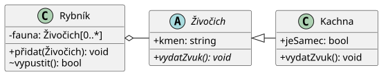
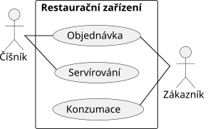
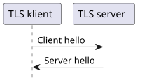
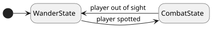

# 18

[<<<](./17.MD)
> Využití analytického modelování v objektově orientovaném programování, objektové paradigma, úrovně abstrakce, diagramy UML (uveďte příklad diagramu tříd, sekvencí, stavů, ...).

## _OOA_ – „Object Oriented Approach“

1. OOP
2. Úrovně abstrakce
3. UML
4. Návrhové vzory

### OOP – Objektově Orientované Programování

* OOP je paradigma založené na objektech, které obsahují atributy a metody
* V OOP definujeme třídy, které slouží jako předpis pro tvorbu objektů
* Konkrétní datový objekt v paměti odvozený z nějaké třídy nazýváme instancí
* Atributy jsou proměnné, které slouží pro uchování vnitřního stavu instance
* Metody jsou podprogramy deklarované uvnitř třídy, které mohou pracovat s atributy dané instance
* Rozhraní třídy popisuje její veřejné API
* Pilíře OOP:
  1. Zapouzdření – seskupení souvisejících idejí v podobě atributů a metod do jednoho objektu a správa přístupu k nim
  2. Dědičnost – odvození třídy od jiné třídy, znovupoužití vybraných atributů a metod
  3. Polymorfismus – určení přesného typu instance za běhu, když v kódu pracujeme pouze s rozhraním nebo rodičovskou třídou
* Některé přísnější výklady OOP povolují komunikaci mezi objekty pouze pomocí zasílání zpráv (jazyk Smalltalk)
* Některé jazyky neumožňují dědit, a místo toho řeší pouze splnění nějakého rozhraní (jazyky Go, Rust, ...)

### Úrovně abstrakce

1. __Mapping__ – _analytik_ se seznámí s chodem firmy a zjistí požadavky
2. __Design__ – _designér_ navrhne SW pomocí UML
3. __Kódování__ – _kodér_ implementuje SW

Analytické modelování SW lze rozdělit na tyto tři úrovně abstrakce. Na každé z nich často dělá jiný člověk/tým, a proto je důležitá komunikace mezi nimi.

### UML – Unified Modeling Language

* UML je jazyk pro modelování
  * Model je zjednodušení reality, soustředí se na důležité prvky systému
  * Modelování nám umožní lépe pochopit problém a komunikovat se zákazníkem
  * UML definuje mnoho druhů modelů, základní dělení je na statické a dynamické (_structure_ a _behavior_)

#### Statické modely

##### Class diagram – diagram tříd

* Zachycuje logickou strukturu systému – vztahy mezi třídami
* Zobrazuje, jaké atributy existují a jaké chování je podporováno
* Nezobrazuje funkčnost, tedy jak je něčeho dosaženo

#### Dynamické modely

##### Use case diagram

* Popisuje funkční požadavky systému a jeho hranice
* Zobrazuje případy použití a způsob komunikace systému s uživateli nebo jinými systémy
* Nezobrazuje funkčnost, tedy jak je něčeho dosaženo
* Aktor je uživatel systému (člověk, bot, jiný systém), kreslíme panáčka
* Jednotlivé _use cases_ pak popisují určitou interakci v čase, kreslíme bubliny pospojované podle závislostí

##### Sekvenční diagram

* Popisuje předávání zpráv a spolupráci prvků
* Zobrazuje modelované chování jako sekvenci kroků v čase
* Čas jde shora dolů, prvky jsou v jednotlivých sloupcích, mezi nimi kreslíme šipky

##### Diagram stavů

* Znázorňuje životní cyklus objektů, které se chovají jako stavový automat

---
[>>>](./19.MD)

<!--
PlantUML

@startuml
skinparam classAttributeIconSize 0
class VectorGraphicsScene {
 -shapes: Shape[0..*]
 +Add(Shape): void
 +SaveToSVG(String): bool
}
abstract class Shape {
 -fillCol: Color
 -strokeCol: Color
 +{abstract}ToString(): String
}
class Circle {
 +centerX: float
 +centerY: float
 +radius: float
 +ToString(): String
}
VectorGraphicsScene o-right- Shape
Shape <|-right- Circle
@enduml

@startuml
actor Zákazník as z
actor Číšník as c
rectangle "Restaurační zařízení" {
  usecase "Objednávka" as UC1
  usecase "Servírování" as UC2
  usecase "Konzumace" as UC3
  UC1 -[hidden]down- UC2
  UC2 -[hidden]down- UC3
}
z -[hidden]up- UC1
UC1 -[hidden]right- c
z -- UC1
c -- UC1
c -- UC2
z -- UC3
@enduml

@startuml
"TLS klient" -> "TLS server": Client hello
"TLS server" -> "TLS klient": Server hello
hide footbox
@enduml

@startuml
hide empty description
[*] -right-> WanderState
WanderState -> CombatState : player spotted
CombatState -> WanderState : player out of sight
@enduml
-->
