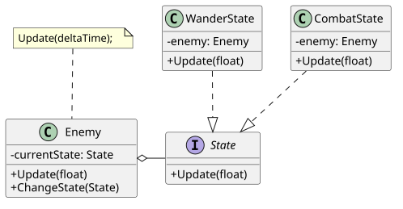
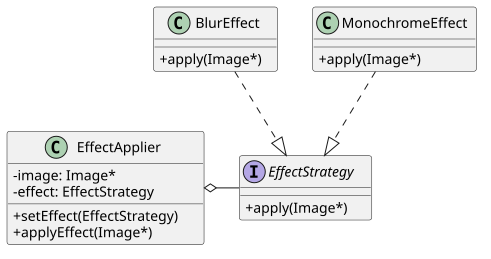
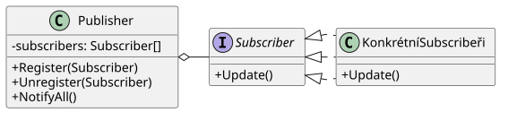

# 19

[<<<](./18.MD)
> Návrhové vzory (design patterns), proč se používají, popis funkčnosti a zápis pomocí diagramů UML (uveďte příklady vzorů State, Strategy, Observer, Composite, ...).

## Návrhové vzory (NV)

* NV přináší řešení běžných problémů při návrhu SW
* Můžeme je chápat jako šablony, které lze použít pro vyřešení konkrétního problému v našem projektu
* Nejedná se o kus hotového kódu, ale o koncept řešení problému
* Při jejich použití může být kód zpřehledněn a svým způsobem i standardizován
* Jedná se o ověřená řešení, jejich znalost usnadňuje komunikaci v týmu
* Při řešení problému není vždy nutné implementovat nějaký NV do posledního detailu, vždy je důležité myslet v kontextu daného projektu
* Dále pozor na: _když v ruce držím kladivo, ve všem vidím hřebík_
* Dělení:
  1. Creational patterns (vytvářející vzory) – mechanismy pro vytváření objektů
  2. Structural patterns (strukturální vzory) – uspořádání objektů do efektivních struktur
  3. Behavioral patterns (vzory chování) – interakce mezi objekty

### State (stav)

* _State_ je návrhový vzor chování
* Objekt má konečný počet definovaných stavů a vždy se může nacházet pouze v jednom z nich
* Zároveň má určeno, kdy a na základě jakých vstupů má přepínat mezi jednotlivými stavy

* Umožňuje organizovat související kód do samostatných tříd
* Snadno lze přidávat nové stavy bez zásahu do existujícího kódu
* Může být zbytečně složité, pokud máme malý počet stavů a příliš mezi nimi nepřepínáme

### Strategy (strategie)

* _Strategy_ je návrhový vzor chování
* Strategie umožňuje zvolení konkrétního algoritmu za běhu
* Namísto jednoho „pevného“ kódu je kód ke spuštění zvolen dynamicky, např. na základě vstupu od uživatele
* Tento vzor není tolik relevantní v jazycích, které podporují funkce vyššího řádu

### Observer (pozorovatel)

* _Observer_ je návrhový vzor chování
* Využití v případě, kdy chceme více objektů informovat o tom, že proběhla nějaká událost (uživatel klikl na tlačítko)
* Jeden _publisher_ má více _subscriberů_

### Composite

* _Composite_ je strukturální návrhový vzor
* Dává smysl u stromových struktur (např. průzkumník souborů)
* Se skupinou různých objektů ve stromové hierarchii lze zacházet jako s jedním objektem
* Viz [wikimedia/W3sDesignCompositeDesignPatternUML](https://upload.wikimedia.org/wikipedia/commons/6/65/W3sDesign_Composite_Design_Pattern_UML.jpg) ([archived](https://web.archive.org/web/20260427044638/https://upload.wikimedia.org/wikipedia/commons/6/65/W3sDesign_Composite_Design_Pattern_UML.jpg))

---
[>>>](./20.MD)

<!--
PlantUML

@startuml
skinparam classAttributeIconSize 0
class Enemy {
-currentState: State
+Update(float)
+ChangeState(State)
}
interface State {
+Update(float)
}
class WanderState {
-enemy: Enemy
+Update(float)
}
class CombatState {
-enemy: Enemy
+Update(float)
}
Enemy o-right- State
WanderState ..|> State
CombatState ..|> State
note "Update(deltaTime);" as N
N .. Enemy
N .[hidden]. State
@enduml

@startuml
skinparam classAttributeIconSize 0
class EffectApplier {
-image: Image*
-effect: EffectStrategy
+SetEffect(EffectStrategy)
+ApplyEffect(Image*)
}
interface EffectStrategy {
+Apply(Image*)
}
class BlurEffect {
+Apply(Image*)
}
class MonochromeEffect {
+Apply(Image*)
}
EffectApplier o-right- EffectStrategy
BlurEffect ..|> EffectStrategy
MonochromeEffect ..|> EffectStrategy
@enduml

@startuml
skinparam classAttributeIconSize 0
class Publisher {
-subscribers: Subscriber[]
+Register(Subscriber)
+Unregister(Subscriber)
+NotifyAll()
}
interface Subscriber {
+Update()
}
class KonkrétníSubscribeři {
+Update()
}
Publisher o- Subscriber
Subscriber <|. KonkrétníSubscribeři
Subscriber <|. KonkrétníSubscribeři
Subscriber <|. KonkrétníSubscribeři
@enduml
-->
