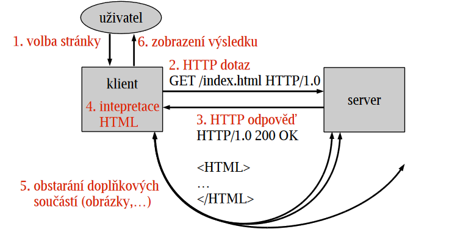

# 20

[<<<](./19.MD)
> WWW aplikace a služby. Architektura REST. Protokol HTTP a jeho verze, uchovávání stavové informace, cookie. Programování na straně klienta a serveru, jejich možnosti a omezení, nejběžnější používané prostředky a jazyky.

## WWW – World Wide Web

* Jedna ze služeb Internetu
* Architektura klient–server (např. chrome–apache)
  * Server klientům vydává aktuální verzi webové stránky/aplikace
  * Klient zpracovává kód poskytnutý serverem (HTML/CSS/JS)

## HTTP – HyperText Transfer Protocol

* __TCP/80__
* WWW protokol pro komunikaci mezi klientem a serverem
* Bezstavový
  * Jakmile je zodpovězen dotaz, transakce pro server končí
  * Server si neudržuje stavové informace o klientech a následující dotazy nedává do souvislosti s těmi předchozími
  * Stav si musí udržovat klient
  * _Výhody_ – robustní; snadnější implementace
  * _Nevýhody_ – větší režie
* Kešovatelný, široce podporovaný
  * Klient si kešuje např. CSS, aby ho nestahoval při každém requestu
  * Server si může kešovat určité vygenerované výsledky, aby je negeneroval znovu



* __HTTP Resource__: Identifikovatelný objekt na webu
* __URL – Uniform Resource Locator__:
  * Univerzální adresa resource
  * Před dvojtečku se píše schéma/protokol (`http:`, `mailto:`, ...)
* __HTTP Request (of resource)__: Klientský požadavek o provedení akce s resource, protokol HTTP definuje metody:
  * `GET` – přečti
  * `HEAD` – vrať pouze hlavičku odpovědi na `GET`
  * `POST` – vytvoř (URL určuje až server)
  * `PUT` – nahraď (URL určuje už klient)
  * `PATCH` – aktualizuj
  * `DELETE` – smaž
  * `CONNECT` – vytvoř tunel
  * `OPTIONS` – zjisti povolené metody
  * `TRACE` – otestuj dostupnost
  * SSR aplikace obvykle používají pouze `GET` a `POST` (limit prohlížeče), SPA+API mohou používat vše
  * Request může být synchronní (zadání adresy, kliknutí na odkaz, ...) a asynchronní (AJAX, ...) – pro server jsou oba přístupy ekvivalentní

```text
GET /index.html HTTP/1.1
Host: www.example.org
User-Agent: Gecko...
Accept-Charset: UTF-8,*
...
```

* __HTTP Response (representation of resource)__: Odpověď serveru = status code + hlavičky + vlastní objekt (data)
  * `1xx` – Informační
  * `2xx` – OK
  * `3xx` – Přesměrování
  * `4xx` – Chyba klienta
    * `400` – Bad Request
    * `401` – Unauthorized
    * `403` – Forbidden
    * `404` – Not Found
    * `405` – Method Not Allowed
    * `429` – Too Many Requests
  * `5xx` – Chyba serveru
* __Cookie__: Speciální HTTP hlavičky pro předávání parametrů mezi klientem a serverem
  * Vytvořeno na serveru, uloženo u klienta
    * Klient pak cookie posílá s následujícími requesty, server zpracuje request včetně cookie
    * Klient může cookies omezit/zakázat
  * Maximální velikost přenášených dat (4 KiB) a maximální počet cookies na doménu
  * Pouze textová data, neřeší implicitně bezpečnost
    * Implicitně neobsahují ID klienta
    * Lze je podvrhnout
    * Je vhodné vždy ověřovat a šifrovat jejich data
  * Lze nastavit HttpOnly (proti XSS), Secure (HTTPS only), SameSite (proti CSRF)
  * Cookies lze také používat pouze pro identifikaci uživatele a příslušná data mít uložena serveru (_session_)

### HTTP verze

* HTTP __0.9__ (1991)
  * Pouze `GET`, odpověď na něj byl samotný HTML soubor
  * Původně tato verze neměla označení; _0.9_ bylo přidáno později, aby se odlišila od novějších verzí
* HTTP __1.0__ (1996)
  * Přidány hlavičky pro metadata
  * Díky hlavičce `Content-Type` lze vracet i něco jiného než HTML
  * Response obsahuje status code
* HTTP __1.1__ (1997)
  * Persistentní spojení pro více request/response (stále sériové)
  * Přidána hlavička `Host` – více virtuálních serverů na jedné IPv4
  * Umožňuje přenášet data po blocích – _chunked transfer encoding_
* HTTP __2__ (2015)
  * Binární přenos namísto textového
  * Paralelní requesty přes jedno TCP spojení
  * Komprese hlaviček
* HTTP __3__ (2022)
  * Transportní protokol TCP byl nahrazen protokolem QUIC

### HTTPS – HTTP Secure

* __TCP/443__
* HTTP + SSL/TLS
* Certifikační autorita vydává digitální certifikáty, jedná se o důvěryhodnou třetí stranu
  * Certifikát obsahuje údaje o subjektu, jeho veřejný klíč, podpis certifikační autority, dobu platnosti, ...

## REST – Representational State Transfer

Architektura REST (2000) je založena na několika požadavcích:

* __Stateless__ (bezstavový) – každý _request_ obsahuje všechny potřebné informace pro jeho pochopení
* __Cache__ – data requestů a responses by měla být explicitně označena jako ne/kešovatelná
* __Uniform interface__ (jednotné rozhraní) – stejné rozhraní pro klienta nehledě na poskytnutou službu, pro splnění tohoto požadavku jsou na rozhraní kladena 4 omezení:
  1. __Identification of resources__ – resources musí jít nějak identifikovat → URL
  2. __Manipulation of resources through representations__ – resources je možné upravovat pomocí HTML stránek, které slouží jako jejich reprezentace
  3. __Self-descriptive messages__ – každá _reprezentace resource_ obsahuje všechny potřebné informace pro její pochopení, klient tedy může být pouhý vykreslovač HTML s nulovou znalostí dané aplikace
  4. __Hypermedia as the engine of application state (HATEOAS)__ – server poskytuje informace dynamicky skrze hypermédia (text, audiovizuál, hyperlinky), kde hyperlinky odkazují na další dostupné zdroje
* __Layered system__ – služba má hierarchii „sandboxovaných“ vrstev (⇝ CDN)
* __Code-on-demand__ (nepovinné) – funkce klienta mohou být rozšířeny přijetím a spuštěním dodatečného kódu (⇝ JavaScript)

## Webová aplikace

* Síťová aplikace, HTTP(S), klient–server
* Na serveru široký výběr jazyků, klient převážně JS nebo jazyky/dialekty, které se do něj překládají

### Způsoby uspořádání klient+server

#### SSR – Server Side Rendering

* Aplikace je celá na serveru
* Klient dostává hotové HTML/CSS/JS vygenerované z aplikačního kódu
* Úkolem klienta je zpracovat obsah (HTML render, ...)
* Synchronní komunikace
* Někdy bývá spojováno s pojmem _třívrstvá architektura_, což je druh architektury klient–server, kde třetí vrstvou je databáze (prezentace ↔ logika ↔ data)

#### Web Service

* Server řeší „business logiku“, CRUD nad daty, výpočty, ...
* Přístup k serveru pomocí API
* Klient dostává data ve strojovém formátu – JSON/XML/...
* Architektura klienta je kompletně oddělená od služby na serveru
* Tento princip řeší pouze server, a ne výslednou podobu UI pro uživatele

#### Single Page Application

* Kombinace Web Service a JS klienta – backend a frontend
* Klient zajišťuje UI, může používat i více API najednou
* Asynchronní komunikace, klient průběžně aktualizuje stránku podle potřeby
* Single Page – URL se v prohlížeči může měnit z důvodu UX, neprobíhá ale žádný refresh / načítání dalších stránek
* UI/UX se blíží desktopové aplikaci, větší režie, úskalí ze strany prohlížeče

### Server

* Součást všech typů WWW aplikací
* Drží resource a vydává ji klientovi v podobě HTML/JSON/XML/JS/CSS/binary
  * V rámci tohoto často řešíme perzistentní uložení dat, business logiku, validaci dat, bezpečnost dat a uživatelských údajů
* Klient ke službám přistupuje pomocí URL
  * Zadáním, kliknutím na odkaz, formulářem, nebo programově (requests)
  * Přenos stavové informace v URL/formuláři/cookie
* Apache/Nginx servírují HTML, nebo slouží jako [reverse proxy](https://stackoverflow.com/questions/62257485/confused-between-proxy-and-reverse-proxy) pro aplikaci
* Omezení serveru: latence, škálování
* Omezení klienta: webový prohlížeč, [same-origin policy](https://en.wikipedia.org/wiki/Same-origin_policy)

### JavaScript (ECMAScript)

* Funkcionální a objektové paradigma, event driven, single threaded
* Asynchronní funkcionalita – callback, promise – důležité
* localStorage, sessionStorage, ...
* Základní syntax vychází z jazyka C (středníky, složené závorky, if, for, ...)
* Dynamicky typovaný a slabá typová kontrola, first class funkce
* Multiplatformní – prohlížeč je virtuální stroj pro JS, obvykle používá JIT
* Spuštěn buď načtením v prohlížeči (společně s HTML), nebo pomocí NodeJS, Deno, ...
* Pro SPA se často využívá pomocných knihoven/frameworků (jQuery, Backbone.js, React, HTMX, ...)

#### DOM – Document Object Model

* Objektová reprezentace dokumentu, standard W3C
  * Určuje, jak získat/modifikovat/přidat/smazat elementy z HTML dokumentu
  * Základ pro strojové zpracování HTML, tedy i pro klientský JS
* HTML dokument je reprezentován jako stromová struktura
* Tag `<html>` je kořenem stromu
* Uzly mohou být identifikovány podle jména tagu, rodiče, nadřazených uzlů, sourozenců, hloubkou
* Pomocí těchto vazeb a atributů _id_, _class_ a _name_ lze jednoznačně identifikovat jakýkoliv element / skupinu elementů v dokumentu
* Metody pro vyhledávání prvků – `document.`
  * `getElementById`
  * `getElementsByTagName`
  * `getElementsByName`
  * `getElementsByClassName`
  * `querySelectorAll` (argumentem je řetězec obsahující CSS selektor)
* Na elementech v DOM lze zachytávat události jako `click`, `mouseover`, `focus`, `touch`, ... pomocí `addEventListener`

---
[>>>](./21.MD)
