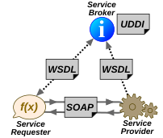

# 21

[<<<](./20.MD)
> Princip práce webových služeb, serializace, SOAP + WSDL + UDDI vs. RESTFul (popis, srovnání, výhody a nevýhody), strojově čitelné formáty pro komunikaci.

## Webová služba

Webová služba obecně značí aplikaci běžící na serveru, která skrze své API poskytuje nějaká data. Ve světě _SOAP_ má ale tento pojem konkrétnější definici, které se drží i W3C:

Webová služba je softwarový systém poskytující _machine-to-machine_ komunikaci po síti. Služba má své _WSDL_, což je strojově čitelný popis jejího rozhraní. Podle tohoto popisu mohou ostatní systémy se službou interagovat pomocí SOAP zpráv, typicky přes HTTP ve formátu XML.

V tomto kontextu se také často objevuje obecnější pojem _RPC_ (Remote Procedure Call, vzdálené volání procedur). Zjednodušeně: program na jednom stroji spustí proceduru na jiném stroji, např. skrze počítačovou síť. Jedná se tedy o vykonání kódu na jiném místě, než je umístěn volající program. RPC má různé implementace a při volání vzdálené procedury programátor nemusí nutně znát implementační detaily použité komunikace ani samotné procedury. Webovou službu lze chápat jako multiplatformní implementaci RPC.

 

* SOAP – Simple Object Access Protocol
  * Protokol pro posílání strukturovaných informací mezi webovými službami po síti, nástupce _XML-RPC_
  * Kořenový element `<soap:Envelope>` obsahuje prvek `<soap:Body>`, který slouží pro data request/response
* WSDL – Web Services Description Language
  * Popis veřejného rozhraní webové služby, definuje dostupné funkce a povolené hodnoty parametrů
* UDDI – Universal Description, Discovery and Integration
  * Registr umožňující zveřejnit webovou službu

SOAP odpovídá principům RPC a je založen na volání procedur a výměně dat. Má větší režii volání a pomocí WSDL lze definovat libovolnou sémantiku. REST je založen na práci se zdroji a klientem je obvykle webový prohlížeč. Má definovanou konečnou množinu operací – ~CRUD.

## Serializace

Serializace je převod stavu objektu do formátu, který lze uložit/přenášet a později znovu rekonstruovat do objektu se stejným stavem. Serializovat lze do binárního i textového formátu (např. JSON nebo XML).

## Strojově čitelné formáty pro komunikaci

Strojově čitelná data musí být strukturovaná. Lze je rozdělit do dvou skupin: Člověkem čitelná data _označkovaná_ tak, aby je mohl přečíst i stroj (HTML, Mikroformát, RDFa), a data ve formátu určeném primárně ke strojovému zpracování (CSV, RDF, XML, JSON, ...). Data považujeme za strojově čitelná, pokud splňují pravidla svého formátu.

---
[>>>](./22.MD)
