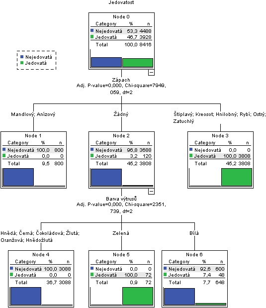
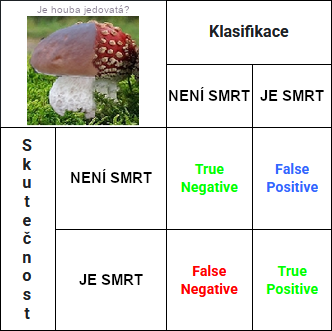
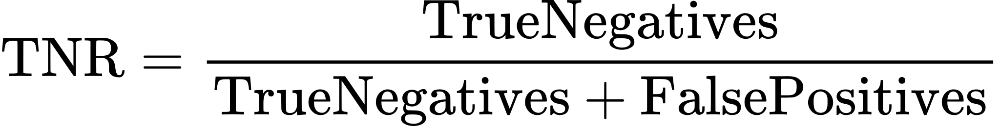
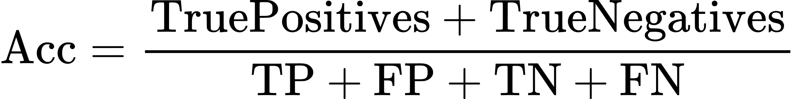
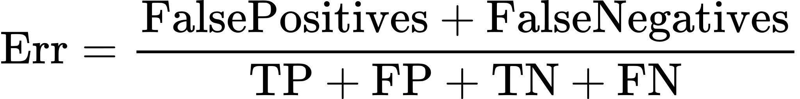
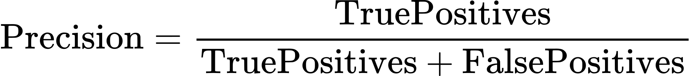
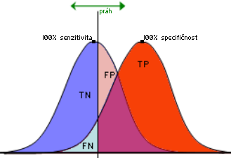

# 31

[<<<](./30.MD)
> Klasifikační algoritmy, predikce vycházející z historických dat, princip a typy rozhodovacích stromů, algoritmus CHAID, evaluace DM modelů (matice záměn, graf senzitivity a specifičnosti, ROC křivka), algoritmická rozšíření rozhodovacích stromů.

## Klasifikační algoritmy a rozhodovací stromy

Klasifikační úloha na základě rozhodovacích stromů odhaduje příslušnost objektů do nějakých kategorií. Předpokladem je znalost cílové (závislé) proměnné a sady prediktorů (nezávislých proměnných). Pro vytvoření modelu se využívá historických dat s přiřazenými třídami ⇒ učení s učitelem. Algoritmy se ve vstupních datech snaží najít vzorce/závislosti/pravidla, na jejichž základě se pak predikují třídy pro nová neznámá data.

Cílovou proměnnou je vhodné mít vyváženou: Nevyvážená data mohou vést k modelům, které jsou zkreslené ve prospěch majoritní třídy. Model může mít vysokou celkovou přesnost, ale velmi špatně predikovat minoritní třídu, která často bývá třídou zájmu (např. detekce podvodů, diagnóza vzácných chorob).

Rozhodovací stromy se tvoří metodou rozděl a panuj: Zkoumané objekty jsou vhodně rozděleny do skupin a každá z nich je znovu rekurzivně rozdělena, dokud nejsou skupiny tak malé, že na ně stačí jednoduchý model. Větvení lze vizuálně vyjádřit pomocí dendrogramu, který znázorňuje jednotlivé kroky klasifikace / shlukovací analýzy v podobě stromu. Větve jdoucí z uzlu představují větve nějaké podmínky (_if-then_).

Rozhodovací stromy dělíme na obecné a binární.

### Znaky obecných rozhodovacích stromů

* Libovolný počet větví
* Snadnější interpretace
* Obvykle méně pater
* Algoritmy CHAID a C5.0

### Znaky binárních rozhodovacích stromů

* Z uzlu vedou dvě větve
* Rychlejší výpočet
* Obvykle více pater
* Algoritmy C&RT a QUEST

### Princip algoritmu pro tvorbu stromů

1. Slučování kategorií vzhledem k cílové proměnné – slučují se ty, které vedou na největší množinu
2. Výběr nejsilnějšího prediktoru na základě algoritmem používaného kritéria
3. Rozštěpení uzlu dle nejsilnějšího prediktoru
4. Opakování procesu do zastavení růstu, kdy nastane jedna z:
   * Máme 100% zařazení do jedné kategorie
   * Nejsou k dispozici žádné významné prediktory
   * Bylo dosaženo tzv. STOP kritérií – explicitně určeno, např. maximální počet vrstev / nedělit poslední 𝑥 % případů / ...
   * Každý list stromu dosáhl jedné z těchto podmínek

### CHAID (Chi² Automatic Interaction Detection)

CHAID je jedním z nejstarších stromových algoritmů. Jedná se o obecný rozhodovací strom (libovolný počet větví). Závislé i nezávislé proměnné mohou být kategorické i spojité (automatický převod na kategorie). Základem jsou klasické testy chí-kvadrát a f-test.

#### CHAID – Slučování kategorií

* Kategorizace spojitých proměnných, typicky do deseti intervalů – _decilů_
* Pak opakuje postup slučování:
  1. Sestavení možných párů kategorií ke sloučení (u nominálních každý s každým, u ordinálních kombinace sousedů)
  2. Otestování závislosti každého páru s cílovou proměnou podle chí-kvadrát nebo f-testu
  3. Výběr páru s nejvyšší hladinou významnosti

#### CHAID – Štěpení uzlu

Pro každý prediktor, který je k dispozici, a jeho sloučené kategorie se provede test závislosti k cílové proměnné. Pokud nenastalo nějaké STOP kritérium, pak se uzel rozštěpí podle prediktoru s nejvyšší hladinou významnosti.

### Rozšíření stromů

* __Boosting__
  * Sekvenční vytváření více jednodušších stromů – každý strom se učí z chyb předchozích stromů
  * Případy s chybnou klasifikací v předchozím stromu mají vyšší váhu
  * Algoritmus XGBoost
* __Rozhodovací lesy__
  * Něco jiného než boosting; vytváření stromů paralelně, ty pak hlasují
* __Pruning__ (prořezávání)
  * Technika, která z hotového stromu odstraňuje málo významné větve (podstromy)
  * Pomáhá zabránit přeučení (overfittingu), kdy je model příliš složitý a přizpůsobuje se i náhodnému šumu v datech
* __Penalizace__
  * Uživatel definuje závažné chyby, kterým se strom vyhýbá

## Evaluace modelů

### Matice záměn

Matice záměn je 2×2 kontingenční tabulka zobrazující hodnoty true/false positive/negative.

* Chyba prvního druhu (False Positive, _falešný poplach_) – pokud je houba ve skutečnosti jedlá, ale klasifikátor rozhodl, že je jedovatá (vyhodíme jedlou houbu)
* Chyba druhého druhu (False Negative, _přehlédnutý výskyt_) – pokud je houba ve skutečnosti jedovatá, ale klasifikovaná byla jako jedlá (sníme jedovatou houbu), tj. horší chyba než prvního druhu → měli bychom za ni klasifikátor penalizovat
* Záleží ovšem na položené otázce, v tomto případě „Je houba jedovatá?“

### Senzitivita, specifičnost a další

#### Senzitivita (TPR – True Positive Rate)

* Podíl správně klasifikovaných a všech skutečně pozitivních případů
* Měří schopnost modelu správně identifikovat pozitivní případy
* Blíží se k jedničce, klesá-li počet chyb druhého druhu (FN)
* Nazývána také jako _sensitivity_, _recall_, _úplnost_, _hit rate_

#### Specifičnost (TNR – True Negative Rate)

* Podíl správně klasifikovaných a všech skutečně negativních případů
* Měří schopnost modelu správně identifikovat negativní případy
* Blíží se k jedničce, klesá-li počet chyb prvního druhu (FP)
* Nazývána také jako _specificity_, _selectivity_

#### Celková správnost (Overall Accuracy)

* Podíl správně klasifikovaných případů vůči všem případům

#### Míra falešně pozitivních (FPR – False Positive Rate)

* Podíl špatně klasifikovaných a všech skutečně negativních případů

#### Celková chyba (Error)

* Podíl špatně klasifikovaných případů vůči všem případům

#### Přesnost

* Kolik procent případů, jež jsme klasifikovali jako pozitivní, jsme trefili?

### Graf senzitivity a specifičnosti

Výstupem binárního klasifikátoru často není přímo hodnota positive/negative, ale číselná hodnota, kde pomocí vhodného nastavení prahu rozhodneme, kam aktuální vzorek zařadíme. Posouváním prahu měníme poměry mezi true/false positive/negative.

Vztah mezi senzitivitou a specifičností v závislosti na různě zvolených hodnotách prahu lze znázornit pomocí _křivky ROC_.

### Křivka ROC – Receiver Operating Characteristic

Křivka ROC ukazuje kvalitu binárního klasifikátoru pro různé hodnoty nastavení jeho prahu. Osa 𝑦 je TPR (senzitivita) a osa 𝑥 je FPR (1-specifičnost). Alternativně se na ose 𝑥 může použít přesnost (v určitých případech vede na zajímavější výsledky).

Máme-li normalizovaný parametr, podle kterého můžeme prvky rozdělit na dvě skupiny (např. jedlé/nejedlé), tak jej nastavíme na nějakou hodnotu prahu (např. 0,5) a spočítáme TPR & FPR. Výsledek zaneseme do grafu jako bod. Pro různé hodnoty prahu získáme více bodů a jejich spojením pak vzniká křivka ROC.

Čím větší je plocha pod křivkou, tím lepší je model.

---
[>>>](./32.MD)
