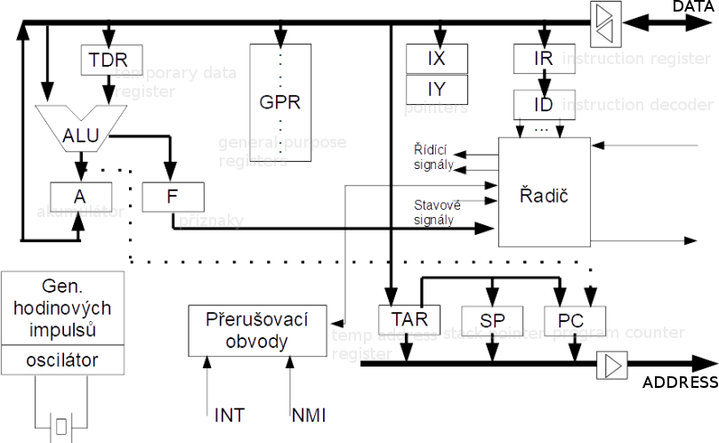

# 35

[<<<](./34.MD)
> Základní architektury počítačů, architektury mikroprocesorů, architektury signálových a grafických procesorů, architektury mikrořadičů. Principy činnosti významných funkčních bloků v jednotlivých architekturách.

## Architektura počítačů

* Architektura je návrh a konstrukce zařízení na zpracování dat – soubor pravidel popisujících funkčnost, organizaci a implementaci počítačových systémů
* Počítač je zařízení na číslicové zpracování informací, jehož vrstvy abstrakce jsou:
  * Uživatelské rozhraní
  * Výkonné jádro aplikace
  * Aplikační knihovny
  * Operační systém
  * Instrukční architektura (ISA)
  * Datová cesta, řízení
  * Logické obvody
  * Tranzistory
* Počítač = CPU (řadič + ALU) + IO + operační paměť + archivní paměť

### Společné vlastnosti architektur

* Struktura počítače je nezávislá na typu řešené úlohy, počítač se programuje obsahem paměti
* Paměť je rozdělena do buněk stejné velikosti, jejichž očíslováním vznikají adresy
* Program je tvořen posloupností instrukcí (elementárních příkazů), které jsou jednotlivě prováděny v&nbsp;pořadí, v jakém jsou zapsány v paměti
  * Pro změnu pořadí lze využít instrukcí ne/podmíněného skoku
* Pro reprezentaci instrukcí i čísel se používájí dvojkové signály a dvojková číselná soustava
* Tok dat řídí řadič → programem řízené zpracování dat probíhá v počítači samočinně
* Zpracování dat probíhá v „diskrétním režimu“ → během výpočtu nelze s počítačem komunikovat

### Harvard

* __Paměť programu je oddělena od paměti dat__
  * Možnost ve stejném okamžiku načítat instrukci a přistupovat k datové paměti
  * Datová a programová paměť mohou mít odlišnou organizaci
  * Programová paměť může být nevolatilní, program není nutné nahrávat z externího média
* Má oddělené sběrnice: datová, instrukční, adresová
* Řízení procesoru je odděleno od řízení vstupních a výstupních jednotek, nejsou napojeny přímo na ALU
* Rychlejší, vhodné pro zpracování většího objemu dat
  * Použití zejména v mikrokontrolérech a signálových procesorech v kombinaci s RISC

### Von Neumann

* __Program a data jsou v téže paměti__
* Jedna sběrnice pro data, instrukce a adresy
* Vstupy jsou koncipovány jako datové zdroje a výstupy jako výsledky, jsou proto napojeny přímo na ALU
* Nevýhody:
  * Může být obtížnější ladění programu
  * Rychlost pamětí je slabým článkem, proto CPU obvykle obsahují rychlou cache
  * Méně bezpečné; možnost mylně interpretovat data jako program
  * Data i instrukce se přenáší po stejné sběrnici

## Procesory

* Procesor je základní jednotka počítače
  * Jedná se o automat pro zpracování informací, který obsahuje řadič a ALU
  * Společně s IO a pamětí tvoří počítač
  * Jeho chování je definováno programem
* Rozdělení: univerzální, grafické, signálové, multimediální, šifrovací, AI, ...
* CPU obsahuje:
  * __Řadič__
    * Řídí chod celého procesoru podle instrukcí programu
    * Obsahuje instrukční registr a instrukční dekodér
    * IR uchovává opcode právě vykonávané instrukce
    * ID dekóduje instrukci a generuje řídící signály pro procesor
    * Existují dvě koncepce řadičů:
      1. __Obvodový řadič__ – speciální sekvenční automat s čítačem a dekodérem; rychlejší, dražší
      2. __Mikroprogramový řadič__ – řídící paměť s uloženými mikroinstrukcemi<!--; adresový registr uchovává adresu registru pro r/w-->
    * Řadič dále obsahuje (pod)řadiče pro přerušení, IO, DMA, periferie, ...
  * __ALU – aritmeticko-logická jednotka__
    * Provádí všechny aritmetické a logické výpočty
    * Součástí bývá příznakový registr (carry, borrow, zero, negative, overflow, half-carry, parity, ...), použití pro větvení programu
    * Procesor může mít více ALU (např. specializované FPU – floating point unit)
  * __Sady registrů__
  * __PC – program counter__
    * Obsahuje adresu právě vykonováné instrukce
    * Často jeden registr ze sady registrů, nebo součást řadiče
  * __Vnitřní sběrnice__ – data, adresy, řízení

### Instrukce

* Specifikace jednoduché činnosti, kterou má provést technický prostředek
* Soubor instrukcí tvoří program
* Binární tvar: opcode + operandy; obvykle zapisujeme v jazyce symbolických adres (_assembly language_)
  * Opcode: operační kód určující typ instrukce
  * Operandy (parametry): konstanty, označení zdrojových/cílových registrů, adresa paměti programu (pro skoky), ...
* Mohou se dále dělit na mikroinstrukce → odlišná externí a interní instrukční sada; lepší zachování zpětné kompatibility
  * Mikroinstrukce je obvykle uložena v jedné buňce ROM a její vykonání trvá jeden takt
* Formáty kódování instrukcí:
  * Proměnná délka opcode – lepší hustota, náročnější dekódování (často v CISC)
  * Pevná délka opcode – rychlé a jednoduché dekódování, snazší implementace pipeliningu, delší programy (často v RISC)
* Instrukční sada – seznam instrukcí, datových typů, dostupných režimů, registrů, pravidel (adresování, přerušení, ...)
  * Dělíme podle: Koncept (ISA), implementace mikro/architektury (x86, ARM, ...), rozsah (CISC/RISC), míra paralelnosti (xSkalární, VLIW)

### ISA – Instruction Set Architecture

* Lze chápat jako rozhraní mezi HW a SW počítače
  * Souhrn vlastností počítačového systému z pohledu programátora v assembly language
* Definuje:
  * Způsob kódování instrukcí – pořadí operací/operandů/adres
  * Zacházení s operandem – způsoby adresování
  * Datové typy a velikosti operandů
  * Možné operace – aritmetické, logické, skoky, ...
  * Způsob ukládání výsledku – střadač / registr / paměť / zásobník
  * Větvení – varianty skoků, volání a návrat z podprogramů, způsoby přerušení

#### Střadačově orientovaná ISA

* Střadač = akumulátor (speciální registr uchovávající hodnotu předchozí operace)
* Akumulátor je implicitním operandem aritmeticko-logických instrukcí (může být zdrojem i cílem)
* Druhý operand je explicitní (registr nebo paměťová buňka) → jednoadresní architektura
* Snadno kódovatelné instrukce (→ jednoduchý HW), krátké instrukce, rychlé přepínání kontextu, častý přístup do paměti, problematická realizace paralelismu mezi instrukcemi

#### Zásobníkově orientovaná ISA

* Vzácné, ale SW implementace se používá např. v JVM
* Bezadresní – instrukce PUSH a POP + operace ALU
* Zdrojem a cílem všech operací je HW zásobník
* Jednoduché a rychlé instrukce (bez operandů), vysoká hustota kódování, rychlá implementace
* Komplikovaný přístup k datům – nemožnost náhodného přístupu, obtížný paralelismus
* Řadič musí řešit přetečení/podtečení HW zásobníku

#### ISA s univerzálními registry

* Nejpoužívanější (x86), základem je soubor velmi rychlých univerzálních registrů (GPR)
  * Mohou být zdrojem i cílem (obsahují mezivýsledky, proměnné, ...)
  * Kolem 8 až 128 registrů
* Instrukce kolem 2 až 3 operandů
* Registry jsou rychlejší než jakákoliv paměť, umožňují náhodný přístup, méně časté sahání do paměti (zrychlení), snadná implementace paralelismu
* Složitý překladač, registry nemohou uchovávat složené datové struktury (pole), přepnutí kontextu trvá delší dobu (ukládání více registrů)
* Některé registry mohou být „neuniverzální“ (stavové registry, pointery, program counter, ...)
* Varianty uložení operandů (`R`egister × `M`emory):
  * `R-R` – oba operandy v registrech (jednoduché kódování, pevná délka instrukce, konstantní CPI (_cycles per instruction_), vyšší počet instrukcí pro daný program, typické pro RISC)
    * `Load/Store` – architektura s dvěma typy instrukcí: pro přístup k paměti a pro práci s daty (ALU)
  * `R-M` – jeden operand může být v paměti (přímý přístup k datům bez meziukládání, hustější kód, různé CPI, typické pro CISC)
  * `M-M` – oba operandy mohou být v paměti (zastaralé)

### Pipelining (zřetězení)

* Zřetězený CPU vkládá dodatečné registry mezi jednotlivé části řadiče
* Zvýšení vytížení jednotlivých CPU komponent
* Pro pipelining ideálně chceme nepřetržitý přísun instrukcí, které lze rozdělit na sekvence nezávislých kroků, jejichž trvání by mělo trvat podobnou dobu
* Parametry: hloubka zřetězení (kolik úrovní), latence řetězu (doba průchodu jedné instrukce)
* U velkého počtu fází vznikají prázdná místa (_bubliny_) → nižší výkon; zvyšování frekvence nutně nezvýší rychlost, ale určitě zvýší spotřebu
* Pipeline v CPU vnitřně zavádí určitý paralelismus, zvenku se ale CPU tváří sekvenčně → mohou vznikat _hazardy_ (narušení vykonávání programu)
  * Strukturní hazardy – kolize sdílených prostředků
  * Datové hazardy – instrukce čeká na jinou (na výsledek, na uvolnění registru, ...)
  * Řídící hazardy – ztráty při podmíněném skoku atd.
* Řešení hazardů:
  * Statické při kompilaci – přeskládání instrukcí – vkládání NOPů nebo zamíchání s&nbsp;nezávislými instrukcemi
  * Dynamické za běhu – vkládání prázdných taktů řadičem

## Mikroprocesor × Mikrořadič

* Mikroprocesor je CPU realizovaný jedním obvodem s vysokou hustotou integrace; rozdělení:
  * Univerzální (CISC do desktopu, RISC do embedded)
  * Signálový (DSP – Digital Signal Processor) – filtry, FFT, modulace, ...
  * Grafické, multimediální, ...
* Mikrořadič je mikroprocesor doplněný pamětí a periferiemi (spíš RISC + Harvard (SRAM+FLASH) + střadač/registr ISA); obsahuje:
  * Zdroj hodin, čítače, časovače, watchdog timer, Real Time Clock
  * Porty, IO, sběrnice
  * Přerušovací podsystémy
  * Převodníky mezi analog a digital

## Speciální procesory

### Signálové procesory

* Očekává se průběžné zpracování velkého množství dat protékajících procesorem v reálněm čase
  * Na data se aplikují různé DSP algoritmy, má vysoký pracovní kmitočet a využívá co největšího stupně paralelizmu
* Konvoluce, korelace, filtrace (IIR, FIR), diskrétní transformace, práce s maticemi
  * Důraz na násobení konstantou/proměnnou, akumulaci dílčích součinů, aritmetické a logické posuny
* Rozdělení:
  * DPS mikroprocesory (neobsahují paměť ani další periferie) a DSP mikrokontroléry (periferie např. ADc/DAc)
  * Celočíselné (levné, složitější vývoj) a s plovoucí řádovou čárkou (složitější struktura, větší spotřeba, přesnější a jednodušší algoritmy)
* Obvyklá architektura:
  * Harvard, RISC, pipelining, hodně registrů (registrová ISA)
  * Superskalár/VLIW
  * MAC unit (multiply-accumulate), ALU, barrel-shifter

### Grafické procesory (GPU)

* Vykreslování – 3D data na 2D obraz
* SIMD – jeden postup nad velkým množstvím dat; masivně paralelní architektura
* Shadery, řadič paměti, Texture Mapping Unit, Render Output Unit

### NPU – Neural Processing Unit / TPU – Tensor Processing Unit

* Pro akceleraci AI výpočtů, upravené GPU

### Mobilní procesory

* ARM, důraz na nízkou spotřebu, „big.little“ (kombinace různých jader)

### Spojení CPU + FPGA

* V FPGA lze vytvořit vhodné (i nestandardní) vstupně-výstupní periferie nebo provádět specifické výpočty
* Vyšší náklady, ale může být rychlejší a energeticky účinnější

---
[>>>](./36.MD)
