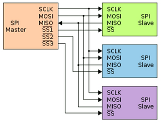

# 37

[<<<](./36.MD)
> Významné průmyslové komunikační sběrnice a protokoly. Sběrnice a protokoly v počítačových systémech – topologie, charakteristické vlastnosti.

## Sběrnice

Sběrnice je soustava vodičů přenášejících data stejného charakteru. Používá se buď pro přenos informací mezi jednotlivými funkčními bloky systému, nebo pro propojení systému s okolím. Přenos dat na sběrnici je řízen podle nějaké konvence/standardu → protokol.

Kolem této problematiky se točí mnoho pojmů – např. _RS-232_ × _U(S)ART_ – a nemusí být vždy jasné, jestli má řečník zrovna na mysli typ sběrnice, nějaký protokol či obecný standard, nebo třeba typ konektoru. Po více či méně náročném bádání se dá samozřejmě zjistit, co přesně jednotlivé pojmy znamenají, je ale otázkou, jak jsou přesné definice v praxi dodržovány. Při zpracování této otázky jsem v tomto ohledu příliš hluboko nebádal.

* Řízení:
  * Dvoubodové – řízení přenosu ze strany zdroje nebo cíle
  * Master–Slave – master přebírá řízení nad ostatními zařízeními, tedy i nad sběrnicí
  * Multimaster – obvod zvaný arbitr sběrnice spravuje přístup ke sběrnici
* Přenos:
  * Sériové – v jednom okamžiku se přenáší pouze jeden bit
  * Paralelní –  větší počet vodičů, jednotlivé bity se mohou přenášet různě dlouho, parazitní kapacity
* Synchronizace:
  * Synchronní – vhodné pro velké objemy dat, konstantní přenosová rychlost; způsoby synchronizace:
    * Extra drát s hodinami, nepoužitelné pro delší spoje
    * Přijímač i vysílač mají vlastní hodiny a musí se synchronizovat pomocí pulzů vysílaných společně s daty
    * Fázová či frekvenční modulace
  * Asynchronní – vhodné pro nepravidelný přenos a odolnější proti rušení
  * Arytmický – asynchronní domluva, dočasně synchronní přenos

### Průmysl

#### CAN (Controller Area Network)

CAN je komplexní a spolehlivá sběrnice, která se využívá v průmyslu a __automotive__. Její norma definuje fyzickou a linkovou vrstvu. Na úrovni aplikační vrstvy existuje cca 40 různě licencovaných protokolů. Zprávy v CAN neobsahují příjemce a odesílatele, ale pouze identifikátor obsahu zprávy. Rámec tak přijmou všichni a podle identifikátoru se rozhodnou, zdali zprávu dále zpracují. Dva vodiče: CAN High a CAN Low.

#### Ethernet

* Protokol definující přenos dat na lokální síti (standardy IEEE 802)
* Koaxiál – vnitřní měděný vodič pro přenos a vnější vodič pro stínění, staré
* Kroucená dvojlinka – čtyři páry zakroucených vodičů, koncovka „RJ-45“ (_unkeyed 8P8C_)
* Optika – přenos pomocí světelného paprsku
* (MAC adresy, přepínače, bezdrát, [...](../../BC/DX/21.MD))

#### RS-232

RS-232 je standard pro sériovou komunikaci. U osobních počítačů byl nahrazen sběrnicí USB, na které jej lze simulovat virtuálním _COM Portem_. V průmyslu má se svými nástupci RS-422 a RS-485 stále využití: __propojení PLC, měřících přístrojů, tiskáren, čteček__ atd. Stardard určuje pouze fyzickou vrstvu (napětí / časování / konektory (_D-Sub_) / vlastnosti vedení) a neřeší přenášený protokol. Zároveň jsou často zmiňovány definice signálů mezi počítačem _DTE_ a modemem _DCE_ (modemy pak spolu komunikují jinou technologií). Příkladem signálů jsou _TxD_ (DTE odesílá data) a _RxD_ (DTE přijímá data). Data jsou pak přenášena ve formátu `start bit` + `5–8 bitů` + `sudá parita / lichá parita / 0 / 1` + `jeden/dva stop bity` rychlostí okolo 100 Kbitps na vzdálenost maximálně desítek metrů.

### MCU

#### I²C (Inter-Integrated Circuit)

* Multimaster sběrnice pro připojování (původně) pomalých periferií
  * Není pevně daný master; master je ten, kdo zrovna potřebuje vysílat
* Dva obousměrné vodiče – data a hodiny – half-duplex sériový přenos
* `start` → `slave address` → (`8 bitů` + `acknowledge`)⁺ → `stop`
* Rychlost maximálně jednotky Mbitps a vzdálenost maximálně jednotky metrů
* Použití pro zapojení: __EEPROM, porty, čidla, ADc/DAc, displeje,__ ...

#### SPI (Serial Peripheral Interface)

* Full duplex master-slave
* Vždy jeden master – určuje hodiny a komunikační rychlost
* Každé slave zařízení má 4 vodiče
* Není třeba adresace díky _slave select_ ⇒ každé další zařízení znamená nový vodič do mastera
* Všechny signály jsou jednosměrné – podporuje oba směry, ale ne na stejném drátu (MOSI+MISO – lze najednou vysílat i přijímat)
* Použití pro stejné periferie jako u I²C

### PC

#### USB (Universal Serial Bus)

* Sériový přenos dat, 4/9 vodičů, vzdálenost jednotky metrů, až 127 zařízení, zpětná kompatibilita
* Podpora ovladačů v OS, autoidentifikace periferií, HotSwap
* Stromová topologie – listy stromu jsou _Node_, zbytek je _Hub_; kořen stromu je hostitelský _Hub_

#### PCIe (Peripheral Component Interconnect Express)

* Sériová dvoubodová sběrnice složená ze dvou nízkonapěťových diferenciálních párů (každý pro jeden směr)
  * Tomuto páru se říká _lane_ a sám by tvořil PCIe x1
  * Obvykle máme více _lanes_, až PCIe x32
  * Proto je sběrnice někdy nazývána jako sério-paralelní, víc _lanes_ znamená také širší konektor
  * Základní rychlost je 250 MB/s, s každou verzí a s každým zdvojnásobením _lanes_ se rychlost a propustnost zhruba zdvojnásobí

PCIe | x1 | x16
--- | --: | --:
v1.0 | 250 MB/s | 4 GB/s
v6.0 | ~8 GB/s | ~128 GB/s

#### SATA (Serial Advanced Technology Attachment)

* Sériová dvoubodová sběrnice
* 7 vodičů, délka až 1 metr, 600 MB/s
* Napájení není součástí rozhraní

---
[>>>](./38.MD)
