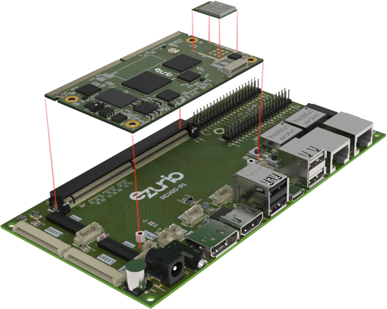
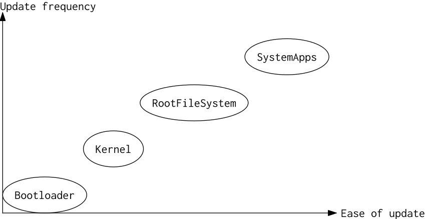

# 38

[<<<](./37.MD)
> Single board computer – definice, součásti, třídy výkonnosti. SoC. SoM. Operační systémy pro vestavná zařízení. Linux pro vestavná zařízení. Úpravy OS pro cílové zařízení. Paměti Flash, systémy souborů, podpora v OS.

## Single board computer (SBC)

* Single board computer == jednodeskový počítač
  * Všechny důležité komponenty jsou přítomny na jedné desce plošných spojů → soběstačné
  * CPU, paměť, IO, periferie
  * Často architektura ARM/RISC-V s operačním systémem Linux/Android
  * Oproti ATX PC je fyzicky menší s menší spotřebou
  * Raspberry Pi, Orange Pi, Banana Pi, Beagleboard, LattePanda

* Podle <https://investors.raspberrypi.com/>:
  * _FY25, SBC and Compute Module unit sales by segment_:
    * _25% Enthusiasts and education_
    * _75% Industrial and embedded_
  * Využití např. v: automotive, chytrá domácnost, IoT brány, RFID, pokladny, průmyslová automatizace, sítě pro elektroauta, tenký klient, veřejné obrazovky, zemědělství, zdravotnictví

* SBC porovnáváme podle:
  * SoC/CPU, GPU, NPU
  * RAM – kapacita a typ
  * Úložiště: microSD slot, M.2 slot, onboard flash
  * Periferie, porty, protokoly:
    * Wi-Fi, Bluetooth, Ethernet
    * USB, HDMI, MIPI (camera/display interface), GPIO header (kolik pinů)
  * Fyzická velikost, provozní teploty
  * V jakém prostředí může být nasazen (extrémní teploty, vibrace, radiace, ...)

* Možné periferie SBC:
  * Univerzální GPIO
  * Převodníky AD/DA, čítače/časovače/RTC
  * Vstupní – user (klávesnice, touchscreen), senzor, kamera, čidlo, mikrofon
  * Výstupní – displej, reproduktor
  * Úložiště – microSD, NVME, onboard flash
  * Sběrnice a konektory – USB, Ethernet, CAN, UART, Wi-Fi, Bluetooth, ...

## SoC – System on Chip

* Počítač v jednom integrovaném obvodu
* CPU, paměť, IO, řadiče pro úložiště; dále např. GPU, Wi-Fi, ...
* Velké množství pinů
* Dokumentace na tisíce stránek
* ⇒ Pracovat přímo se SoC vyžaduje jeho dobrou znalost a dobrou desku, která je na něj připravená

## SoM – System on Module

* CPU, paměť, úložiště na jedné desce
* Piny čipu jsou vyvedeny na piny desky
* Deska je součástí většího systému
* Custom baseboard / carrier board; ta přidává IO a věci specifické pro dané použití

## Operační systémy pro vestavná zařízení

* Linux, případně i Windows
* RTOS:
  * Wind River VXWorks
  * Siemens Nucleus
  * LynxOS
  * FreeRTOS
  * Azure RTOS (ThreadX)
  * Zephyr
  * BlackBerry QNX
* Při výběru OS řešíme, zdali:
  * Potřebujeme pracovat v „režimu reálného času“ (deterministická a včasná obsluha událostí)
  * Je pro nás kritická bezpečnost a ochrana dat
  * Vyžadujeme splnění norem či certifikací
  * Vyžadujeme podporu konkrétních periferií
  * HW nároky, spotřeba

### Linux pro vestavná zařízení

* Výhody:
  * Je připraven na různorodý hardware a připojená zařízení (CPU architektury, sběrnice, typy úložišť, ...)
  * Dobré plánování procesů a práce se sítí
  * Open source, flexibilní
  * Velká a aktivní komunita
* Úskalí:
  * Linux vyžaduje výkonnější CPU s podporou režimů a virtualizace; a dostatek RAM
  * Linux je třeba udržovat, což nemusí být snadná záležitost
  * Lze instalovat doprovodný SW (můžeme brát jako výhodu i nevýhodu)
  * Cílíme-li na RTOS nebo nějaké certifikace, může existovat lepší alternativa

## Sestavení OS Linux pro SBC

* Toolchain – sada nástrojů pro překlad zdrojového kódu na spustitelný kód pro cílové zařízení
* Bootloader (zavaděč) – kód nahraný na definovaném místě startovacího média, jehož úkolem je zkopírovat startovací kód operačního systému do RAM a spustit jej
* Kernel (jádro) – nejdůležitější program v OS, který přiděluje procesorový čas, přepíná procesy, řídí přístup k RAM a řídí přístup k IO
* RootFileSystem – systém souborů, který se nachází na oddílu s kořenovým adresářem. Obsahuje soubory a adresáře nezbytné pro spuštění a fungování systému
* Systémové aplikace

Mezi možné formáty RootFileSystem u vestavných zařízení patří:

1. Ramdisk, nahráno z flash při startu
2. „Normální“, např. _ext4_ na SD kartě nebo _UBIFS_ na flash
3. Readonly compressed filesystems
   * Např. _SquashFS_
   * Výhodou readonly FS je bezpečnost:
     * Nelze zapisovat → hůře se na takový systém útočí
     * Pokud u normálních FS vypadne např. při zápisu napájení, hůře se z takových chyb zotavuje (často nemáme plnohodnotný FS jako na desktopu/serveru, který by si s tím poradil)
     * Aktualizujeme pouze celý FS → méně chaosu u zákazníků

Pro funkční embedded Linux potřebujeme zprovoznit/sestavit Toolchain+Bootloader+Kernel+RootFileSystem+SystemApps, což je komplexní operace, kterou je proto vhodné nějak automatizovat. S tím může pomoci nástroj _Yocto_, kde je sestavení softwaru popsáno modulárně pomocí receptů a vrstev.

## Flash

* Flash je nevolatilní a elektricky programovatelná paměť
* Je založena na EEPROM a dělí se na NAND a NOR podle použitých hradel
  * EEPROM musí být před přepsáním celá vymazána
  * NAND Flash lze přepisovat po blocích
  * NOR Flash lze přepisovat po jednotlivých slovech

## Systém souborů (FS – File System)

* Systém == uspořádání ⇒ FS je sada pravidel, jak budou data v úložišti uspořádána (realizace souborů, adresářů, metadat, oprávnění, ...)
* Vlastnosti FS:
  * Minimální a maximální velikost souboru
  * Počet podadresářů a hloubka adresářového stromu
  * Celkový využitelný prostor média
  * Podporované znakové sady pro pojmenování souborů a obecná pravidla pro jména souborů
  * Pravidla pro vytváření změn
  * Způsob uložení souboru vzhledem k typu média (to se odráží na fragmentaci média)
  * Zajištění ochrany souborů
  * Šifrování obsahu média, komprimace dat, žurnálování, ...
* Příklady FS:
  * __FAT32__ – poměrně jednoduchý a starý (vyšší fragmentace, žádná ochrana, omezená maximální velikost souboru/disku), disk s tímto FS lze ovšem přečíst na leckterém zařízení
  * __exFAT__ – proprietární, vhodné pro externí média u OS Windows
  * __NTFS__ – proprietární, vhodné pro interní média u OS Windows
  * __ext4__ – nativní pro většinu Linuxových distribucí
  * __Btrfs__ – alternativní FS pro OS Linux s mnoha funkcemi (lepší podpora pro RAID, kompresi, kontrolu); pokud je nevyužijeme, asi lépe zůstat u ext4
  * __UBIFS__ – _Unsorted Block Image File System_ – určeno pro flash paměti a embedded zařízení
  * __XFS__ a __ZFS__ – vyvinuto pro velké disky

---
[>>>](./39.MD)
