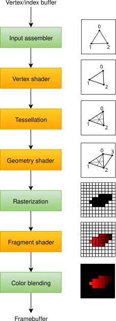

# 39

[<<<](./38.MD)
> Pipeline pro 3d grafiku v reálném čase: struktura a datové toky, druhy a použití shaderů, komunikace programu na CPU s shadery.

## 3D grafika

### Základní princip 3D grafiky

1. Reprezentace objektů pomocí 3D vektorových dat
   * Obálka tvořená vrcholy, hranami, ploškami (_vertex_, _edge_, _face_) → síť trojúhelníků
2. Transformace 3D objektů
   * Posun, rotace, škálování
   * Projekce 3D vektorů na plochu → převod na 2D vektory
3. Rasterizace (převod vektorů na bitmapu)
4. Obarvení rastru na základě světel, textur, materiálů, ...
5. Vyřešení zakrývání a průhlednosti

### Pipeline pro 3D grafiku

Proces převedení 3D dat na výsledný 2D obraz probíhá v&nbsp;několika fázích – grafická pipeline. Dříve byla fixní, dnes je standardem programovatelná pipeline. Chování jednotlivých fází se definuje programováním tzv. _shaderů_. Shader je malý program spouštěný přímo na GPU pro každý vertex / fragment (~pixel), jehož vlastnosti může ovlivnit.



#### Input assembler

Načte 3D vektorová data z bufferu (lineární prostor v&nbsp;paměti GPU), který je naplněn v aplikačním kódu. Data jsou v této fázi zpracována do formátu pro další fáze pipeline.

#### Vertex shader

Povinná fáze pipeline, která přijímá vertexy od input assembleru a každý zpracovává zvlášť. Vždy přijme jeden vertex a jeden vrací. Hlavním cílem je upravit pozici vertexu. Využívá se homogenních souřadnic, kde homogenní vrchol `(x, y, z, w)` odpovídá 3D vrcholu `(x/w, y/w, z/w)`. Původní data násobíme maticemi:

```text
  [ Vertex data ] → local space: souřadnice relativní k počátku objektu →
→ [   Model mx  ] → world space: souřadnice relativní k počátku scény →
→ [   View mx   ] →  view space: souřadnice z pohledu kamery →
→ [Projection mx] →  clip space: ortografická/perspektivní projekce (ořezové roviny, FOV)
```

#### Tessellation

Hardwarová teselace – dělení plošek na menší plošky – dynamické přidávání/odebírání detailu objektů.

#### Geometry shader

Jako vstup přijímá primitiva (vrcholy, hrany, plošky). Primitiva může zahodit, nebo vytvořit nová a mít tak větší výstup něž vstup. Na tuto fázi lze pohlížet jako flexibilnější teselaci, příliš se ale nepoužívá z důvodu nároků na výkon.

#### Rasterization

Ve fázi rasterizace jsou vstupní primitiva převedena na _fragmenty_, které reprezentují pixely pro zapsání do framebufferu. Jsou zahozeny fragmenty, které nebudou vidět (plošky mimo obrazovku / otočené od kamery / zakryté jiným objektem).

#### Fragment shader

Přijímá jednotlivé fragmenty a každý zpracovává zvlášť. Hlavním cílem je nastavení barvy. Může využít texturovací souřadnice a normály jakožto interpolovaný výstup vertex shaderu.

#### Color blending

Slučuje fragmenty, které jsou namapovány na stejný pixel (řeší se u&nbsp;poloprůhledných objektů).

### Kód

* Pro implementaci renderování obvykle používáme nějaké grafické API jako Direct3D, OpenGL, nebo Vulkan
* V OpenGL:
  * Surová data vertexů (např. souřadnice + normály + texturovací souřadnice) vkládáme do VBO (Vertex Buffer Object)
  * Abychom neopakovali stejná data, můžeme využít EBO (Element Buffer Object), který obsahuje indexy vertexů z VBO
  * Pomocí VAO (Vertex Array Object) popíšeme, v jakém formátu jsou surová data vertexů
  * Shadery píšeme v jazyce GLSL a kompilujeme za běhu aplikace (`glCompileShader`)
  * Shadery mohou obsahovat `uniform` proměnné, jejichž hodnoty nastavujeme z aplikačního kódu (`glProgramUniform...`)

---
[>>>](./01.MD)
